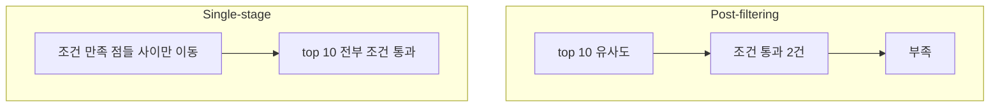

# Pre-filtering vs Post-filtering

벡터 검색에 조건을 거는 방법은 셋이고, **어디서 거르느냐**만 다르다.

| 방식 | 순서 | 문제 |
|---|---|---|
| **Post-filtering** | 유사도 top-K → 조건으로 거름 | 상위 K개가 전부 조건 밖이면 **결과 0건** |
| **Pre-filtering (naive)** | 조건 만족 집합 전체 → 그 안에서 유사도 | 집합이 크면 [[풀 스캔(Full Scan)]]에 가까워짐 |
| **Single-stage (Qdrant)** | 탐색 중 조건 확인 | [[Payload Index]]가 필요 |

## Post-filtering의 실패 모습

"카테고리가 modeling인 블록 10개"를 post-filter로 하면, 유사도 상위 10개가 전부 visualization일 때 **결과가 0건**이 된다. 데이터에는 답이 있는데 못 찾는다. 흔한 임시방편이 `k`를 크게 뽑는 것인데, 이건 확률을 낮출 뿐 보장이 아니다.

## Single-stage가 되는 조건

[[HNSW]] 탐색 중 각 이웃마다 조건을 확인해야 하므로 그 확인이 빨라야 한다. 그래서 [[Payload Index]]가 전제다. Qdrant는 필터가 매우 선택적이면(남는 점이 적으면) 아예 [[풀 스캔(Full Scan)|전수 비교]]로 전환하기도 한다. 그게 더 빠르기 때문이다.

## 우리 프로젝트의 현재 위치

**post-filtering이다.** LangChain 래퍼로 top-K를 받아 파이썬에서 [[score_threshold|점수 컷]], `block_id` 일치, `source` 제외를 순서대로 거른다.

- 지금은 문제없다. 카탈로그가 작고 `k`를 여유 있게(최소 5, 기본 15) 뽑아 걸러도 후보가 남는다.
- 문서가 커지면 0건 문제가 나타난다. 그때 [[Qdrant 메타데이터 필터]] + [[Payload Index]]로 옮겨야 한다.

## 한 줄 정리

**받고 나서 거르면 0건이 날 수 있고, 찾으면서 거르면 개수가 보장된다.** 후자의 대가가 payload index다.

## 관련

- [[Qdrant 메타데이터 필터]]
- [[Payload Index]]
- [[score_threshold]]
- [[HNSW]]
