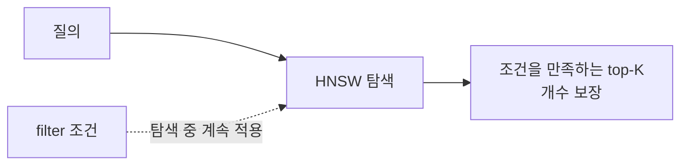

# Qdrant 메타데이터 필터

- [[Qdrant Point와 Payload|payload]]에 조건을 걸어 **검색 대상을 구조적으로 좁히는** 기능이다.
- [[MongoDB 쿼리 연산자]]의 `$and`/`$or`/`$not`과 같은 자리인데, **유사도 탐색과 동시에** 적용된다는 게 다르다.

```python
from qdrant_client.http import models

query_filter = models.Filter(
    must=[
        models.FieldCondition(key="category", match=models.MatchValue(value="STATISTICS")),
        models.FieldCondition(key="block_type", match=models.MatchAny(any=["TDP0033", "TSM0004"])),
    ],
    must_not=[
        models.FieldCondition(key="is_deprecated", match=models.MatchValue(value=True)),
    ],
)
```

## 세 개의 절

| 절 | 뜻 | SQL |
|---|---|---|
| `must` | 전부 참이어야 | `AND` |
| `should` | 하나라도 참이면 | `OR` |
| `must_not` | 참이면 제외 | `NOT` |

조건 하나는 `FieldCondition(key=..., match=...)` 꼴이다.

| 매처 | 쓰임 |
|---|---|
| `MatchValue(value=x)` | 정확히 x |
| `MatchAny(any=[...])` | 목록 중 하나 (`$in`) |
| `Range(gte=, lte=)` | 숫자 범위 |

## Qdrant의 진짜 강점

대부분의 벡터 DB는 검색을 끝낸 뒤 결과를 거른다. Qdrant는 **[[HNSW]] 그래프를 걸어가는 도중에** 필터를 적용한다(single-stage). 조건을 만족하는 점들 사이에서만 이동하므로 개수가 보장된다. 자세한 비교는 [[Pre-filtering vs Post-filtering]].



## 전제 조건

필터에 쓰는 필드에는 [[Payload Index]]가 있어야 한다. 없으면 payload를 전부 뒤지는 [[풀 스캔(Full Scan)]]이 된다. **필터를 도입하는 순간 payload index도 같이 들어와야 한다.**

## 우리 프로젝트의 현재 상태

검색 경로에서는 `query_filter`를 **아직 쓰지 않는다.** `Filter`/`FieldCondition`은 문서 삭제 경로에만 있고, 조건 필터링은 파이썬에서 결과를 받은 뒤 한다. 즉 지금은 post-filtering이다. 규모가 작아 문제가 없을 뿐, 문서가 커지면 첫 번째로 바뀔 지점이다.

## 한 줄 정리

Qdrant 필터는 **must/should/must_not로 쓴 payload 조건**이고, 탐색 도중 적용되는 게 다른 벡터 DB와의 차이다.

## 관련

- [[Qdrant Point와 Payload]]
- [[Payload Index]]
- [[Pre-filtering vs Post-filtering]]
- [[Qdrant query_points]]
- [[MongoDB 쿼리 연산자]]
