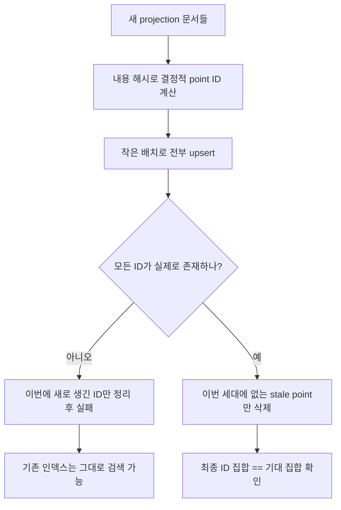

# Qdrant 인덱스 재빌드 전략

카탈로그가 바뀌면 [[Qdrant]] 인덱스를 다시 만들어야 한다. **어떻게 다시 만드느냐**가 운영 안정성을 가른다.

## 하면 안 되는 방식

```text
1. 컬렉션 비우기
2. 새 문서 임베딩해서 넣기
```

2번이 중간에 실패하면(임베딩 API 타임아웃, rate limit, 프로세스 종료) **검색이 통째로 죽는다.** 비우는 순간부터 새로 다 넣기 전까지 인덱스가 빈 상태다.

## 쓰는 방식 — 세대 교체



핵심 넷:

**1) 결정적 point ID** — 문서 내용을 해시해 UUID를 만든다. 같은 문서면 항상 같은 ID라서 재시도가 [[upsert|멱등]]하다.

**2) 작은 배치** — 8개씩 끊어 넣는다. 임베딩 타임아웃 위험과 실패 범위를 함께 줄인다.

**3) 확인 후 삭제** — 새 문서가 전부 있는 걸 확인한 **뒤에** 옛 세대를 지운다. 순서가 반대면 앞의 나쁜 방식과 같아진다.

**4) 실패 시 되돌리기** — 실패하면 **이번 시도에서 처음 생긴 ID만** 지운다. 기존 세대는 손대지 않으므로 검색은 계속 된다.

## 왜 [[HNSW]] 때문에 더 조심하나

HNSW는 그래프라 점을 지우면 경로가 끊긴다. 삭제가 많으면 성능이 서서히 나빠진다. 그래서 "지우고 다시" 보다 **덮어쓰고 남은 것만 지우는** 쪽이 그래프에도 낫다.

## 한 줄 정리

재빌드는 **비우고 채우는 게 아니라 덮어쓰고 확인한 뒤 남은 걸 지우는 것**이다. 그래야 실패해도 검색이 살아 있다.

## 관련

- [[Qdrant]]
- [[Qdrant Point와 Payload]]
- [[upsert]]
- [[HNSW]]
- [[Fail-soft]]
