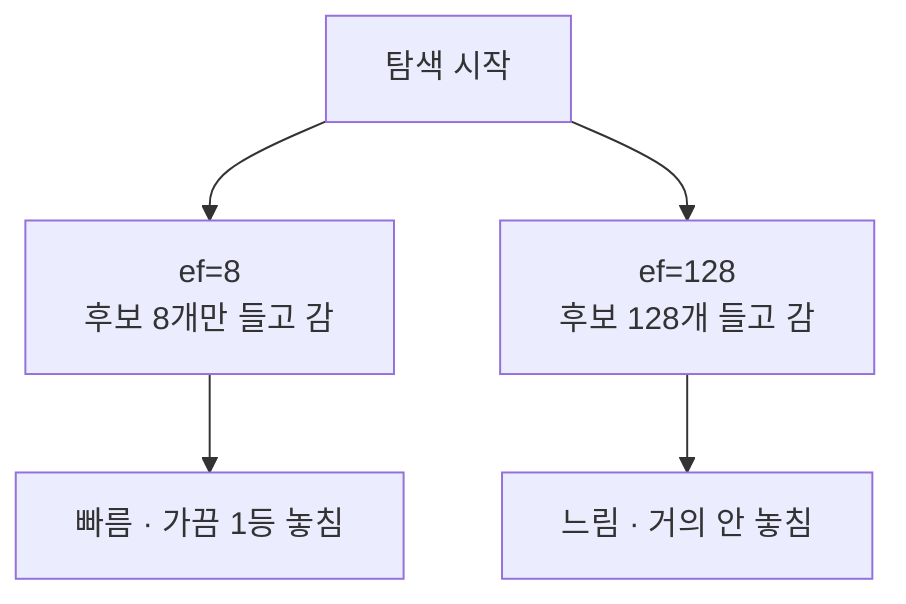

# Recall과 ef 튜닝

- **recall = 진짜 정답 중 내가 실제로 찾아낸 비율.** [[ANN(근사 최근접 이웃)]]의 품질 지표다.
- 전수 비교(`exact=True`)로 만든 정답지와 [[HNSW]] 결과를 비교해서 구한다.

```text
recall@10 = (ANN 상위 10개 ∩ 정답 상위 10개) / 10
```

## ef가 하는 일

`hnsw_ef`는 **탐색 중 손에 들고 있는 후보의 개수**다. 후보를 여러 개 유지하면 [[Small World 그래프|greedy 탐색]]이 지역 최적에 빠져도 다른 후보에서 빠져나올 수 있다.



- `ef`는 최소한 `limit`(top-K)보다 커야 한다. 후보 목록이 원하는 개수보다 작으면 말이 안 된다.
- 올릴수록 recall이 오르지만 **어느 지점부터 거의 안 오르고 지연만 는다.** 그 무릎(knee)을 찾는 게 튜닝이다.

## 실무 절차

1. 대표 질의 50~100개를 고른다.
2. `exact=True`로 정답지를 만든다.
3. `hnsw_ef`를 32 → 64 → 128 → 256으로 올리며 recall과 p95 지연을 같이 기록한다.
4. 목표 recall(예: 0.95)을 만족하는 **가장 작은 ef**를 고른다.

## 검색 품질 ≠ recall

recall이 1.0이어도 사용자가 원하는 문서가 안 나올 수 있다. 그건 벡터 인덱스 문제가 아니라 [[임베딩(Embedding)|임베딩]]·[[청킹(Chunking)|청킹]]·질의 표현 문제다. **recall은 "인덱스가 자기 일을 했는가"만 말한다.** 검색 결과의 유용성은 [[Retrieval Evaluation]]이 따로 본다.

## 규모 감각

카탈로그가 수십~수백 건 수준이면 HNSW가 뭘 놓칠 일이 사실상 없다. 이 다이얼이 의미를 갖는 건 **수만 건을 넘어갈 때**다.

## 한 줄 정리

recall은 **놓치지 않은 비율**이고, ef는 그걸 사는 대신 지연을 지불하는 다이얼이다.

## 관련

- [[HNSW 파라미터]]
- [[ANN(근사 최근접 이웃)]]
- [[Retrieval Evaluation]]
- [[score_threshold]]
