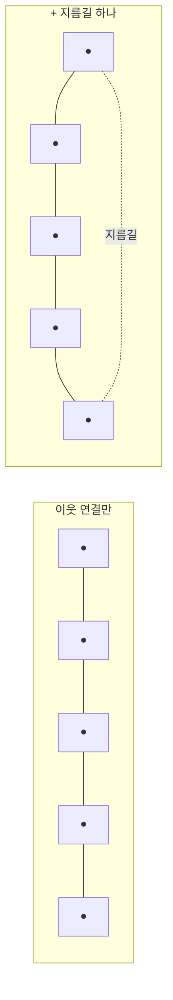

# Small World 그래프

- [[HNSW]]의 SW에 해당하는 개념. **가까운 이웃끼리 촘촘히 연결하되, 가끔 아주 먼 곳으로 가는 지름길을 섞은 그래프**다.
- "여섯 다리만 건너면 다 아는 사이"라는 그 원리와 같다.

## 두 성질을 동시에 갖는다

| 성질 | 어떻게 얻나 | 왜 필요한가 |
|---|---|---|
| **군집성** | 이웃끼리 빽빽하게 연결 | 근처에 도착하면 정밀하게 훑을 수 있다 |
| **짧은 경로** | 드물게 섞인 장거리 간선 | 반대편까지 몇 홉이면 닿는다 |

둘 중 하나만 있으면 안 된다. 이웃 연결만 있으면 반대편까지 한 칸씩 기어가야 하고, 무작위 연결만 있으면 근처에서 정밀 탐색이 안 된다.

## Navigable — 걸어서 찾는다는 것

탐색은 **greedy**다.

1. 아무 점에서 시작
2. 내 이웃 중 질의 벡터에 **더 가까운** 점으로 이동
3. 더 가까워지는 이웃이 없으면 멈춤

데이터 전체를 보지 않고 **그래프를 걸어서** 정답 근처로 간다. 이게 [[ANN(근사 최근접 이웃)]]의 실제 동작이다.

## 약점과 그 해법

greedy 탐색은 **지역 최적(local minimum)** 에 빠질 수 있다. 주변보다는 가깝지만 진짜 정답은 아닌 곳에서 멈춘다. 해법 둘:

- 후보를 하나만 들고 다니지 말고 여러 개 유지한다 → [[Recall과 ef 튜닝|ef]]
- 층을 쌓아 큰 걸음부터 걷는다 → [[HNSW]]의 H(Hierarchical)

## 한 줄 정리

Small World 그래프는 **촘촘한 이웃 + 드문 지름길**이라 몇 홉이면 어디든 닿고, 그 위를 greedy로 걸어가는 게 벡터 탐색이다.

## 관련

- [[HNSW]]
- [[ANN(근사 최근접 이웃)]]
- [[Recall과 ef 튜닝]]
