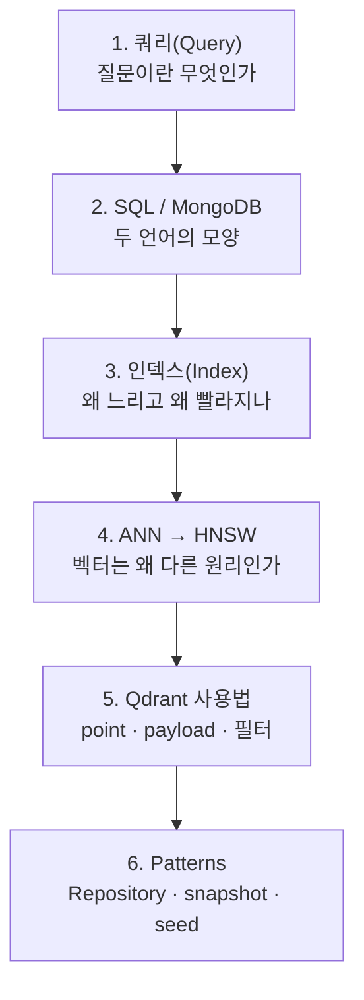

# 데이터베이스 MOC

프로젝트에서 쓰는 저장소는 성격이 다른 넷이다. **잘 답하는 질문의 모양**이 다르기 때문에 나눠 쓴다.

| 저장소 | 잘 답하는 질문 | 폴더 | 영구 저장 |
|---|---|---|---|
| MariaDB ([[SQL]]) | 조건에 정확히 맞는 행을 다른 표와 이어서 | `SQL/` | 예 |
| [[MongoDB]] | 이 ID의 문서 통째로 / 이 필드가 이 값인 문서들 | `NoSQL/` | 예 |
| [[Qdrant]] | 이 문장과 **의미가 비슷한** 것 상위 N개 | `Vector/` | 예 |
| [[BM25]] | 이 **단어가 실제로 겹치는** 문서 순위 | (RAG 폴더) | 아니요 · 인메모리 |

## 폴더 구조

```text
Database/
├─ Foundations/   저장 모델과 쿼리의 공통 개념
├─ SQL/           관계형 — MariaDB 계열
├─ NoSQL/
│  └─ MongoDB/
│     └─ Methods/ 메서드 하나당 노트 하나
├─ Index/         두 진영 공통 · 인덱스 원리
├─ Vector/        벡터 DB — Qdrant · HNSW
└─ Patterns/      BigZAMi AI Agent 저장소 실무 패턴
```

## Foundations — 공통 개념

- [[쿼리(Query)]] — 조건형(SQL·Mongo)과 유사도형(벡터·BM25)의 갈림
- [[RDBMS vs Document DB]] — 어느 쪽을 언제 고르나
- [[SQL ↔ MongoDB 문법 대조표]] — 같은 질문을 두 문법으로

## SQL — 관계형 (문법)

**조회** — [[SQL]] · [[SELECT 문법]] · [[WHERE와 조건식]] · [[NULL과 3값 논리]] · [[SQL 실행 순서]]
**결합·집계** — [[JOIN]] · [[GROUP BY와 집계 함수]] · [[서브쿼리]] · [[CTE와 윈도우 함수]]
**변경** — [[INSERT UPDATE DELETE]] · [[트랜잭션(ACID)]]
**구조·성능** — [[DDL과 제약조건]] · [[MySQL EXPLAIN 읽기]]

## NoSQL — 문서 DB (`NoSQL/MongoDB/`)

지금 가장 많이 쓰는 DB라 문법·메서드를 따로 묶었다. 전체 지도는 [[MongoDB MOC]].

**기초** — [[MongoDB]] · [[MongoDB 문서 모델과 BSON]] · [[MongoDB 셸 쿼리 문법]]
**읽기** — [[MongoDB 쿼리 연산자]] · [[MongoDB 배열 쿼리]] · [[projection]] · [[MongoDB 커서와 페이지네이션]]
**쓰기** — [[MongoDB 갱신 연산자]] · [[upsert]]
**메서드 낱개** — [[MongoDB CRUD 메서드]]가 지도 (find · findOne · updateOne · replaceOne · bulkWrite · findOneAndUpdate …)
**집계** — [[MongoDB Aggregation Pipeline]] · [[MongoDB 집계 연산자]]
**설계·운영** — [[MongoDB 인덱스 실전]] · [[MongoDB 데이터 모델링]] · [[Mongo 스키마 레지스트리]] · [[MongoDB 예외 처리]] · [[motor]] · [[mongosh 실전]]

## Index — 두 진영 공통

- [[인덱스(Index)]] — 없으면 왜 느린가
- [[B-tree]] — 정렬 트리가 주는 것
- [[풀 스캔(Full Scan)]] — 전부 확인하기
- [[복합 인덱스]] — 왼쪽 접두사 규칙
- [[유니크 인덱스]] — 동시성 경합까지 막는 계약
- [[explain과 실행 계획]] — `IXSCAN` vs `COLLSCAN`

## Vector — 벡터 DB

**원리**

- [[벡터 데이터베이스]] — 제품 비교와 선택 기준
- [[ANN(근사 최근접 이웃)]] — 정확도를 확률로 바꾸기
- [[Small World 그래프]] — 걸어서 찾는다는 것
- [[HNSW]] — 층으로 쌓은 근접 그래프
- [[HNSW 파라미터]] — M · ef_construct · hnsw_ef
- [[Recall과 ef 튜닝]] — 정확도와 속도의 다이얼

**Qdrant 사용법**

- [[Qdrant]] — 진입 노트
- [[Qdrant Point와 Payload]] — 저장 단위
- [[Qdrant query_points]] — 검색 호출
- [[Qdrant 메타데이터 필터]] — must / should / must_not
- [[Payload Index]] — 필터를 쓰려면 필요한 것
- [[Pre-filtering vs Post-filtering]] — 거르는 시점이 결과를 바꾼다
- [[Qdrant 메서드 사전]] — 클라이언트 메서드
- [[LangChain VectorStore 메서드]] — 우리가 실제로 쓰는 래퍼
- [[Qdrant 인덱스 재빌드 전략]] — 검색을 죽이지 않는 세대 교체

## Patterns — AI Agent 저장소 실무

- [[AI Agent 컬렉션 지도]] — 어떤 컬렉션이 무슨 질문에 답하나
- [[Repository 패턴과 Port]] — 도메인이 DB 라이브러리를 모르게
- [[Snapshot 캐시와 무효화]] — 한 요청에 한 번만 읽기
- [[Degraded와 fail-soft 저장소]] — 죽어도 계속하되 남기기
- [[Seed 배포와 멱등 동기화]] — 몇 번 돌려도 같은 결과

## 읽는 순서



## 이 폴더 밖에 있는 것

검색 품질과 의미 쪽은 [[RAG 개념 MOC]]가 소유한다. DB는 **저장과 조회**, RAG는 **무엇을 근거로 고르는가**로 나뉜다.

- [[BM25]] · [[TF-IDF]] · [[한국어 토크나이징과 BM25]] — 어휘 검색 (DB 아님, 인메모리)
- [[임베딩(Embedding)]] · [[BGE-M3]] · [[코사인 유사도]] · [[임베딩 모델 로딩 패턴]] — 벡터를 만드는 쪽
- [[score_threshold]] — "근거 없음"을 표현하는 검색 정책
- [[Hybrid RAG Search]] · [[Reciprocal Rank Fusion]] · [[구조화 검색 채널]] — 채널 결합
