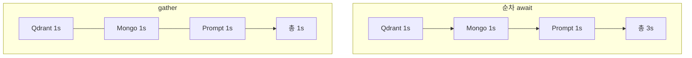

# asyncio.gather와 병렬 실행

- `asyncio.gather`는 **여러 코루틴을 동시에 돌리고 전부 끝나기를 기다린다.**
- [[async-await]]의 진짜 값어치가 나오는 지점이다. `await`를 줄줄이 쓰면 순차 실행이라 아무 이득이 없다.

## 순차 vs 병렬

```python
# 순차 — 1초짜리 셋이면 3초
a = await load_qdrant_status()
b = await load_mongo_status()
c = await load_prompt_status()

# 병렬 — 셋 중 가장 느린 것만큼 (약 1초)
qdrant, mongo, prompts = await asyncio.gather(
    load_qdrant_status(),
    load_mongo_status(),
    load_prompt_status(),
)
```



## 목록을 병렬로

```python
return tuple(await asyncio.gather(*(run_one(branch) for branch in branches)))
```

제너레이터를 `*`로 펼친다. **반환 순서는 입력 순서와 같다** — 먼저 끝난 순서가 아니다. 이게 결정성 면에서 중요하다.

## 예외 처리 — 기본값이 위험하다

| 설정 | 동작 |
|---|---|
| 기본 (`return_exceptions=False`) | **하나라도 실패하면 즉시 그 예외를 올린다.** 나머지 결과는 버려진다 |
| `return_exceptions=True` | 예외를 **결과 목록의 값으로** 돌려준다. 전부 완주 |

```python
results = await asyncio.gather(*tasks, return_exceptions=True)
for r in results:
    if isinstance(r, Exception):
        logger.warning("병렬 작업 실패: %s", r)
        continue
```

부분 실패를 허용하는 [[Fail-soft]] 경로라면 `return_exceptions=True`가 맞다. 하나라도 틀리면 전체가 무의미한 경우에만 기본값을 쓴다.

## create_task — 지금 시작해 두고 나중에 기다리기

```python
pending = asyncio.create_task(anext(events))
...                                   # 다른 일을 하는 동안 이미 돌고 있다
event = await pending
```

`gather`는 "전부 기다린다", `create_task`는 "**일단 띄워 두고** 필요할 때 기다린다"다. 스트리밍 이벤트를 앞서 받아 두는 식으로 쓴다 ([[Streaming]]).

**띄운 task는 반드시 await하거나 취소해야 한다.** 안 그러면 `Task was destroyed but it is pending` 경고와 함께 조용히 사라진다.

## 병렬이 되지 않는 경우

- **CPU 작업**은 안 빨라진다. asyncio는 I/O 대기 시간을 겹치는 것이지 병렬 계산이 아니다. 임베딩 인코딩 같은 건 배치나 별도 프로세스가 답이다.
- **동기 함수를 그냥 부르면** 이벤트 루프가 막힌다. [[motor]] 같은 async 드라이버를 쓰는 이유다.
- **동시성 상한**이 필요할 때가 많다. LLM을 100개 동시에 부르면 provider가 막는다. `asyncio.Semaphore`로 제한한다.

## 한 줄 정리

`gather`는 **I/O 대기를 겹쳐 총 시간을 가장 느린 하나로 줄이고**, 예외 정책(`return_exceptions`)을 반드시 의식해서 골라야 한다.

## 관련

- [[async-await]]
- [[Async Resource Lifecycle]]
- [[motor]]
- [[Fail-soft]]
- [[Concurrent Tool Execution]]
- [[Parallel Agent Fan-out]]
- [[Streaming]]
