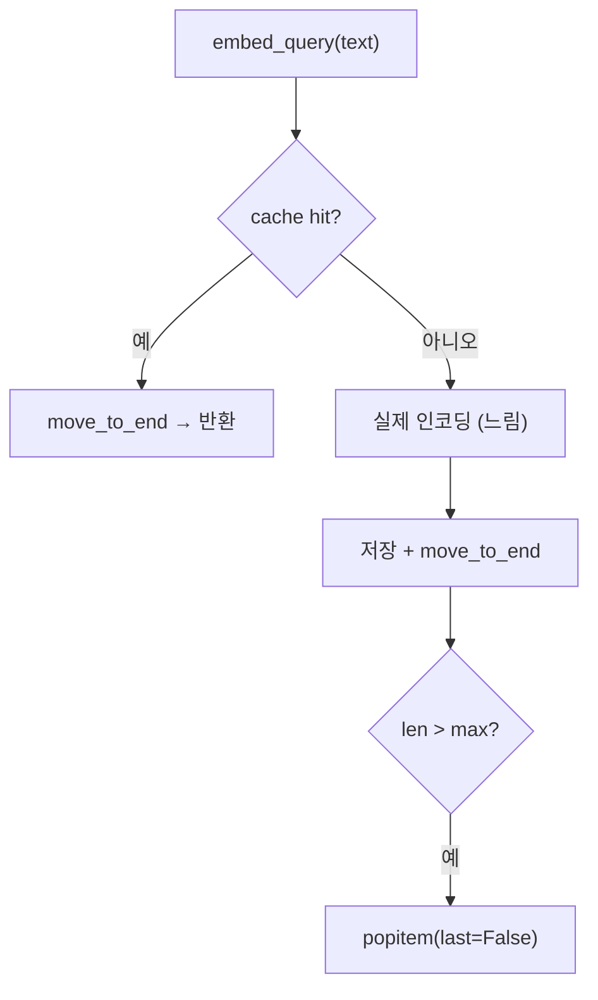

# OrderedDict와 LRU 캐시

- **LRU(Least Recently Used) 캐시** = 상한이 있고, 넘치면 **가장 오래 안 쓴 것부터** 버리는 캐시.
- 파이썬에서는 `OrderedDict` 두 메서드로 20줄 안에 구현된다.

## 두 메서드가 전부다

```python
from collections import OrderedDict

cache = OrderedDict()
cache["a"] = 1
cache.move_to_end("a")          # "a"를 맨 뒤(=최근)로 이동
cache.popitem(last=False)       # 맨 앞(=가장 오래된) 항목 제거
```

| 메서드 | 하는 일 |
|---|---|
| `move_to_end(key)` | 최근 사용 표시 |
| `popitem(last=False)` | 가장 오래된 것 축출 |
| `popitem(last=True)` | 가장 최근 것 축출 (LIFO — LRU 아님) |

## 실제 구현 — 질의 임베딩 캐시

```python
class QueryCachingEmbeddings(Embeddings):
    def __init__(self, inner, max_entries=256):
        self._inner = inner
        self._max_entries = max(1, int(max_entries))
        self._cache: OrderedDict[str, list[float]] = OrderedDict()
        self._cache_lock = threading.Lock()

    def embed_query(self, text: str) -> list[float]:
        with self._cache_lock:
            cached = self._cache.get(text)
            if cached is not None:
                self._cache.move_to_end(text)          # 히트 → 최근으로
                return cached
        vector = self._inner.embed_query(text)          # 미스 → 실제 계산 (lock 밖)
        with self._cache_lock:
            self._cache[text] = vector
            self._cache.move_to_end(text)
            while len(self._cache) > self._max_entries:
                self._cache.popitem(last=False)         # 넘치면 오래된 것부터
        return vector
```



**무거운 계산은 lock 밖에서** 한다. lock 안에서 임베딩을 돌리면 다른 스레드가 전부 멈춘다 ([[threading.RLock]]).

## `functools.lru_cache`를 안 쓴 이유

```python
from functools import lru_cache

@lru_cache(maxsize=256)
def embed(text: str): ...
```

간단한 함수라면 이게 답이다. 하지만:

- **인스턴스 메서드에 걸면 `self`가 키에 들어가** 객체가 GC되지 않는다.
- 캐시 통계·수동 무효화·부분 캐싱(질의는 캐시, 문서는 안 함) 같은 **정책이 필요하면** 직접 구현이 낫다.

실제로 `embed_documents`는 재빌드 전용 대량 경로라 캐시하지 않는다. 이런 선택적 정책이 `lru_cache`로는 안 된다.

## 캐시 키 설계

- 키는 **결정적**이어야 한다. 같은 입력 → 같은 키.
- 텍스트가 길면 키가 무겁다. [[hashlib과 결정적 ID|해시]]를 키로 쓰는 것도 방법이다.
- **모델이 바뀌면 캐시가 오염된다.** 키에 모델명을 섞거나 프로세스와 함께 버린다.

## 한 줄 정리

`move_to_end` + `popitem(last=False)` 두 줄이 LRU의 전부이고, 무거운 계산은 lock 밖에 둔다.

## 관련

- [[collections.defaultdict]]
- [[임베딩 모델 로딩 패턴]]
- [[threading.RLock]]
- [[Snapshot 캐시와 무효화]]
- [[hashlib과 결정적 ID]]
- [[Prompt Caching]]
