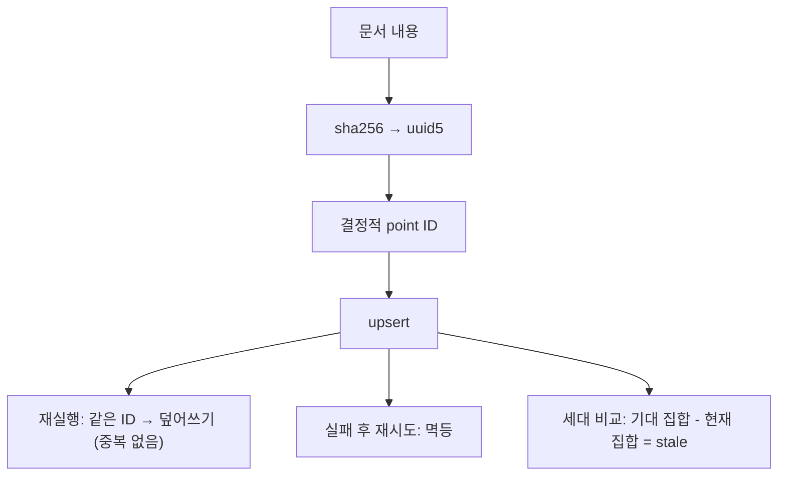

# hashlib과 결정적 ID

- **결정적 ID** = 내용이 같으면 항상 같은 값이 나오는 식별자. 랜덤 UUID의 반대다.
- 이게 있으면 **재실행이 안전해진다.** [[upsert]]와 [[Seed 배포와 멱등 동기화]], [[Qdrant 인덱스 재빌드 전략]]이 전부 이 위에 서 있다.

## 해시로 만들기

```python
import hashlib, json

def content_hash(payload: dict) -> str:
    canonical = json.dumps(payload, sort_keys=True, ensure_ascii=False, separators=(",", ":"))
    return hashlib.sha256(canonical.encode("utf-8")).hexdigest()
```

**정규화(canonicalization)가 핵심이다.** 같은 내용인데 다른 해시가 나오면 쓸모가 없다.

| 옵션 | 왜 |
|---|---|
| `sort_keys=True` | dict 순서가 달라도 같은 문자열 |
| `separators=(",", ":")` | 공백 차이 제거 |
| `ensure_ascii=False` | 한글을 `\uXXXX`로 안 바꿈 — 일관되기만 하면 되지만 가독성이 낫다 |
| `.encode("utf-8")` | 해시는 bytes만 받는다 |

## UUID로 만들기 — uuid5

```python
from uuid import NAMESPACE_URL, uuid5

def _document_point_id(collection_name: str, document) -> str:
    key = f"{collection_name}:{content_hash(document)}"
    return str(uuid5(NAMESPACE_URL, key))
```

| 함수 | 성질 |
|---|---|
| `uuid4()` | **랜덤.** 부를 때마다 다르다 |
| `uuid5(namespace, name)` | **결정적.** 같은 (namespace, name)이면 항상 같은 UUID |

[[Qdrant]]는 point id로 UUID 형식을 요구한다. 그래서 해시를 그대로 못 쓰고 `uuid5`로 감싼다. namespace를 섞으면 **컬렉션이 달라도 같은 내용이면 충돌하는 문제**를 피한다.

## 무엇이 좋아지나



- **중복이 안 생긴다.** 같은 문서를 두 번 넣어도 point 하나.
- **변경 감지가 공짜다.** 해시가 바뀌었다 = 내용이 바뀌었다.
- **삭제 대상이 계산된다.** `현재 ID 집합 - 기대 ID 집합 = stale`.

## 진단 로그에도 쓴다

```python
f": raw_content_chars={diagnostics['raw_content_chars']}"
f": raw_content_sha256={diagnostics['raw_content_sha256']}"
```

원문을 통째로 남기지 않고 **길이 + 해시**만 남긴다. 같은 실패가 반복되는지는 해시로 판별되고, 민감 정보는 로그에 안 남는다 ([[Structured Output 정규화]]).

## 주의

- **해시는 되돌릴 수 없다.** ID에서 내용을 복구할 수 없으니 payload에 원래 키를 같이 넣는다.
- **정규화 규칙을 바꾸면 모든 ID가 바뀐다.** 인덱스 스키마 버전(`v4` 같은)을 따로 두는 이유다.
- 보안 용도(비밀번호 등)에는 sha256을 그대로 쓰지 않는다. 그건 다른 주제다.

## 한 줄 정리

내용을 정규화해 해시하면 **같은 것은 같은 ID**가 되고, 그 순간 재실행·중복·삭제 문제가 한꺼번에 풀린다.

## 관련

- [[upsert]]
- [[Qdrant 인덱스 재빌드 전략]]
- [[Seed 배포와 멱등 동기화]]
- [[json.dumps]]
- [[Snapshot 캐시와 무효화]]
- [[Structured Output 정규화]]
