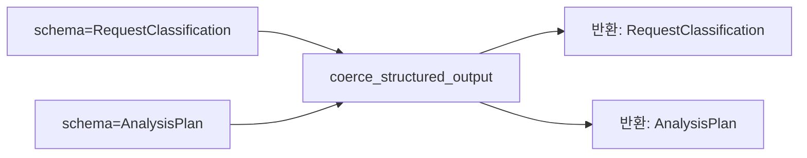

# TypeVar와 제네릭

- `TypeVar`는 **"어떤 타입이든 되지만, 들어온 것과 나가는 것이 같다"** 를 표현하는 도구다.
- [[typing 모듈]]의 일부이고, [[Protocol]]과 함께 파이썬 정적 타이핑의 두 축이다.

## 문제

```python
def first(items: list) -> object:      # 뭐가 나올지 모른다
    return items[0]

x = first([1, 2, 3])                   # x 는 object — int 라는 정보가 사라짐
```

## 해결

```python
from typing import TypeVar

T = TypeVar("T")

def first(items: list[T]) -> T:
    return items[0]

x = first([1, 2, 3])       # x: int  ← 타입이 보존된다
y = first(["a", "b"])      # y: str
```

`T`는 **하나의 호출 안에서 같은 타입을 가리키는 자리표시자**다.

## bound — 범위를 좁히기

```python
ModelT = TypeVar("ModelT", bound=BaseModel)

def coerce_structured_output(raw: object, schema: type[ModelT]) -> ModelT:
    """어떤 Pydantic 모델이든 받되, 넣은 타입 그대로 돌려준다."""
```

- `bound=BaseModel` → **BaseModel의 하위 타입만** 허용.
- `type[ModelT]`는 "인스턴스"가 아니라 **클래스 자체**를 받는다는 뜻이다. `schema.model_validate(...)`를 부르려면 클래스가 필요하다.
- 호출부에서 `coerce_structured_output(raw, RequestClassification)`을 쓰면 반환 타입이 `RequestClassification`으로 확정된다. [[Structured Output 정규화]]가 이 형태다.



## constraints — 몇 개 중 하나

```python
AnyStr = TypeVar("AnyStr", str, bytes)     # str 이거나 bytes, 그 하위는 아님
```

`bound`는 "이것의 하위 타입", constraints는 "이 목록 중 정확히 하나"다.

## 제네릭 클래스

```python
from typing import Generic

class Cache(Generic[T]):
    def __init__(self) -> None:
        self._items: dict[str, T] = {}

    def get(self, key: str) -> T | None:
        return self._items.get(key)

c: Cache[list[float]] = Cache()     # 임베딩 벡터 캐시
```

## 언제 쓰나 — 실무 기준

- **래퍼·팩토리·정규화 함수**처럼 "들어온 타입을 그대로 돌려주는" 함수. 여기가 TypeVar의 본진이다.
- 반대로 반환 타입이 **입력과 무관하게 정해지면** TypeVar가 필요 없다. 그냥 구체 타입을 쓴다.
- 런타임에는 아무 영향이 없다. **타입 체커와 사람을 위한 것**이다.

## 한 줄 정리

TypeVar는 **입력 타입을 반환까지 이어 주는 자리표시자**이고, `bound`로 허용 범위를 좁힌다.

## 관련

- [[typing 모듈]]
- [[Protocol]]
- [[Annotated]]
- [[Literal]]
- [[Pydantic v2 메서드 사전]]
- [[Structured Output 정규화]]
