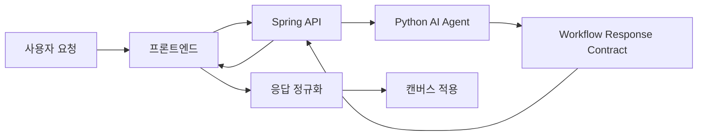

# AI Workflow 생성 파이프라인

AI Workflow 생성 파이프라인은 사용자의 자연어 요청을 분석 워크플로우 블록, 링크, 옵션으로 바꾸는 애플리케이션 구조이다.

핵심은 LLM이 바로 UI를 조작하지 않고, 정해진 계약 객체를 만든 뒤 프론트엔드가 그 객체를 검증하고 캔버스에 적용하는 것이다.

## 기본 흐름

## 왜 계약이 필요한가

- LLM 응답은 자연어라서 그대로 UI에 적용하기 어렵다.
- 워크플로우는 블록, 링크, 옵션, 위치 같은 구조 정보가 필요하다.
- 백엔드, AI 서버, 프론트엔드가 같은 의미를 다루려면 중간 DTO가 필요하다.

## 응답 계약의 핵심 필드

| 필드 | 의미 |
|---|---|
| `mode` | `generate`, `mutate`, `proposal`, `qa` 같은 응답 성격 |
| `blocks` | 생성하거나 배치할 블록 목록 |
| `links` | 블록 간 연결 |
| `actions` | 기존 캔버스를 수정할 변경 명령 |
| `alternatives` | 여러 워크플로우 후보 |
| `reasoning` | 추천 근거 |
| `proposalOptions` | 사용자가 선택할 후속 질문/분기 |

## generate와 mutate

| 모드 | 목적 | 프론트 처리 |
|---|---|---|
| `generate` | 새 워크플로우 추천 | `blocks`, `links`를 캔버스에 diff 적용 |
| `mutate` / `modify` | 기존 워크플로우 수정 | `actions`를 순차 실행 |
| `proposal` | 바로 실행하기 애매한 경우 | 선택 카드 표시 |
| `qa` | 일반 질문 답변 | 캔버스 적용 없음 |

## 설계 원칙

- AI는 "무엇을 해야 하는지"를 구조화해서 제안한다.
- UI는 "어떻게 안전하게 적용할지"를 결정한다.
- 기존 캔버스 상태가 있으면 프롬프트에 함께 넣어 수정 요청으로 전환한다.
- LLM 응답은 반드시 [[Agent 응답 정규화]]를 거쳐 UI 내부 스키마로 맞춘다.

## 흔한 실패 지점

- snake_case와 camelCase가 섞여 필드가 누락된 것처럼 보인다.
- 블록 alias와 실제 canvas blockId를 혼동한다.
- option 값이 JSON string, object, array로 섞여 들어온다.
- 기존 캔버스의 watcher와 AI 배치 이벤트가 race condition을 만든다.

## 한 줄 정리

AI Workflow 생성 파이프라인은 자연어 요청을 **구조화된 워크플로우 계약**으로 바꾸고, 이를 정규화와 검증을 거쳐 캔버스에 반영하는 구조이다.

## 관련

- [[Structured Output]]
- [[Agent 응답 정규화]]
- [[Workflow Action]]
- [[캔버스 적용 오케스트레이터]]
- [[gRPC]]
