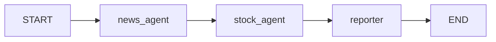

- Agent Graph = [[AI Agent|에이전트]]·노드들을 **임의의 그래프**로 연결한 [[Multi Agent|멀티 에이전트]] 토폴로지. 일직선([[Supervisor 패턴]]의 별모양)·트리([[Hierarchical Agent]])·P2P([[Swarm 패턴]])보다 자유롭다.
- [[LangGraph]]의 `StateGraph`가 대표 구현 — 어떤 노드든 어떤 노드로든 엣지를 그을 수 있다.

## 언제 필요한가

- 협업 흐름이 **DAG**나 **반복 그래프**로 가장 자연스럽게 표현될 때.
- 분기·병렬·재진입이 섞인 워크플로우. 예: 사이드 체크 노드, 검증 노드, fallback 분기.

## LangGraph DAG 예

```python
from langgraph.graph import StateGraph, START, END

g = StateGraph(State)
g.add_node("planner", planner_node)
g.add_node("researcher", researcher_node)
g.add_node("coder", coder_node)
g.add_node("reviewer", reviewer_node)
g.add_node("finalizer", finalizer_node)

g.add_edge(START, "planner")
g.add_edge("planner", "researcher")
g.add_edge("planner", "coder")          # 병렬 fan-out
g.add_edge("researcher", "reviewer")
g.add_edge("coder", "reviewer")
g.add_edge("reviewer", "finalizer")     # fan-in
g.add_edge("finalizer", END)
```

- 같은 입력에 대해 researcher / coder가 동시에 작업 → reviewer가 둘을 합산.

## 직렬 에이전트 그래프

에이전트 그래프는 병렬 DAG뿐 아니라 직렬 파이프라인도 표현할 수 있다.



LangGraph에서는 `create_react_agent()`로 만든 agent 자체도 노드가 될 수 있다.

```python
builder.add_node("news_agent", news_agent)
builder.add_node("stock_agent", stock_agent)
builder.add_node("reporter", report_node)
```

이 구조는 [[Serial Agent Pipeline]]으로 정리할 수 있다.

## 조건부 엣지 — 동적 분기

```python
def route(state):
    if state["needs_research"]: return "researcher"
    if state["has_code"]:        return "coder"
    return "finalizer"

g.add_conditional_edges("planner", route)
```

## 사이클 — 반복 개선

- [[ReAct 패턴]]은 사실 `llm → tool → llm` 의 2노드 사이클.
- [[Reflection]]은 `generator → critic → generator` 사이클.
- Graph는 무한 루프 위험이 있으니 `max_steps` 같은 가드 필수.

## 다른 토폴로지와의 관계

|                        | 표현력    | 디버깅    |
| ---------------------- | ------ | ------ |
| [[Single Agent]]       | 가장 단순  | 가장 쉬움  |
| [[Supervisor 패턴]]      | 별 모양   | 쉬움     |
| [[Hierarchical Agent]] | 트리     | 보통     |
| Agent Graph            | 임의 그래프 | 어려움    |
| [[Swarm 패턴]]           | 동적 P2P | 가장 어려움 |

## 권장 설계

- 그래프 시각화를 항상 유지 — LangGraph Studio, `graph.get_graph().draw_mermaid()`.
- 각 노드는 **순수 함수**처럼 입력 상태 → 부분 상태 반환. 사이드 이펙트는 도구로.
- 사이클이 있다면 명확한 종료 조건 + 최대 반복 카운트.
- 상태(State) 스키마를 [[Pydantic]]·[[typing 모듈|TypedDict]]로 강하게 정의.

## 관련

- [[LangGraph]] — 표준 구현.
- [[Multi Agent]] · [[Agent as Tool]] — 노드를 다른 에이전트로 만들 때.
- [[Serial Agent Pipeline]] — 에이전트들을 순서대로 연결하는 그래프.
- [[Agentic Loop]] — 단일 에이전트도 결국 그래프의 특수 케이스.
