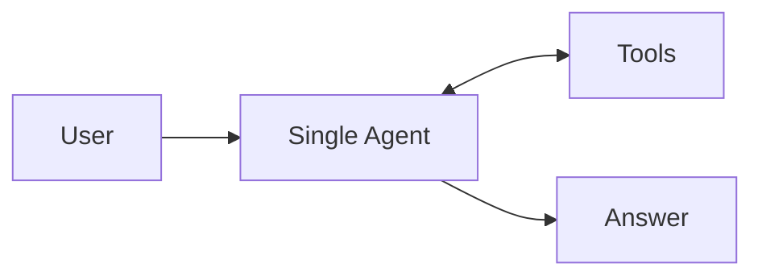
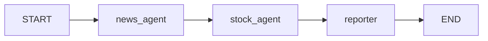
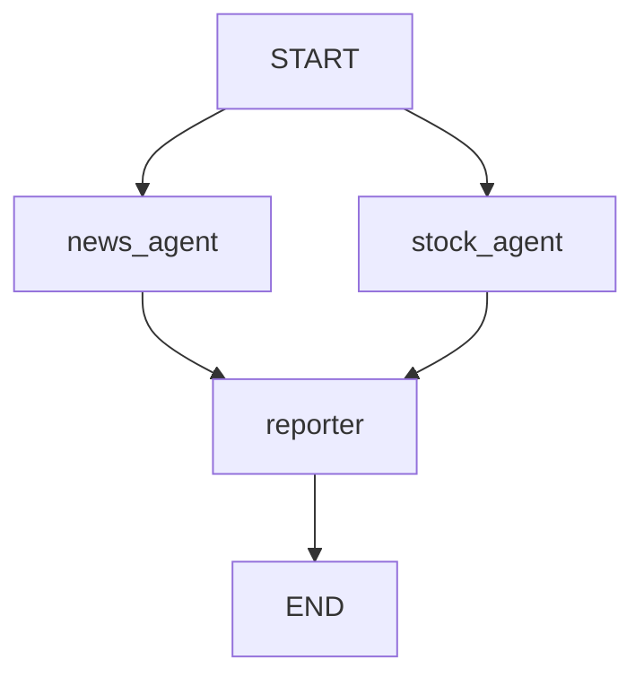
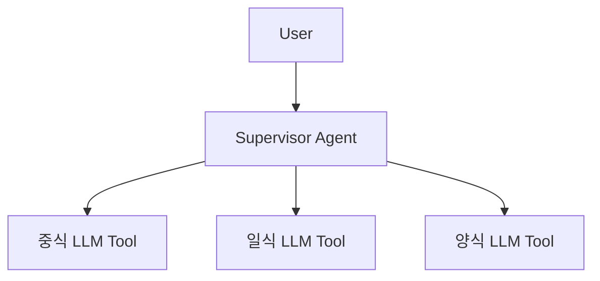

# Agent System Topologies

Agent System Topology는 여러 [[AI Agent|에이전트]]를 어떤 구조로 배치할지에 대한 설계 방식이다.

## 1. Single Agent

하나의 에이전트가 질문 이해, 도구 선택, 답변 생성을 모두 맡는다.

- 가장 단순하다.
- 실습 초반의 `create_react_agent(llm, mytools)`가 여기에 가깝다.
- 도구가 많아지면 선택 실수가 늘 수 있다.

## 2. Sequential

에이전트가 정해진 순서대로 실행된다.

- 앞 단계 결과가 뒤 단계 입력이 되어야 할 때 좋다.
- 예: 뉴스 수집 → 주가 조회 → 리포트 작성.
- 관련: [[Serial Agent Pipeline]]

## 3. Parallel

서로 독립적인 작업을 동시에 실행하고 마지막에 합친다.

- 대기 시간을 줄일 수 있다.
- 여러 노드가 같은 State 필드를 업데이트하므로 [[LangGraph State]]의 reducer가 중요하다.
- 관련: [[Parallel Agent Fan-out]]

## 4. Hierarchical

상위 에이전트가 하위 에이전트에게 일을 나누어 맡긴다.

- 상위 Agent는 라우터/관리자 역할을 한다.
- 하위 Agent 또는 하위 LLM은 특정 전문 영역만 맡는다.
- 관련: [[Supervisor 패턴]], [[Sub-LLM as Tool]], [[Agent as Tool]]

## 선택 기준

| 상황 | 추천 구조 |
|---|---|
| 도구가 적고 실습/프로토타입 | Single Agent |
| 단계 순서가 명확함 | Sequential |
| 작업들이 서로 독립적임 | Parallel |
| 역할이 많고 전문성이 나뉨 | Hierarchical |

## 핵심

에이전트 구조는 "멋있게 복잡하게" 만드는 것이 목적이 아니다.

단일 에이전트가 헷갈리는 지점이 보이면, 그때 역할을 쪼개고 그래프로 배치한다.
