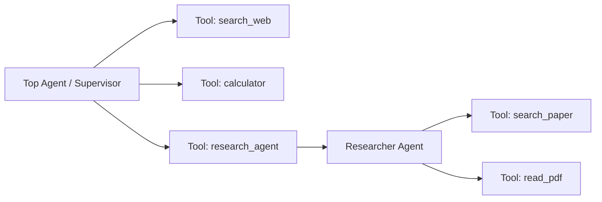
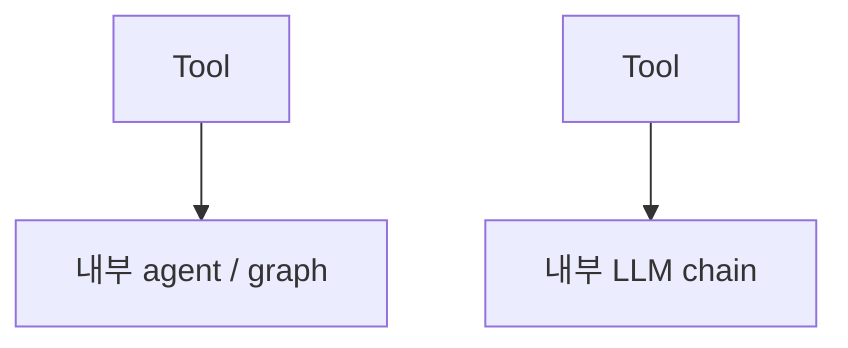

- Agent as Tool = **다른 [[AI Agent|에이전트]]를 [[Tool Calling|도구처럼 호출]]** 할 수 있게 노출하는 패턴. 호출자 입장에서는 그냥 도구가 늘어난 것처럼 보이고, 내부적으로는 별도의 에이전트가 자율 동작한다.
- [[Multi Agent|멀티 에이전트]]의 가장 단순하고 안정적인 시작점. [[Supervisor 패턴]]에서 워커를 함수처럼 다루는 방식이기도 하다.

## 구조



## Strands 구현

```python
from strands import Agent
from strands.tools import tool

researcher = Agent(
    name="researcher",
    tools=[search_paper, read_pdf],
    system_prompt="너는 학술 리서치 전문가다.",
)

@tool
def research(question: str) -> str:
    """심층 학술 리서치가 필요할 때 호출한다."""
    return researcher(question)   # 다른 에이전트를 호출

top = Agent(tools=[search_web, calculator, research])
top("RAG 평가 방법을 학술 자료 기반으로 정리해줘")
# → top이 research 도구를 부르고, 그 안에서 researcher 에이전트가 자율 동작
```

## LangGraph 구현

```python
def research_agent_node(state):
    return research_graph.invoke({"messages": state["messages"]})

# 또는 도구 형태로 노출
@tool
def call_research_agent(query: str) -> str:
    return research_graph.invoke({"messages": [HumanMessage(query)]})["messages"][-1].content
```

## Sub-LLM as Tool과의 관계

[[Sub-LLM as Tool]]은 Agent as Tool보다 단순한 형태이다.

Agent as Tool은 도구 내부에 별도의 에이전트나 그래프가 들어갈 수 있지만, Sub-LLM as Tool은 도구 내부에 `prompt | llm | parser` 같은 단발 LLM 체인을 넣는다.



## 장점

- **분리·재사용** — research agent를 다른 supervisor에서도 그대로 가져다 쓸 수 있다.
- **컨텍스트 격리** — 워커 내부의 사고·도구 호출이 부모 컨텍스트로 누출 안 됨 → 토큰 절약.
- **언어·모델 이질성 흡수** — 워커가 다른 모델·다른 프로토콜이어도 호출자는 함수로만 본다.

## 단점

- 워커가 실패해도 호출자에겐 단순 에러로만 보임 → 디버깅이 어려움.
- 호출자가 워커의 진행 상황(streaming)을 보기 어려움. 필요하면 streaming 도구로 설계.
- 깊이가 깊어지면 비용·지연 곱셈.

## 권장 설계

- 워커 도구의 `description`을 명확히 — supervisor가 언제 부를지 판단하는 매뉴얼.
- 워커 응답 형식을 **고정** ([[Structured Output]]) — 호출자가 다음 단계 판단을 안정적으로.
- 워커마다 [[Cost와 Token|토큰 예산]] 한도를 분리해 폭주 방지.

## 관련

- [[Multi Agent]] · [[Supervisor 패턴]] · [[Swarm 패턴]] · [[Hierarchical Agent]].
- [[A2A 프로토콜]] — 외부 조직 에이전트를 도구화하는 표준.
- [[Tool Calling]] — 기본 메커니즘.
- [[Sub-LLM as Tool]]
