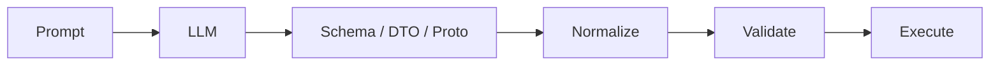

# Contract-first Workflow

Contract-first Workflow는 LLM이 만든 결과를 먼저 명확한 계약 객체로 제한하고, 나머지 시스템은 그 계약만 신뢰하도록 만드는 설계 방식이다.

LLM 애플리케이션에서는 "좋은 답변"보다 "적용 가능한 구조"가 더 중요할 때가 많다. 특히 UI 자동 조작, 데이터 분석 파이프라인, 도구 실행은 계약이 없으면 작은 말투 차이도 장애가 된다.

## 핵심 구조

## 계약의 예

- JSON Schema
- Pydantic model
- Java DTO
- gRPC proto
- TypeScript interface

## 장점

- 프론트엔드와 백엔드가 같은 필드 의미를 공유한다.
- 테스트가 쉬워진다.
- LLM 응답의 말투 변화에 덜 흔들린다.
- 실패 지점을 normalize, validate, execute 중 어디인지 나눌 수 있다.

## 계약에 넣을 것

| 범주 | 예 |
|---|---|
| 의도 | `mode`, `intent`, `stage` |
| 구조 | `blocks`, `links`, `actions` |
| 설명 | `reasoning`, `message` |
| 선택지 | `alternatives`, `proposalOptions` |
| 안전 장치 | `requiresUserSelection`, `warning` |

## 주의점

- 계약이 있어도 모델이 항상 완벽히 지키는 것은 아니다.
- 운영에서는 [[Agent 응답 정규화]]와 [[Pre-validation Normalizer]]가 필요하다.
- 옵션 적용 전후에는 [[Configuration Merge Pipeline]]과 [[Contract Guardrail Pipeline]]이 필요하다.
- 계약 변경은 히스토리 복원, UI 렌더, 테스트 fixture까지 영향을 준다.
- 계약이 너무 크면 LLM이 누락하기 쉽다.

## 한 줄 정리

Contract-first Workflow는 **LLM 출력보다 시스템 계약을 중심에 두고 AI 기능을 안정화하는 설계 방식**이다.

## 관련

- [[Structured Output]]
- [[AI Workflow 생성 파이프라인]]
- [[Agent 응답 정규화]]
- [[Pre-validation Normalizer]]
- [[Block Contract]]
- [[Block Manifest]]
- [[Post-merge Normalizer]]
- [[gRPC]]
