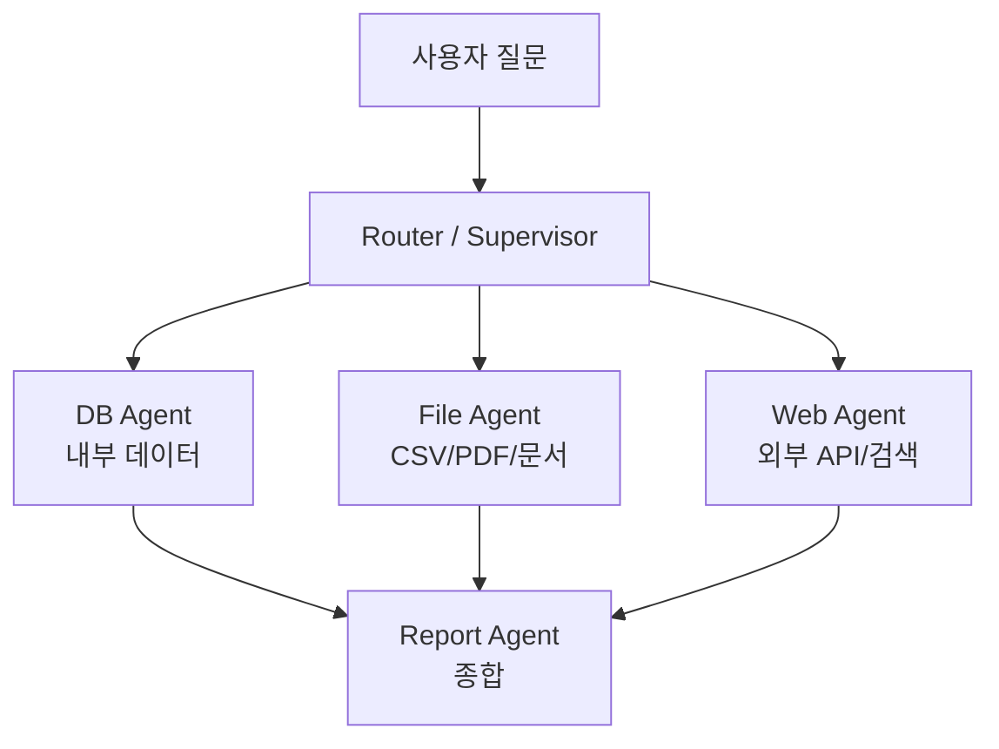
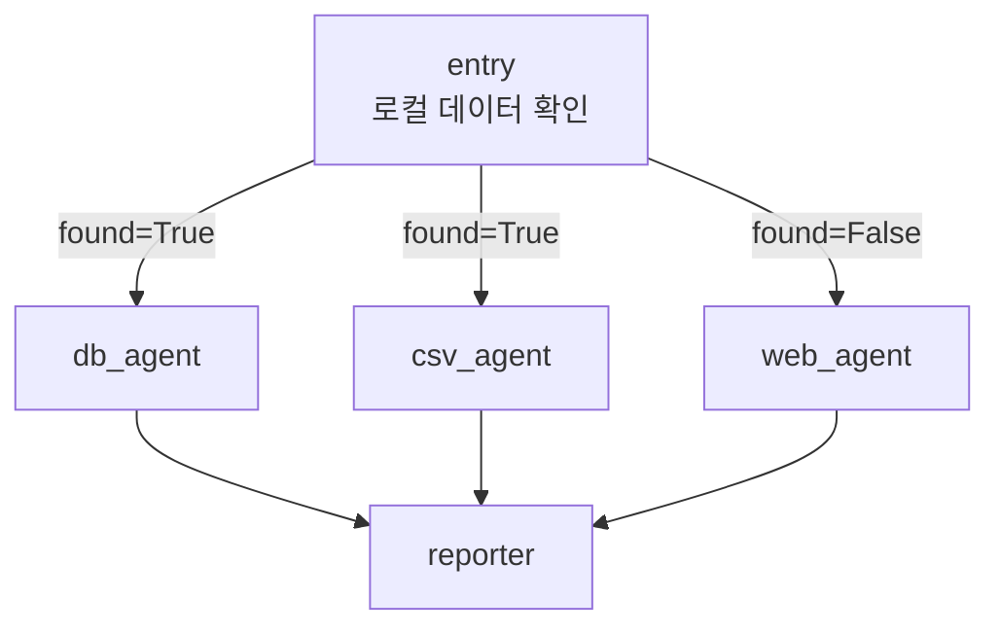
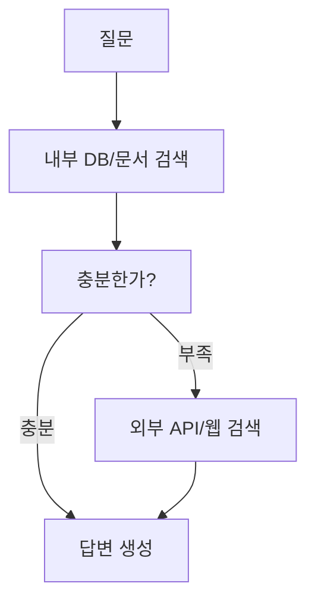

# External Information MAS

External Information MAS는 여러 에이전트가 내부 DB, 로컬 파일, 외부 API, 웹 검색 등을 나눠 조회한 뒤 결과를 종합하는 멀티 에이전트 구조다.

## 왜 필요한가

LLM은 학습된 지식만으로 답하면 최신성, 정확성, 조직 내부 지식에서 약하다.

그래서 에이전트에게 정보 출처별 역할을 나눠준다.

## 구조

## 실습과 연결

뉴스/주가 리포트 실습은 External Information MAS의 작은 형태다.

| 에이전트 | 정보 출처 |
|---|---|
| `news_agent` | Google News RSS |
| `stock_agent` | yfinance API |
| `reporter` | 수집 결과 종합 |

질병 건강관리 리포트 실습은 로컬 정보와 웹 정보를 함께 쓰는 형태다.

| 에이전트 | 정보 출처 | 역할 |
|---|---|---|
| `db_agent` | [[SQLite 데이터 소스|SQLite DB]] | 식단과 운동 조회 |
| `csv_agent` | CSV 파일 | 증상과 주의사항 조회 |
| `web_agent` | Tavily / Web | 로컬에 없을 때 외부 검색 |
| `reporter` | 수집된 메시지 | 통합 건강관리 리포트 작성 |

- 이 구조는 [[로컬 우선 정보 수집 MAS]]로 볼 수 있다.
- `route()`가 `["db_agent", "csv_agent"]`처럼 여러 노드를 반환하므로 [[LangGraph Conditional Fan-out]]이기도 하다.

## 내부 정보 우선 전략

운영 환경에서는 보통 내부 정보를 먼저 본다.

## 설계 포인트

- 내부 데이터와 외부 데이터를 구분해서 출처를 남긴다.
- 최신성이 필요한 정보는 API나 웹 검색으로 보강한다.
- 개인/회사 내부 데이터는 외부 검색 프롬프트에 섞이지 않게 한다.
- 결과를 종합하는 reporter 노드에서 출처와 불확실성을 함께 정리한다.

## 관련

- [[RAG(Retrieval-Augmented Generation)]]
- [[Parallel Agent Fan-out]]
- [[LangGraph Conditional Fan-out]]
- [[로컬 우선 정보 수집 MAS]]
- [[SQLite 데이터 소스]]
- [[Serial Agent Pipeline]]
- [[Fallback]]
- [[Observability]]
