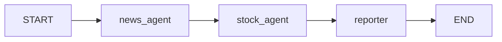
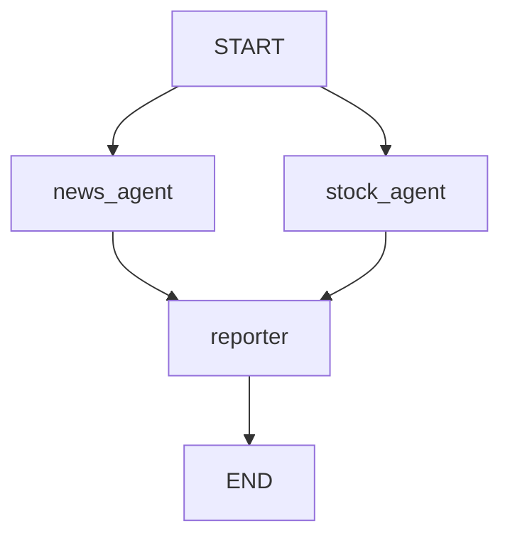

- Multi-Agent System = 여러 [[AI Agent|에이전트]]가 **각자의 역할·도구·프롬프트**를 갖고 협업해 하나의 목표를 달성하는 구조.
- 한 에이전트의 컨텍스트·도구가 폭주할 때, 책임을 나눠 **분업 + 위임**으로 풀어내는 것이 핵심.

## 왜 단일 에이전트로 부족한가

- system prompt에 모든 역할(분석가 + 작가 + 검증자)을 욱여넣으면 LLM이 헷갈린다.
- 도구가 너무 많으면 잘못된 도구를 고를 확률이 올라간다.
- 단계별로 다른 모델(GPT-4o for planning, gpt-4o-mini for execution)을 쓰고 싶을 때.

## 토폴로지 4종

| 패턴 | 특징 | 대표 |
|------|------|------|
| [[Serial Agent Pipeline]] | 여러 에이전트를 정해진 순서대로 실행 | LangGraph 직렬 배치 |
| [[Parallel Agent Fan-out]] | 여러 에이전트를 동시에 실행 후 합류 | LangGraph 병렬 배치 |
| [[Supervisor 패턴]] | 1명의 매니저가 부하 에이전트에 작업 분배 | LangGraph supervisor, CrewAI hierarchical |
| [[Swarm 패턴]] | 에이전트들이 P2P로 handoff | OpenAI Swarm, Strands |
| [[Hierarchical Agent]] | 매니저의 매니저… 트리 구조 | LangGraph 다층 |
| Network | 자유로운 그래프, 임의 통신 | 가장 유연·복잡 |

강의자료에서는 큰 흐름을 Single, Sequential, Parallel, Hierarchical로 잡아도 된다.

관련 정리: [[Agent System Topologies]]

## 일반적 설계 절차

1. 단일 에이전트로 시작 → 한계가 보이는 영역을 식별.
2. 역할을 명사로 정의 (Researcher, Coder, Reviewer 등).
3. 각 역할의 입력·출력 계약을 글로 적는다.
4. 처음엔 [[Supervisor 패턴]]을 권장 (가장 안정적).
5. 동적이고 자율적인 협업이 필요해지면 [[Swarm 패턴]].

## 메시지 패싱 모델

- 에이전트 간 통신은 보통 **메시지 기반** — 한 에이전트의 출력이 다른 에이전트의 입력 메시지가 된다.
- 공유 [[Memory|메모리]] / 블랙보드 패턴으로 모든 에이전트가 같은 상태를 보게 만들 수도 있다.
- LangGraph에서는 `messages: Annotated[..., add_messages]`를 State에 두면 여러 에이전트의 결과가 순서대로 누적된다.

## LangGraph 직렬 배치 예

직렬 배치는 `뉴스 수집 → 주가 조회 → 리포트 생성`처럼 앞 단계 결과가 뒤 단계 입력이 되는 작업에 잘 맞는다.

관련: [[Serial Agent Pipeline]]

## LangGraph 병렬 배치 예

병렬 배치는 `뉴스 수집`과 `주가 조회`처럼 서로 기다릴 필요가 없는 작업에 잘 맞는다.

관련: [[Parallel Agent Fan-out]]

## 흔한 함정

- **무한 핑퐁** — A → B → A → B … 종료 조건이 약하면 발생. `max_turns` 필수.
- **컨텍스트 폭증** — 에이전트가 늘수록 전체 대화 이력이 거대해진다. 요약·구획화 필요.
- **비용** — 호출 수가 곱셈으로 늘어난다. 모델 다운그레이드, 캐싱이 필수.

## 관련

- [[Single Agent]] — 출발점.
- [[Agent System Topologies]] — Single / Sequential / Parallel / Hierarchical 전체 비교.
- [[Serial Agent Pipeline]] — 정해진 순서대로 에이전트를 연결.
- [[Parallel Agent Fan-out]] — 여러 에이전트를 동시에 실행 후 합류.
- [[Supervisor 패턴]] · [[Swarm 패턴]] · [[Hierarchical Agent]].
- [[CrewAI]] · [[AutoGen]] · [[LangGraph]] · [[Strands Agents]] — 구현 프레임워크.
