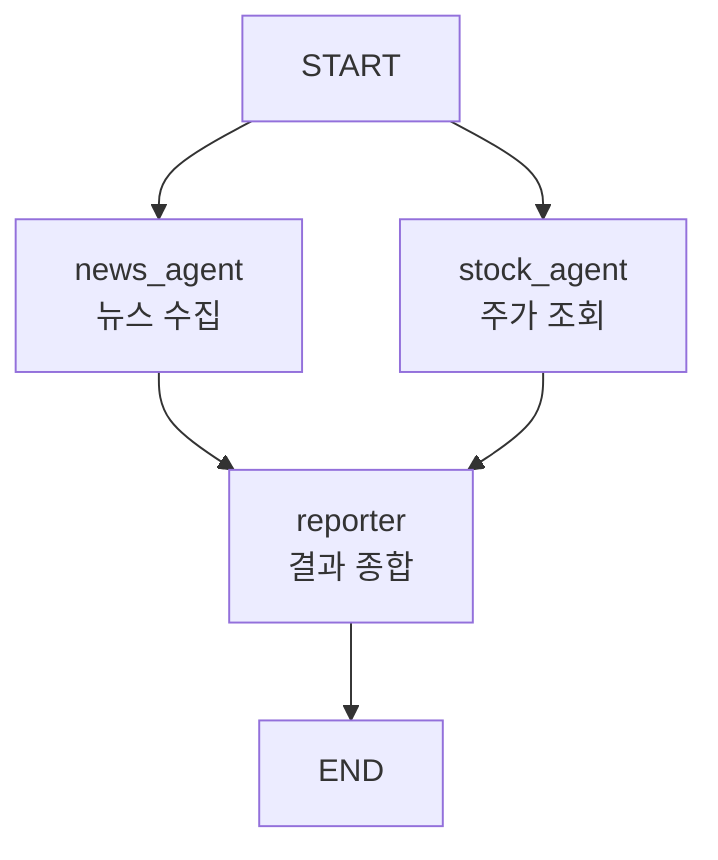
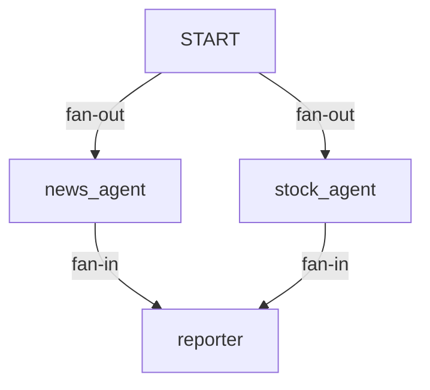
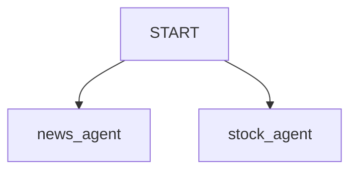
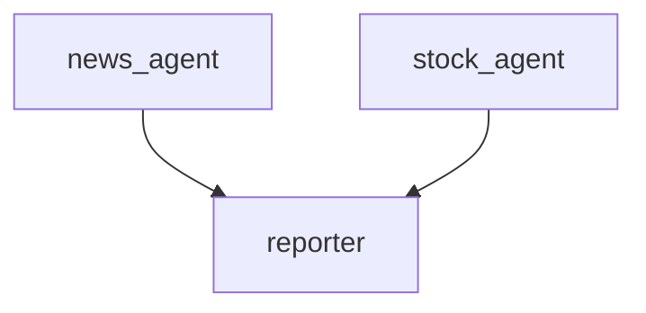
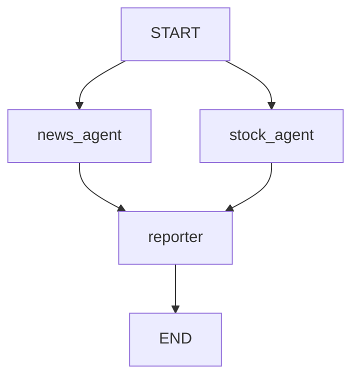

# Parallel Agent Fan-out

## 정의

Parallel Agent Fan-out은 여러 에이전트나 노드를 **동시에 분기 실행**한 뒤, 하나의 노드로 결과를 모아 종합하는 멀티 에이전트 구조이다.



## LangGraph 코드 구조

```python
builder.add_edge(START, "news_agent")
builder.add_edge(START, "stock_agent")

builder.add_edge("news_agent", "reporter")
builder.add_edge("stock_agent", "reporter")

builder.add_edge("reporter", END)
```

`START`에서 여러 노드로 edge를 연결하면 같은 초기 State를 바탕으로 여러 노드가 실행될 수 있다.

각 노드의 결과는 State에 합쳐진다.

## 직렬 코드와 비교

직렬 배치는 시작점에서 하나의 노드로만 간다.

```python
builder.add_edge(START, "news_agent")
builder.add_edge("news_agent", "stock_agent")
builder.add_edge("stock_agent", "reporter")
```

병렬 배치는 시작점에서 여러 노드로 동시에 뻗는다.

```python
builder.add_edge(START, "news_agent")
builder.add_edge(START, "stock_agent")
```

즉 병렬 배치의 핵심은 fan-out이다.

## Fan-out / Fan-in은 Map / Reduce 감각이다

`fan-out`은 하나의 입력을 여러 작업으로 퍼뜨리는 것이다. Map 단계와 비슷하다.

`fan-in`은 여러 작업의 결과를 하나로 모아 종합하는 것이다. Reduce 단계와 비슷하다.

| 용어 | 의미 | 실습 예 |
|---|---|---|
| Fan-out | 하나의 시작점에서 여러 작업으로 퍼짐 | `START → news_agent`, `START → stock_agent` |
| Fan-in | 여러 작업 결과가 하나의 노드로 모임 | `news_agent → reporter`, `stock_agent → reporter` |
| Map | 독립 작업을 각각 수행 | 뉴스 수집, 주가 조회 |
| Reduce | 결과를 합쳐 최종 산출물 생성 | 투자 리포트 작성 |

예시 구조는 다음과 같다.



## reporter가 읽는 값

직렬이든 병렬이든 `reporter`는 결국 같은 방식으로 결과를 읽는다.

```python
collected = "\n\n".join(m.content for m in state["messages"])
```

차이는 `messages`에 결과가 쌓이는 과정이다.

직렬:

```text
초기 요청
→ 뉴스 결과 추가
→ 주가 결과 추가
→ reporter가 읽음
```

병렬:

```text
초기 요청
→ 뉴스 결과와 주가 결과가 각각 추가
→ reporter가 읽음
```

그래서 병렬에서는 `messages` 누적 reducer가 더 중요하다.

## State 누적이 중요하다

병렬 fan-out에서는 여러 노드가 같은 State 필드를 업데이트할 수 있다.

따라서 같은 필드에 결과를 모으려면 reducer가 필요하다.

```python
class AgentState(TypedDict):
    messages: Annotated[Sequence[BaseMessage], add_messages]
```

`add_messages`는 여러 agent가 반환한 메시지를 덮어쓰지 않고 누적한다.

## Static Fan-out vs Conditional Fan-out

Static Fan-out은 그래프를 만들 때 분기 경로가 이미 정해져 있는 구조다.

```python
builder.add_edge(START, "news_agent")
builder.add_edge(START, "stock_agent")
```

Conditional Fan-out은 State나 LLM 판단 결과에 따라 실행할 노드를 고르는 구조다.

```python
builder.add_conditional_edges(
    "router",
    route,
    {
        "news": "news_agent",
        "stock": "stock_agent",
        "both": ["news_agent", "stock_agent"],
    },
)
```

실습 초반에는 Static Fan-out부터 이해하면 된다. 조건부 분기는 구조가 복잡해지므로, 정말 필요한 경우에만 쓴다.

질병 건강관리 리포트 실습처럼 라우터가 여러 노드 목록을 반환하면 [[LangGraph Conditional Fan-out]]이다.

```python
def route(state):
    if state["found"]:
        return ["db_agent", "csv_agent"]
    return ["web_agent"]
```

- `found=True`: 로컬 DB/CSV agent를 동시에 실행.
- `found=False`: 웹 검색 agent만 실행.
- 즉 "항상 병렬"이 아니라 "조건에 따라 병렬 실행 대상이 달라지는" 구조다.

## 병렬 배치 정답 체크리스트

이번 실습 코드가 병렬 배치로 맞으려면 다음 조건을 만족해야 한다.

### 1. 도구 함수에는 반드시 `@tool`을 붙인다

정답:

```python
@tool
def stock_tool(ticker: str):
    ...
```

오답:

```python
@toolc
def stock_tool(ticker: str):
    ...
```

`@toolc`는 정의되어 있지 않은 이름이므로 Python 실행 시 `NameError`가 난다.

또는 도구 스키마가 만들어지지 않기 때문에 `create_react_agent(..., tools=[stock_tool])` 단계에서 정상적인 도구로 사용할 수 없다.

### 2. `START`에서 두 에이전트로 나간다

```python
builder.add_edge(START, "news_agent")
builder.add_edge(START, "stock_agent")
```

이 두 줄이 병렬 fan-out의 핵심이다.



### 3. 두 에이전트가 같은 합류 노드로 들어온다

```python
builder.add_edge("news_agent", "reporter")
builder.add_edge("stock_agent", "reporter")
```

이 두 줄이 fan-in이다.



### 4. 합류 노드가 끝나면 `END`로 간다

```python
builder.add_edge("reporter", END)
```

최종 노드가 끝나면 그래프를 종료한다.

## 병렬 배치 전체 정답 형태

```python
builder = StateGraph(AgentState)
builder.add_node("news_agent", news_agent)
builder.add_node("stock_agent", stock_agent)
builder.add_node("reporter", report_node)

builder.add_edge(START, "news_agent")
builder.add_edge(START, "stock_agent")

builder.add_edge("news_agent", "reporter")
builder.add_edge("stock_agent", "reporter")

builder.add_edge("reporter", END)
```

그래프 모양:



## 직렬 배치와의 차이

| 구분 | [[Serial Agent Pipeline]] | Parallel Agent Fan-out |
|---|---|---|
| 실행 방식 | 순서대로 실행 | 동시에 분기 실행 |
| 정보 의존성 | 앞 결과를 뒤 노드가 참고 | 각 노드가 독립적으로 작업 |
| 속도 | 느릴 수 있음 | 빠를 수 있음 |
| 합류 지점 | 자연스럽게 다음 노드 | fan-in 노드 필요 |
| 예시 | 뉴스 후 주가 후 리포트 | 뉴스와 주가를 동시에 수집 후 리포트 |

## 언제 쓰면 좋은가

- 여러 작업이 서로 독립적일 때
- 뉴스 수집과 주가 조회처럼 동시에 해도 되는 작업일 때
- 응답 시간을 줄이고 싶을 때
- 마지막에 결과를 종합하는 reporter, judge, evaluator 노드가 있을 때

## 주의점

- 합류 노드가 여러 결과를 모두 읽을 수 있게 State 설계가 필요하다.
- 같은 State 키를 여러 노드가 업데이트하면 reducer가 없을 때 충돌할 수 있다.
- 병렬 결과의 순서가 항상 의미 있는 것은 아니므로, 출력에 출처나 agent 이름을 남기는 것이 좋다.

## 한 줄 정리

> Parallel Agent Fan-out은 여러 에이전트를 동시에 실행하고, 합류 노드에서 결과를 종합하는 LangGraph 멀티 에이전트 구조이다.

관련:

- [[Serial Agent Pipeline]]
- [[Multi Agent]]
- [[Agent Graph]]
- [[LangGraph Conditional Fan-out]]
- [[LangGraph State]]
- [[LangGraph Edge]]
