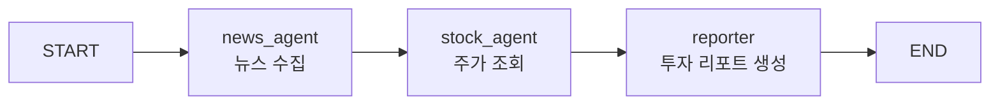
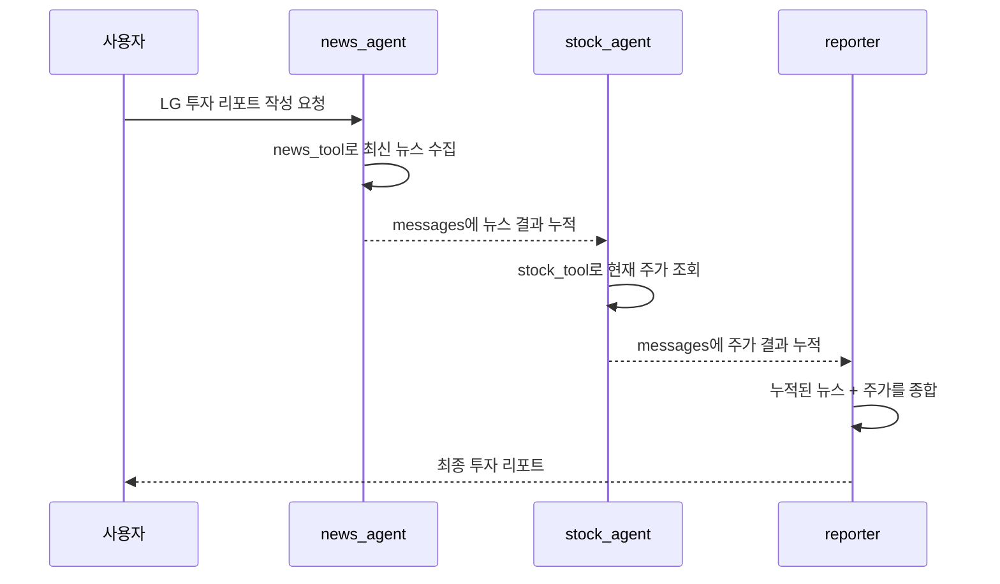
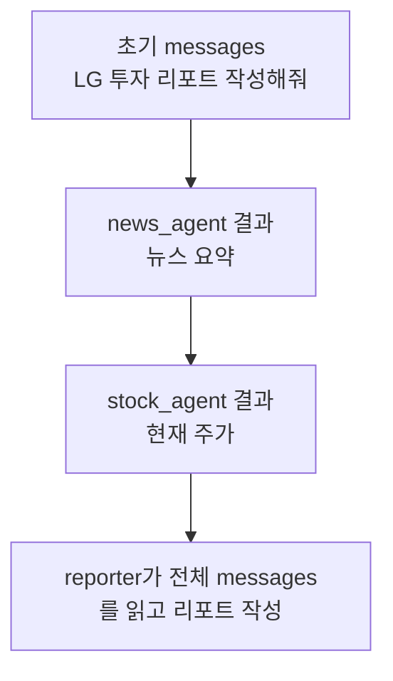
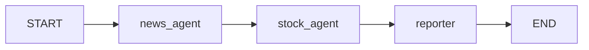
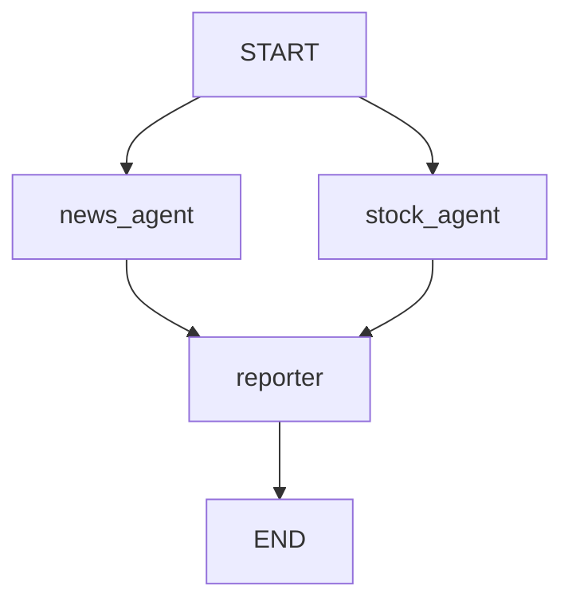

# Serial Agent Pipeline

## 정의

Serial Agent Pipeline은 여러 에이전트를 **정해진 순서대로 직렬 배치**해서 실행하는 멀티 에이전트 구조이다.

한 에이전트가 먼저 작업하고, 그 결과가 `State`에 누적된 뒤 다음 에이전트가 이어서 작업한다.



## 이번 실습 구조

이번 노트북의 직렬 배치 예시는 다음 구조이다.

```python
builder.add_edge(START, "news_agent")
builder.add_edge("news_agent", "stock_agent")
builder.add_edge("stock_agent", "reporter")
builder.add_edge("reporter", END)
```

실행 흐름:



## 중요한 코드 포인트

### 1. 에이전트도 노드가 될 수 있다

```python
news_agent = create_react_agent(
    llm,
    tools=[news_tool],
    prompt="너는 뉴스 수집 담당이다. 종목·기업 관련 최신 뉴스를 검색해 정리하라.",
)
```

`create_react_agent()`가 반환하는 것은 실행 가능한 LangGraph 객체이다.

따라서 일반 Python 함수뿐 아니라 agent 자체도 `add_node()`에 넣을 수 있다.

```python
builder.add_node("news_agent", news_agent)
builder.add_node("stock_agent", stock_agent)
```

이 말은 다음과 같다.

```text
노드 = 반드시 내가 직접 만든 함수만 되는 것이 아니다.
노드 = LangGraph가 실행할 수 있는 runnable이면 된다.
```

관련: [[LangGraph create_react_agent]], [[LangGraph Node]]

### 2. `messages`는 에이전트 사이의 전달 통로다

```python
class AgentState(TypedDict):
    messages: Annotated[Sequence[BaseMessage], add_messages]
```

`messages`는 각 에이전트가 만든 응답을 누적하는 공유 공간이다.

`add_messages`가 붙어 있기 때문에 각 노드가 반환한 새 메시지는 기존 메시지를 덮어쓰지 않고 뒤에 붙는다.



관련: [[LangGraph State]], [[LangGraph StateGraph]]

### 3. reporter는 에이전트가 아니라 일반 노드다

```python
def report_node(state: AgentState):
    collected = "\n\n".join(m.content for m in state["messages"])
    prompt = (
        "아래는 수집된 뉴스와 주가 정보다. 이를 종합해 투자 리포트를 작성하라.\n"
        "구성: ① 현재 주가 요약 ② 주요 뉴스 3줄 ③ 종합 코멘트 3줄\n\n"
        + collected
    )
    response = llm.invoke(prompt)
    return {"messages": [response]}
```

`report_node`는 도구를 고르는 agent가 아니다.

역할은 단순하다.

```text
앞 노드들이 messages에 쌓아둔 결과를 읽고
LLM으로 최종 리포트를 생성한다.
```

즉 `news_agent`, `stock_agent`는 각각 도구를 가진 하위 에이전트이고, `reporter`는 결과를 종합하는 워크플로우 노드이다.

## 직렬 배치의 장점

- 실행 순서가 명확하다.
- 앞 단계 결과를 뒤 단계가 참고할 수 있다.
- 디버깅이 쉽다.
- 단계별 책임이 분리된다.
- 투자 리포트처럼 "수집 → 조회 → 종합" 흐름에 잘 맞는다.

## 직렬 배치의 단점

- 앞 단계가 늦으면 전체가 늦어진다.
- 서로 독립적인 작업도 순서대로 실행되어 시간이 더 걸릴 수 있다.
- 앞 단계의 잘못된 결과가 뒤 단계에 영향을 준다.
- State에 messages가 계속 쌓여 컨텍스트가 길어질 수 있다.

## 병렬 배치와의 차이

직렬 배치:



병렬 배치:



| 구분 | 직렬 배치 | 병렬 배치 |
|---|---|---|
| 실행 순서 | 정해진 순서대로 실행 | 여러 노드가 동시에 시작 가능 |
| 적합한 경우 | 앞 결과가 뒤 작업에 필요할 때 | 작업들이 서로 독립적일 때 |
| 속도 | 느릴 수 있음 | 더 빠를 수 있음 |
| 디버깅 | 쉬움 | 합류 지점 관리 필요 |
| 예시 | 뉴스 수집 후 주가 조회 후 리포트 | 뉴스와 주가를 동시에 수집 후 리포트 |

## 코드 구현 차이

직렬과 병렬은 `tool`, `agent`, `State` 정의가 거의 같을 수 있다.

차이는 대부분 `add_edge()`에서 생긴다.

### 직렬 배치 코드

```python
builder.add_edge(START, "news_agent")
builder.add_edge("news_agent", "stock_agent")
builder.add_edge("stock_agent", "reporter")
builder.add_edge("reporter", END)
```

이 코드는 다음 뜻이다.

```text
START에서 news_agent만 먼저 실행한다.
news_agent가 끝나야 stock_agent가 실행된다.
stock_agent가 끝나야 reporter가 실행된다.
```

핵심은 `START`에서 나가는 edge가 하나라는 점이다.


### 병렬 배치 코드

```python
builder.add_edge(START, "news_agent")
builder.add_edge(START, "stock_agent")

builder.add_edge("news_agent", "reporter")
builder.add_edge("stock_agent", "reporter")
builder.add_edge("reporter", END)
```

이 코드는 다음 뜻이다.

```text
START에서 news_agent와 stock_agent가 둘 다 시작된다.
두 에이전트가 각각 결과를 messages에 추가한다.
reporter는 두 결과를 모아 최종 리포트를 만든다.
```

핵심은 `START`에서 나가는 edge가 두 개라는 점이다.


## 무엇이 같고 무엇이 다른가

같은 부분:

- `AgentState`
- `messages: Annotated[..., add_messages]`
- `stock_tool`
- `news_tool`
- `news_agent = create_react_agent(...)`
- `stock_agent = create_react_agent(...)`
- `report_node`
- `builder.add_node(...)`

다른 부분:

- `builder.add_edge(...)` 연결 방식
- 실행 순서
- reporter가 결과를 받는 타이밍

## 실행 순서 차이

직렬:

```text
사용자 요청
→ news_agent 실행
→ stock_agent 실행
→ reporter 실행
→ 최종 답변
```

병렬:

```text
사용자 요청
→ news_agent 실행
→ stock_agent 실행
→ 두 결과가 reporter로 합류
→ 최종 답변
```

병렬이라고 해서 코드 줄이 완전히 동시에 실행되는 느낌으로만 이해하면 안 된다.

핵심은 그래프 구조상 `news_agent`와 `stock_agent`가 서로의 결과를 기다리는 의존 관계가 없다는 것이다.

## 언제 쓰면 좋은가

- 각 단계가 이전 단계의 결과를 반드시 참고해야 할 때
- 업무 절차가 명확히 순서화되어 있을 때
- 에이전트 간 의존 관계를 단순하게 유지하고 싶을 때
- 수집, 분석, 작성처럼 파이프라인 구조가 자연스러울 때

## 한 줄 정리

> Serial Agent Pipeline은 여러 에이전트와 노드를 `add_edge()`로 일렬 연결해, 앞 단계의 메시지 결과를 뒤 단계가 이어받아 처리하게 만드는 LangGraph 멀티 에이전트 구조이다.

관련:

- [[Multi Agent]]
- [[Agent Graph]]
- [[LangGraph StateGraph]]
- [[LangGraph Edge]]
- [[LangGraph create_react_agent]]
- [[Parallel Agent Fan-out]]
