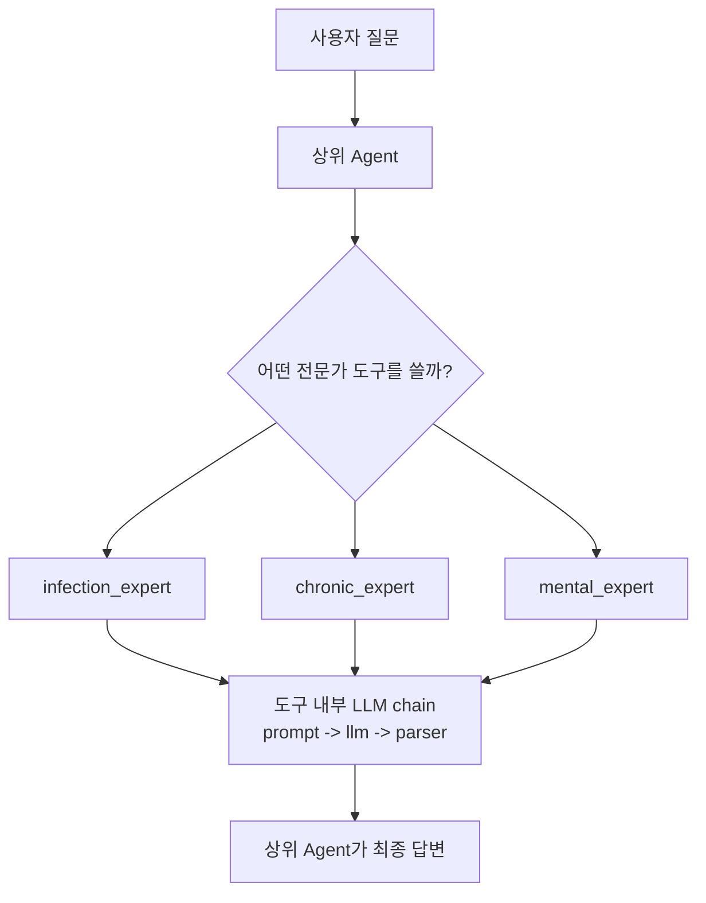
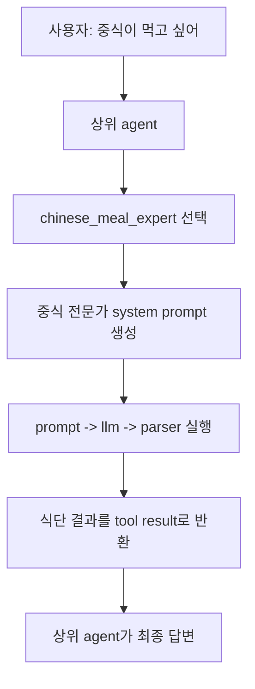
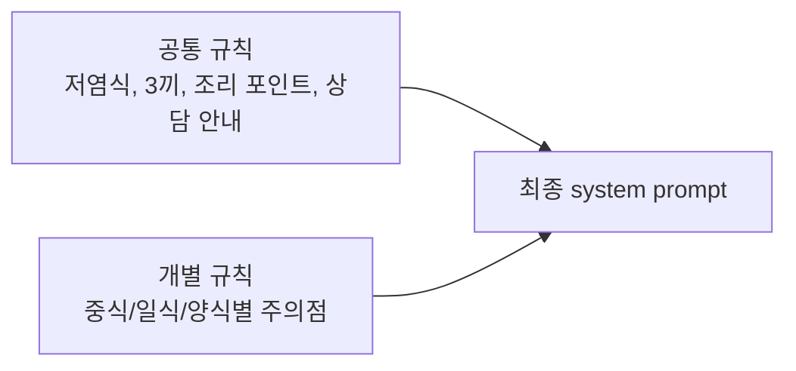
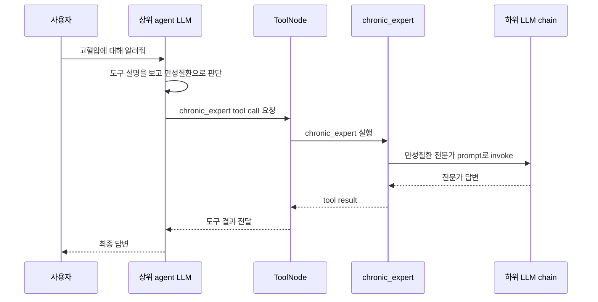

# Sub-LLM as Tool

## 정의

Sub-LLM as Tool은 특정 역할을 가진 LLM 호출 체인을 `@tool` 함수 안에 넣고, 상위 에이전트가 필요할 때 해당 하위 LLM을 도구처럼 호출하게 만드는 패턴이다.



## Agent as Tool과의 차이

[[Agent as Tool]]은 다른 에이전트 전체를 도구처럼 호출하는 패턴이다.

Sub-LLM as Tool은 그보다 단순하다. 도구 내부에 완전한 에이전트 루프가 있는 것이 아니라, 보통 `prompt | llm | parser` 같은 단발 LLM 체인이 들어 있다.

| 구분 | Sub-LLM as Tool | Agent as Tool |
|---|---|---|
| 내부 구조 | 단발 LLM chain | 별도 agent 또는 graph |
| 도구 내부 루프 | 보통 없음 | 있을 수 있음 |
| 사용 목적 | 전문가 프롬프트 분기 | 독립 워커 에이전트 호출 |
| 예시 | 감염성 질환 전문가 LLM | 리서치 에이전트, 코딩 에이전트 |

## 코드 구조

```python
llm = ChatOpenAI(model="gpt-4o-mini", temperature=0)
parser = StrOutputParser()
```

공통으로 사용할 LLM과 parser를 준비한다.

```python
@tool
def infection_expert(disease: str):
    """감염성 질환에 대해 물어볼 때 사용한다."""

    prompt = ChatPromptTemplate.from_messages([
        ("system", "너는 감염성 질환 전문가다. 치료와 조치를 간단히 설명하라."),
        ("human", "{disease}"),
    ])

    return (prompt | llm | parser).invoke({"disease": disease})
```

이 함수는 겉으로는 도구이지만, 내부에서는 별도의 전문가 프롬프트로 LLM을 다시 호출한다.

## 하위 LLM 도구 예시: 고혈압 식단 전문가

하위 LLM 도구는 질병 전문가뿐 아니라 식단, 법률 문서 요약, 코드 리뷰, 뉴스 분석처럼 역할이 분명한 작업에도 사용할 수 있다.

예를 들어 고혈압 환자의 식단을 중식, 일식, 양식으로 나누려면 각 식단 전문가를 도구로 만든다.

```python
@tool
def chinese_meal_expert(request: str):
    """고혈압 환자가 중식을 먹고 싶어 할 때, 저염 기준의 하루 3끼 중식 식단을 짜줄 때 사용한다."""

    prompt = build_meal_prompt(
        "중식",
        "볶음 요리는 기름과 소스를 줄이고, 채소, 두부, 살코기를 중심으로 구성해. "
    )
    return (prompt | llm | parser).invoke({"request": request})
```

겉으로 보면 `chinese_meal_expert`는 하나의 도구이다.

하지만 내부에서는 다음 일이 일어난다.



## 공통 프롬프트 재사용

하위 LLM 도구가 여러 개일 때는 프롬프트 문장이 많이 겹친다.

예시:

```text
고혈압 환자를 위한 저염 식단 전문가다.
아침, 점심, 저녁 3끼를 짜줘.
각 끼니마다 메뉴와 조리 포인트를 설명해.
마지막에 의료진 또는 영양사와 상담하라고 덧붙여.
```

이런 공통 문장은 상수나 함수로 묶는 것이 좋다.

```python
COMMON_OUTPUT_RULE = (
    "각 끼니마다 메뉴와 조리 포인트를 간단히 설명해. "
    "마지막에는 개인 질환 상태에 따라 의료진 또는 영양사와 상담하라는 문장을 짧게 덧붙여."
)

def build_meal_prompt(cuisine: str, cuisine_tip: str):
    return ChatPromptTemplate.from_messages([
        (
            "system",
            f"너는 고혈압 환자를 위한 저염 {cuisine} 식단 전문가다. "
            f"고혈압 환자가 먹을 수 있는 아침, 점심, 저녁 3끼 식단을 {cuisine} 스타일로 짜줘. "
            f"{cuisine_tip}"
            f"{COMMON_OUTPUT_RULE}"
        ),
        ("human", "사용자 요청: {request}"),
    ])
```

이렇게 하면 중식, 일식, 양식 도구는 차이점만 넘기면 된다.



중요한 점은 이 공통화가 LangGraph 문법은 아니라는 것이다. Python 코드 구조를 깔끔하게 만들어 프롬프트 유지보수를 쉽게 하는 방식이다.

## 실행 흐름

```python
mytools = [infection_expert, chronic_expert, mental_expert]
agent = create_react_agent(llm, mytools)
```

상위 agent는 세 개의 전문가 도구를 가진다.

```python
result = agent.invoke({"messages": "고혈압에 대해 알려줘"})
```

실행 흐름:



## 중요한 포인트

### 1. 상위 LLM과 하위 LLM은 역할이 다르다

상위 LLM:

```text
어떤 전문가 도구를 호출할지 결정한다.
```

하위 LLM:

```text
선택된 전문가 프롬프트에 맞춰 실제 내용을 생성한다.
```

### 2. 같은 모델을 써도 역할은 분리된다

코드에서는 상위 agent와 하위 전문가 도구들이 모두 같은 `llm` 객체를 사용한다.

```python
llm = ChatOpenAI(model="gpt-4o-mini", temperature=0)
```

하지만 프롬프트가 다르기 때문에 역할이 분리된다.

```text
상위 agent: 도구 선택자
infection_expert: 감염성 질환 전문가 프롬프트
chronic_expert: 만성질환 전문가 프롬프트
mental_expert: 정신건강 전문가 프롬프트
```

즉 물리적으로 모델이 3개인 것은 아니어도, 논리적으로는 역할이 다른 하위 LLM처럼 동작한다.

### 3. 도구 선택 기준은 docstring이다

상위 agent는 도구의 docstring을 보고 선택한다.

```python
"""감염성 질환에 대해 물어볼 때 사용한다."""
"""만성질환에 대해 물어볼 때 사용한다."""
"""정신건강에 대해 물어볼 때 사용한다."""
```

따라서 docstring이 부정확하면 상위 agent가 잘못된 전문가를 고를 수 있다.

## 장점

- 도메인별 프롬프트를 분리할 수 있다.
- 상위 agent는 라우팅과 최종 응답에 집중한다.
- 전문가별 응답 스타일을 다르게 만들 수 있다.
- 이후 실제 다른 모델로 교체하기 쉽다.

## 단점

- 상위 LLM의 도구 선택이 틀릴 수 있다.
- LLM 호출이 중첩되어 비용과 지연이 증가한다.
- 각 전문가 도구의 출력 형식이 들쭉날쭉하면 최종 답변 품질이 흔들린다.

## 신뢰성 높이는 방법

- 도구 docstring을 명확히 작성한다.
- 질병 카테고리가 중요하면 [[Intent Classification]]을 별도로 둔다.
- 전문가 도구의 출력 형식을 고정한다.
- 중요한 도메인에서는 선택 결과를 검증하거나 fallback을 둔다.

## 한 줄 정리

> Sub-LLM as Tool은 전문가 역할의 LLM 체인을 `@tool`로 감싸고, 상위 agent가 질문 의도에 맞는 하위 LLM 도구를 선택해 호출하게 만드는 패턴이다.

관련:

- [[Agent as Tool]]
- [[LLM Tool Selection]]
- [[Routing Workflow]]
- [[LangChain @tool]]
- [[Tool Calling]]
- [[LangGraph create_react_agent]]
- [[Prompt Engineering]]
