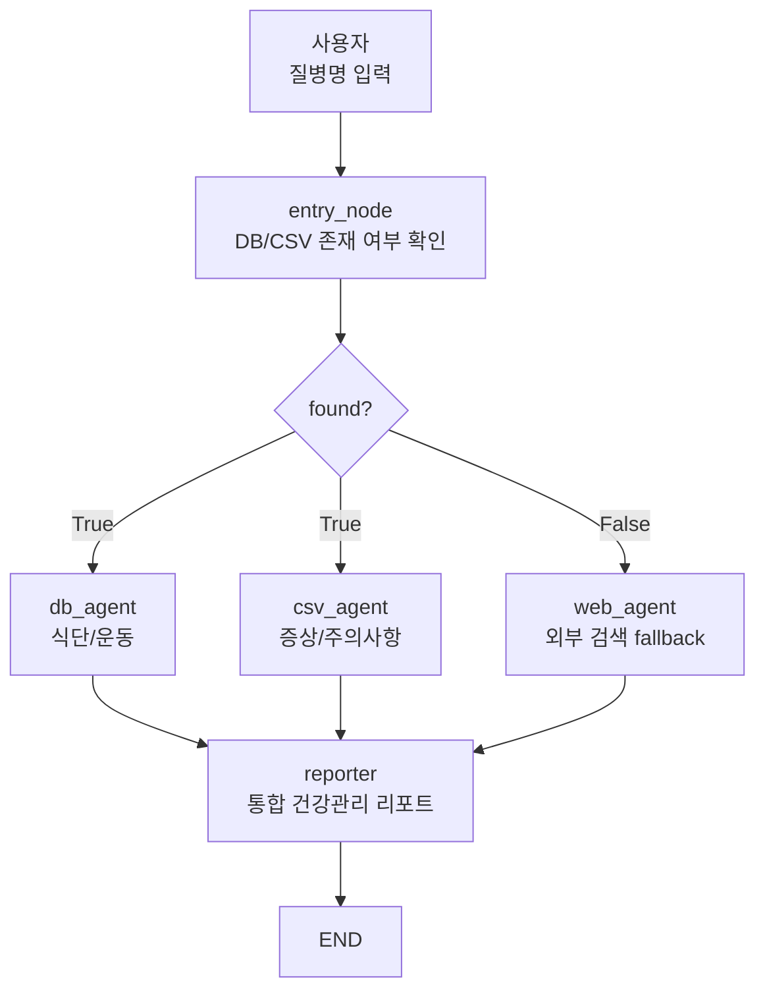
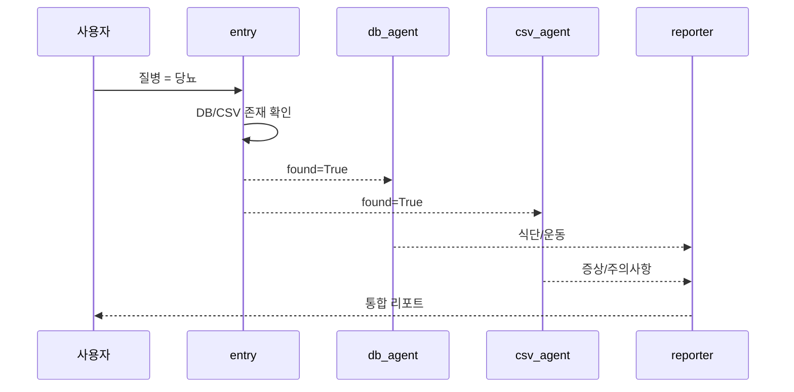
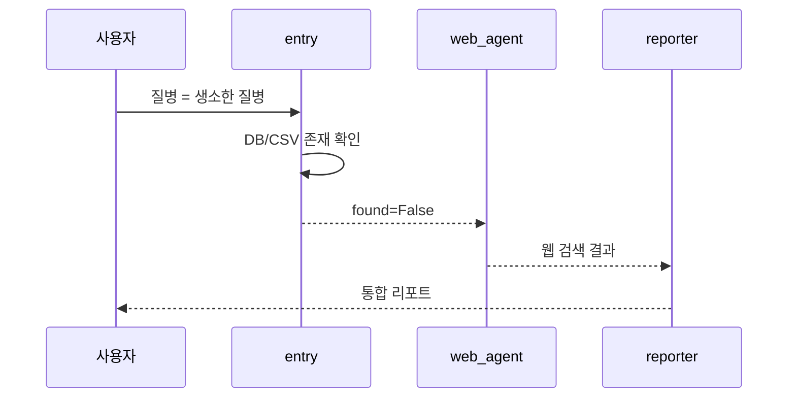

# 로컬 우선 정보 수집 MAS

- 로컬 우선 정보 수집 MAS = 내부 DB, CSV, 문서 같은 **신뢰 가능한 로컬 정보**를 먼저 확인하고, 없거나 부족할 때만 외부 웹 검색으로 보강하는 [[External Information MAS]] 패턴이다.
- 실습에서는 질병명을 입력받아 `disease.db`, `disease_info.csv`, 웹 검색을 조건부로 사용했다.
- 핵심은 **모든 질문을 곧바로 웹으로 보내지 않고, 로컬 지식 기반을 먼저 확인하는 것**이다.

## 전체 아키텍처



## 정보 출처별 역할 분리

| 노드 / 에이전트 | 정보 출처 | 역할 |
|---|---|---|
| `entry_node` | SQLite + CSV | 로컬에 질병 정보가 있는지 확인 |
| `db_agent` | `disease.db` | 권장 식단과 운동 조회 |
| `csv_agent` | `disease_info.csv` | 증상과 주의사항 조회 |
| `web_agent` | Tavily / Web | 로컬에 없을 때 외부 검색 |
| `reporter` | 수집된 messages | 최종 리포트 생성 |

## 로컬 데이터가 있을 때



- `당뇨`가 DB와 CSV에 있으면 웹 검색을 하지 않는다.
- 내부 정보가 충분하면 외부 검색 비용과 불확실성을 줄일 수 있다.

## 로컬 데이터가 없을 때



- 로컬 데이터가 없으면 [[Fallback]]으로 웹 검색을 사용한다.
- 이때 reporter는 웹 정보의 신뢰도와 출처를 보수적으로 다뤄야 한다.

## 코드에서 중요한 포인트

```python
def entry_node(state: AgentState):
    disease = state["disease"]
    ...
    return {"found": in_db or in_csv}
```

- `entry_node`는 답변을 만드는 노드가 아니라 **라우팅 판단에 필요한 state를 채우는 노드**다.

```python
def route(state: AgentState):
    if state["found"]:
        return ["db_agent", "csv_agent"]
    return ["web_agent"]
```

- 이 라우터는 [[LangGraph Conditional Fan-out]]이다.
- 로컬 정보가 있으면 두 agent를 동시에 실행한다.
- 로컬 정보가 없으면 웹 agent만 실행한다.

```python
collected = "\n\n".join(m.content for m in state["messages"])
```

- `reporter`는 여러 agent가 누적한 메시지를 읽어 최종 답변을 만든다.

## SQLite / CSV / Web의 차이

| 출처 | 장점 | 한계 |
|---|---|---|
| [[SQLite 데이터 소스|SQLite DB]] | 구조화된 조회, 정확한 키 검색 | DB에 없는 내용은 못 찾음 |
| CSV | 만들기 쉽고 실습에 적합 | 규모가 커지면 관리가 어려움 |
| Web | 최신 정보 가능 | 신뢰도·출처 검증 필요 |

## 운영 설계 감각

- 실습에서는 SQLite와 CSV를 mock 데이터로 썼다.
- 운영에서는 보통 PostgreSQL, MySQL, 문서 검색 시스템, 벡터 DB, 사내 API를 함께 쓴다.
- 의료·금융처럼 중요한 도메인에서는 웹 검색 결과를 그대로 믿지 말고, 출처 검증·안전 문구·사람 검토를 붙인다.
- 사용자 개인 정보나 내부 DB 내용을 외부 검색 프롬프트에 섞지 않도록 조심한다.

## 한 줄 정리

- 로컬 우선 정보 수집 MAS는 **내부 지식 기반을 먼저 보고, 없을 때만 외부 검색으로 fallback하는 멀티 에이전트 아키텍처**다.

## 관련

- [[External Information MAS]]
- [[LangGraph Conditional Fan-out]]
- [[Parallel Agent Fan-out]]
- [[Fallback]]
- [[Routing Workflow]]
- [[SQLite 데이터 소스]]
- [[RAG(Retrieval-Augmented Generation)]]
