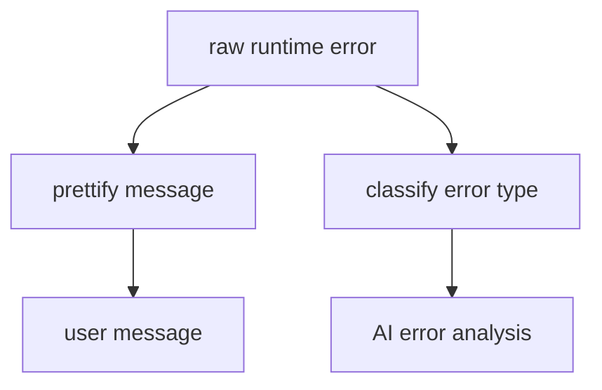

# AI Pipeline Error Normalization

AI Pipeline Error Normalization은 실행 중 발생한 원시 오류를 사용자가 이해할 수 있는 분석 오류로 바꾸는 과정이다.

데이터 분석 워크플로우에서는 R, Python, 브라우저 런타임, 네트워크 오류가 섞여 올라온다. 원문 오류를 그대로 보여주면 사용자는 무엇을 고쳐야 할지 알기 어렵다.

## 목적

- 중복 오류를 묶어 UI 노이즈를 줄인다.
- 원시 오류를 도메인 오류로 분류한다.
- 사용자에게 복구 방향을 알려준다.
- 이후 AI 오류 분석 카드가 이어질 수 있게 error type을 남긴다.

## 예시

| 원시 오류 | 사용자 메시지 |
|---|---|
| `undefined columns selected` | 선택한 컬럼을 데이터에서 찾을 수 없음 |
| `cannot open the connection` | 이전 블록의 RDS 결과 파일을 찾을 수 없음 |
| `contrasts can be applied only...` | 범주형 변수 레벨이 부족해 모델 학습 불가 |
| `y values must be 0 <= y <= 1` | 로지스틱 회귀 타깃이 0/1 이진이 아님 |

## 오류 분류

## 대표 error type

| error type | 의미 |
|---|---|
| `upstream_artifact_missing` | 선행 블록 산출물이 없음 |
| `column_mismatch` | 추천 컬럼과 실제 데이터 컬럼 불일치 |
| `invalid_option` | 필수 옵션 누락 또는 잘못된 값 |
| `unknown_runtime_error` | 분류되지 않은 런타임 오류 |

## dedupe

브라우저에서는 하나의 실패가 `console.error`, `window.error`, `unhandledrejection`으로 여러 번 들어올 수 있다.

중복 제거 기준:

- 같은 blockId
- 같은 error message
- 짧은 시간 창 안에 발생

## 한 줄 정리

AI Pipeline Error Normalization은 **기계가 뱉은 오류를 사용자가 고칠 수 있는 분석 문제로 번역하는 레이어**이다.

## 관련

- [[Observability]]
- [[Fallback]]
- [[AI Workflow 생성 파이프라인]]
- [[Guardrails]]
- [[Evaluation]]
