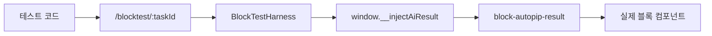

# AI Workflow 테스트 하니스

AI Workflow 테스트 하니스는 실제 애플리케이션 전체를 띄우지 않고 특정 블록이나 파이프라인 조각만 격리해서 검증하는 장치이다.

AI가 만든 payload는 조합이 많고 UI 렌더링까지 확인해야 하므로, 단위 테스트와 브라우저 테스트 사이에 가벼운 하니스가 있으면 회귀를 빨리 잡을 수 있다.

## 필요한 이유

- AI 응답은 구조가 복잡하고 케이스가 많다.
- 차트 블록은 실제 DOM 렌더링까지 확인해야 한다.
- 블록 lifecycle, EventBus, activated 훅 같은 UI 조건을 재현해야 한다.
- 전체 로그인/라우팅 흐름을 매번 거치면 테스트가 느리고 불안정하다.

## 하니스 구조

## 좋은 하니스 조건

- 실제 컴포넌트를 mount한다.
- 필요한 seed 데이터만 주입한다.
- 외부 로그인, 메뉴, 서버 상태는 제거한다.
- 에러를 `window.__blockError`처럼 테스트가 읽을 수 있는 곳에 노출한다.
- 준비 완료 신호를 둔다.

## 단위 테스트와의 차이

| 테스트 | 보는 것 |
|---|---|
| 단위 테스트 | 순수 함수, 정규화, 옵션 변환 |
| 하니스 | 블록 lifecycle, EventBus, DOM 렌더 |
| E2E | 전체 사용자 흐름 |

## 한 줄 정리

AI Workflow 테스트 하니스는 **AI payload가 실제 UI 블록에서 제대로 렌더링되는지 빠르게 확인하는 격리 실행 환경**이다.

## 관련

- [[Evaluation]]
- [[Observability]]
- [[AI Workflow 생성 파이프라인]]
- [[Agent 응답 정규화]]
