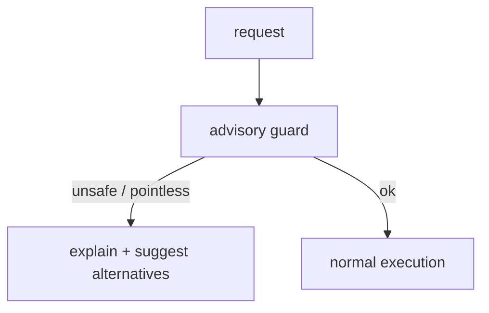

# Advisory Short-circuit

Advisory Short-circuit은 agent가 요청을 계속 실행하는 대신, 현재 상태에서 실행해도 의미가 없거나 위험하다고 판단되면 즉시 설명 응답으로 종료하는 패턴이다.

## 언제 필요한가

- 과거 실패 기록상 같은 선택을 반복할 가능성이 높을 때
- 데이터 조건상 요청한 작업이 성립하지 않을 때
- 사용자가 선택해야 하는 대안이 남아 있을 때
- 자동 수정하면 사용자의 분석 의도를 바꿔버릴 위험이 있을 때

## 예시

분류 문제에서 타깃 컬럼이 극단적으로 불균형해 어떤 train/test split에서도 한쪽 클래스가 사라진다면, agent가 학습 비율만 계속 바꾸는 것은 의미가 없다. 이 경우 실행을 반복하지 않고 "이 타깃은 부적합하며 다른 타깃이나 문제 유형을 선택해야 한다"고 안내하는 편이 낫다.

## 구조

## 설계 원칙

- 자동으로 의도를 바꾸지 않는다.
- 왜 실행하지 않는지 설명한다.
- 가능한 대안을 제시한다.
- 내부 오류처럼 보이지 않게 정상 응답으로 만든다.

관련: [[Negative Feedback Memory]], [[Response Builder Pattern]], [[Human-in-the-loop]]
