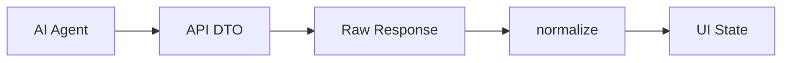

# Agent 응답 정규화

Agent 응답 정규화는 AI 서버, 백엔드, 프론트엔드 사이에서 조금씩 다른 응답 형태를 하나의 내부 스키마로 맞추는 과정이다.

[[Structured Output]]을 사용해도 운영 중에는 버전 차이, 레거시 응답, snake_case/camelCase 혼용이 생긴다. 정규화 레이어는 이 차이를 UI 바깥에서 흡수한다.

## 무엇을 정규화하나

| 대상 | 예 |
|---|---|
| 필드명 | `workflow_name` -> `workflowName` |
| 배열 기본값 | `blocks`가 없으면 `[]` |
| 선택 플래그 | `"true"`, `1`, `yes` -> `true` |
| 중첩 옵션 | `params` 객체를 top-level 옵션으로 펼침 |
| 레거시 텍스트 | `[대표]`, `[근거]` 형식에서 추천 객체 복원 |

## 위치



## 왜 프론트에도 필요할까

- 실제 UI는 API 버전이 바뀌는 동안 구버전 채팅 히스토리를 계속 보여줘야 한다.
- LLM 응답에는 사람이 읽는 설명과 기계가 읽는 필드가 같이 들어온다.
- 추천 카드, 캔버스 적용, undo/redo가 모두 같은 객체 구조를 기대해야 한다.

## 정규화 규칙 예

```javascript
normalized.workflowName =
  response.workflowName ||
  response.workflow_name ||
  response.proposalTitle ||
  ""

normalized.blocks = Array.isArray(response.blocks) ? response.blocks : []
```

## 대안 선택 정규화

여러 추천이 있을 때는 `alternatives`도 내부 스키마로 맞춰야 한다.

- 각 후보의 `workflowName`, `workflowDescription`, `blocks`, `links`를 보정한다.
- 선택이 필요한 응답이면 대표 `blocks`와 `links`를 비워 자동 적용을 막는다.
- 사용자가 카드를 선택한 뒤에만 캔버스 배치가 가능하게 한다.

## 옵션 정규화

AI가 블록 옵션을 다음처럼 내려줄 수 있다.

```json
[
  {"optName": "xVar", "optVal": "[\"age\"]"},
  {"optName": "params", "optVal": "{\"method\":\"mean\"}"}
]
```

프론트의 auto-pipeline은 보통 flat 객체를 기대한다.

```json
{
  "xVar": ["age"],
  "method": "mean"
}
```

따라서 옵션 정규화는 JSON 파싱, `params` 펼침, 배열 계약 보정까지 포함한다.

## 설계 팁

- 정규화 함수는 가능하면 순수 함수로 둔다.
- UI state mutation은 정규화 바깥에서 한다.
- snake_case/camelCase 매핑은 한 곳에 모은다.
- 레거시 fallback은 제거 일정을 정해두되, 히스토리 복원에는 유용하다.

## 한 줄 정리

Agent 응답 정규화는 **LLM과 UI 사이의 변덕을 하나의 안정된 계약으로 바꾸는 완충층**이다.

## 관련

- [[Structured Output]]
- [[Guardrails]]
- [[Workflow Action]]
- [[AI Workflow 생성 파이프라인]]
- [[라벨 정규화]]
