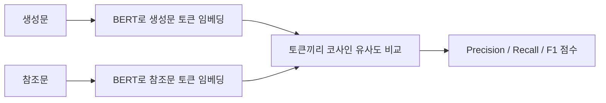

# BERTScore

- BERTScore = 생성문과 참조문을 [[BERT]] 계열 모델로 [[임베딩(Embedding)|임베딩]]한 뒤, **단어가 아니라 의미가 얼마나 비슷한지** 보는 평가 지표다.
- [[BLEU]]나 [[ROUGE]]처럼 단어 겹침만 보지 않기 때문에, 표현이 달라도 의미가 비슷하면 더 잘 잡아낸다.

## 왜 필요한가

문장 A:

```text
고혈압 환자는 나트륨 섭취를 줄이는 것이 좋다.
```

문장 B:

```text
혈압이 높은 사람은 짠 음식을 덜 먹는 편이 좋다.
```

- 단어는 많이 다르다.
- 하지만 의미는 거의 같다.
- BLEU/ROUGE는 낮게 나올 수 있지만, BERTScore는 더 높게 나올 수 있다.

## BERTScore의 작동 감각



- 생성문과 참조문을 각각 토큰으로 나눈다.
- 각 토큰을 BERT가 문맥을 고려한 벡터로 바꾼다.
- 벡터끼리 [[코사인 유사도]]를 계산한다.
- 가장 비슷한 토큰들을 매칭해 Precision, Recall, F1 형태의 점수를 만든다.

## BERT가 하는 역할

- BERT는 단어를 그냥 글자 그대로 보지 않는다.
- 앞뒤 문맥을 함께 보고 "이 단어가 이 문장에서 어떤 의미인지"를 벡터로 만든다.
- 그래서 `은행`이 금융기관인지, 강가인지 같은 문맥 차이를 반영할 수 있다.

## 좋은 점

- 같은 의미를 다른 표현으로 쓴 문장을 더 잘 평가한다.
- 번역, 요약, 질의응답에서 단어 겹침 지표보다 사람 판단과 더 가까운 경우가 많다.
- 한국어도 다국어 BERT 계열 모델을 쓰면 적용 가능하다.

## 한계

- 의미가 비슷해 보여도 사실관계가 반대인 문장을 완벽하게 잡지는 못한다.
- BERT 모델 선택에 따라 점수가 달라진다.
- 도메인 전문 문서에서는 일반 BERT 모델이 뉘앙스를 놓칠 수 있다.
- 그래서 중요한 평가는 [[LLM-as-Judge]] 또는 사람 평가와 함께 본다.

## BLEU, ROUGE와 비교

| 지표 | 보는 기준 | 장점 | 약점 |
|---|---|---|---|
| [[BLEU]] | 단어 조각 겹침 | 빠르고 단순 | 표현이 바뀌면 낮게 나옴 |
| [[ROUGE]] | 참조문 핵심 포함 | 요약 평가에 직관적 | 의미 바꿔 말하기에 약함 |
| BERTScore | 임베딩 의미 유사도 | 표현이 달라도 의미를 봄 | 모델 선택과 비용 영향 |

## 한 줄 정리

- BERTScore는 **정답 문장과 똑같이 썼는가**보다 **정답 문장과 비슷한 뜻인가**를 본다.
- 그 기반에는 [[BERT]], [[임베딩(Embedding)]], [[코사인 유사도]]가 있다.

## 관련

- [[텍스트 생성 평가 지표]]
- [[BERT]]
- [[임베딩(Embedding)]]
- [[코사인 유사도]]
- [[BLEU]]
- [[ROUGE]]
- [[LLM-as-Judge]]
