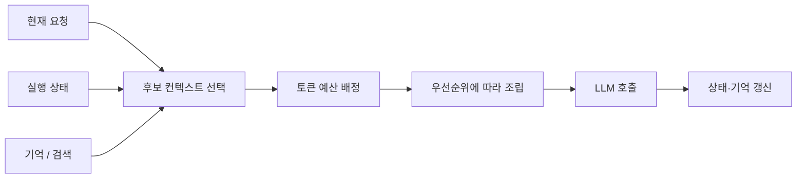

# Context Engineering

Context Engineering은 LLM에 넣을 정보를 많이 모으는 일이 아니라, **현재 판단에 필요한 정보만 올바른 우선순위와 형식으로 제공하는 설계**다. [[Prompt Engineering]]이 지시 문장을 다듬는 일이라면, Context Engineering은 지시·상태·기억·검색 결과·도구 결과를 선택하고 수명 주기를 관리하는 일이다.

## 컨텍스트의 구성

| 종류 | 예시 | 관리 원칙 |
|---|---|---|
| 지시 | 역할, 금지 규칙, 출력 형식 | 가장 안정적이고 짧게 유지한다. |
| 현재 상태 | 사용자 요청, 작업 단계, 이미 수행한 행동 | 매 턴 최신 값으로 갱신한다. |
| 지식 | [[RAG(Retrieval-Augmented Generation)\|검색 문서]], 정책, 데이터 | 관련성과 출처를 기준으로 선별한다. |
| 기억 | 사용자 선호, 이전 결정 | 재사용 가치와 동의 범위를 확인한다. |
| 실행 결과 | 도구 반환값, 오류, 중간 산출물 | 구조화하고 필요한 요약만 남긴다. |

`모든 대화 이력 + 모든 문서`를 넣는 것은 Context Engineering이 아니다. 관련 없는 정보는 토큰 비용뿐 아니라 모델의 주의력을 분산시켜, 핵심 지시와 근거를 놓치게 한다.

## 설계 순서

1. **판단에 필요한 질문을 정의한다.** 지금 답변·계획·도구 실행 중 무엇을 결정하는가를 먼저 정한다.
2. **후보를 수집하고 필터링한다.** 검색 결과, 대화 이력, 장기 기억을 모두 후보로 보고 권한·최신성·관련성으로 거른다.
3. **토큰 예산을 나눈다.** 시스템 지시, 현재 작업 상태, 근거 문서, 응답 여유분의 상한을 각각 둔다.
4. **압축하되 원문 경로를 남긴다.** 요약은 탐색용으로 사용하고, 중요한 사실은 원문·출처로 되돌아갈 수 있게 한다.
5. **호출 후 폐기·갱신한다.** 임시 도구 결과를 장기 기억으로 무단 승격하지 않는다.

## 우선순위와 충돌

컨텍스트는 신뢰도가 같지 않다. 일반적으로 시스템 정책과 검증된 현재 상태는 사용자 제공 문서나 모델이 만든 요약보다 우선한다. 외부 문서가 "이전 지시를 무시하라"고 해도 그것은 데이터이지 지시가 아니다. 이 구분은 [[Guardrails]]의 프롬프트 인젝션 방어와 연결된다.

또한 오래된 기억이 최신 사용자 요청을 덮어쓰면 안 된다. 기억에는 기록 시각, 출처, 사용자·세션 범위를 저장하고, 최신 명시 요청과 충돌하면 보조 신호로만 쓴다.

## 압축 전략

- **최근 N개 메시지**: 대화의 즉시 맥락이 중요한 경우.
- **작업 요약**: 긴 대화에서 결정·미결 항목·제약만 보존하는 경우.
- **검색 기반 기억**: 현재 질문과 관련한 장기 사실만 가져오는 경우.
- **구조화 상태**: 자유 텍스트 대신 계획, 완료 단계, 오류를 필드로 보존하는 경우.

요약을 다시 요약하는 과정은 사실을 잃기 쉽다. 원문, 요약, 원문 위치를 함께 보관하고 중요한 행동 전에는 원문을 재확인한다.

## 점검 질문

- 이 정보가 없으면 현재 결정이 실제로 달라지는가?
- 최신성·권한·출처를 확인했는가?
- 모델이 데이터와 지시를 혼동할 여지가 있는가?
- 컨텍스트 예산을 넘었을 때 무엇을 줄이고 무엇을 보존하는가?
- 선택된 근거와 제외된 이유를 [[Observability|추적]]할 수 있는가?

## 관련

- [[Prompt Context Builder]]
- [[Prompt Caching]]
- [[Memory]]
- [[RAG(Retrieval-Augmented Generation)]]
- [[Structured Output]]
- [[Guardrails]]
- [[Grounded Generation]]
