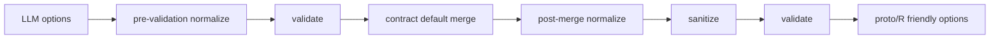

# Contract Guardrail Pipeline

Contract Guardrail Pipeline은 AI가 만든 블록 옵션을 실행 가능한 옵션으로 다듬고, 계약 위반을 검증하는 순서이다.

프로젝트의 흐름은 대략 다음과 같다.

## 단계별 책임

| 단계 | 책임 |
|---|---|
| [[Pre-validation Normalizer]] | 검증 가능한 형태로 정리 |
| validate | 계약 위반 탐지 |
| default merge | 누락된 기본 옵션 채움 |
| [[Post-merge Normalizer]] | default까지 합쳐진 최종 옵션 보정 |
| sanitize | contract에 없는 위험/불필요 키 제거 |
| advisory | 경고를 reasoning에 첨부 |

## blocking과 advisory

- blocking: 실행을 막아야 하는 위반
- warning/advisory: 실행은 가능하지만 사용자에게 알려야 하는 주의사항
- structural blocking: 옵션 추천만으로 고칠 수 없으면 경고로 내려보낼 수 있다

## 한 줄 정리

Contract Guardrail Pipeline은 **LLM 옵션을 계약 기준으로 정규화, 기본값 병합, 검증, 경고 첨부까지 처리하는 안전 파이프라인**이다.

## 관련

- [[Guardrails]]
- [[Block Contract]]
- [[Configuration Merge Pipeline]]
- [[AI Pipeline Error Normalization]]
