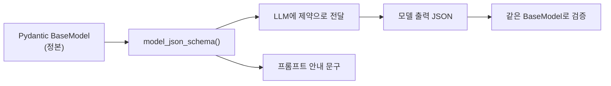

# JSON Schema

- JSON Schema는 **JSON이 어떤 모양이어야 하는지를 JSON으로 적은 것**이다. 언어·프레임워크 경계를 넘는 공용 계약 형식이다.
- LLM에게는 이게 **출력 제약**으로 전달된다 ([[with_structured_output]]의 `method="json_schema"`).

## 모양

```json
{
  "type": "object",
  "properties": {
    "intent": {"type": "string", "enum": ["analysis", "chat", "modify"]},
    "confidence": {"type": "number", "minimum": 0, "maximum": 1},
    "blocks": {"type": "array", "items": {"type": "string"}}
  },
  "required": ["intent", "confidence"],
  "additionalProperties": false
}
```

| 키워드 | 뜻 |
|---|---|
| `type` | object / array / string / number / boolean / null |
| `properties` | 객체의 필드별 스키마 |
| `required` | 반드시 있어야 하는 필드 |
| `enum` | 허용값 목록 — [[Literal]]이 여기로 변환된다 |
| `additionalProperties: false` | 선언 안 된 필드 금지 — Pydantic의 `extra="forbid"` |
| `minimum` / `maxLength` / `pattern` | 값 제약 |
| `$ref` / `$defs` | 중첩 모델 참조 |

## Pydantic이 만들어 준다

```python
schema_dict = RequestClassification.model_json_schema()
```

**손으로 JSON Schema를 쓰지 않는다.** [[Pydantic]] 모델이 정본이고, JSON Schema는 그 투영이다. 정본이 둘이 되면 반드시 어긋난다.



## 프롬프트에 겹쳐 쓰기

```python
def overlay_model_json_schema(...):
    """model_json_schema 결과에 활성 원장 문구를 입힌다. drift는 warning으로 남긴다."""
```

스키마를 제약으로 주는 것과, **사람이 읽을 설명을 프롬프트에 넣는 것**은 다른 일이다. 둘을 따로 관리하면 어긋나므로, 같은 스키마에서 파생시키고 **어긋나면(drift) 경고를 남긴다.**

## 설계 주의

- **깊이 3~4를 넘기지 않는다.** 중첩이 깊으면 [[sLLM(소형 LLM) 운용|작은 모델]]의 준수율이 급락한다. 평탄화가 낫다.
- **`description`을 반드시 채운다.** 필드 이름만으로 모델이 의미를 추측한다. `Field(description=...)`이 그대로 스키마에 실린다.
- **enum은 ASCII로.** 한글 enum 값은 모델에 따라 불안정하다. 표시용 한글은 코드에서 매핑한다.
- **`additionalProperties: false`는 강력하지만** 일부 provider가 지원하지 않는다. 검증 단계에서 한 번 더 막는다.

## 한 줄 정리

JSON Schema는 **경계를 넘는 계약 형식**이고, Pydantic 모델을 정본으로 두고 항상 거기서 생성한다.

## 관련

- [[Pydantic]]
- [[Pydantic v2 메서드 사전]]
- [[Structured Output]]
- [[with_structured_output]]
- [[Structured Output 정규화]]
- [[Literal]]
- [[Block Contract]]
- [[json.loads]]
