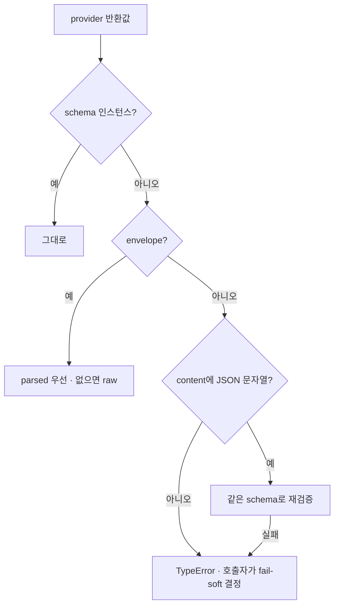

# Structured Output 정규화

- [[with_structured_output]]이 **항상 스키마 인스턴스를 돌려주지 않는다.** provider·모델·버전에 따라 반환 모양이 최소 네 가지다.
- 이 경계가 없으면 **유효한 모델 출력이 ValidationError로 버려진다** — 토큰을 쓰고도 [[Fail-soft]] 경로로 빠진다.

## 들어오는 네 가지 모양

| 모양 | 언제 |
|---|---|
| `Schema` 인스턴스 | 정상 |
| 다른 `BaseModel` | 래퍼가 감싼 경우 |
| envelope dict `{raw, parsed, parsing_error}` | `include_raw=True` |
| message dict / `AIMessage` — `content`에 JSON 문자열 | [[Ollama]]가 파싱을 건너뛴 경우 |

## 정규화 함수

```python
def coerce_structured_output(raw: object, schema: type[ModelT]) -> ModelT:
    """structured output의 provider별 반환 모양을 schema 인스턴스로 정규화한다."""
    if isinstance(raw, schema):
        return raw
    if isinstance(raw, BaseModel):
        raw = raw.model_dump()
    if isinstance(raw, dict):
        if _is_include_raw_envelope(raw):
            parsed = raw.get("parsed")
            if parsed is not None:
                return coerce_structured_output(parsed, schema)
            return coerce_structured_output(raw.get("raw"), schema)
        try:
            return schema.model_validate(raw)
        except ValidationError:
            # 파싱되지 않은 message envelope — content의 JSON 본문을 다시 검증
            content = raw.get("content")
            if isinstance(content, str) and content.strip():
                normalized, _ = canonicalize_missing_json_values(content)
                return schema.model_validate_json(normalized)
            raise
    content = getattr(raw, "content", None)
    if isinstance(content, str) and content.strip():
        normalized, _ = canonicalize_missing_json_values(content)
        return schema.model_validate_json(normalized)
    raise TypeError("structured output이 schema 인스턴스, dict, JSON content 중 어느 모양도 아님")
```

[[Pydantic v2 메서드 사전|model_validate]]와 `model_validate_json`을 나눠 쓰는 게 핵심이다. 앞은 dict를, 뒤는 **JSON 문자열**을 받는다.

## 지켜야 할 선 — 의미를 보정하지 않는다

> 의미를 보정하지 않는다. schema 필드 검증에 실패한 envelope의 `content` JSON을 **같은 schema로 다시 검증할 뿐**이며, 그래도 안 맞으면 원래 예외를 그대로 낸다.



**허용되는 것**: 모양(shape) 정규화 — 껍데기를 벗겨 같은 스키마로 다시 검증.
**금지되는 것**: 값 추측 — 빠진 필드 채우기, 정규식으로 값 뽑기, 기본값으로 대체.

정규식으로 억지로 값을 만들어 내면 **모델이 안 한 판단을 코드가 한 것**이 된다. 그게 실행을 유발하면 원인 추적이 불가능해진다 ([[Guardrails]]).

## 진단 정보를 남긴다

```python
raise ValueError(
    "structured output provider envelope rejected"
    f": parser={error_type or 'unknown'}"
    f": detail={error_text or '<empty>'}"
    f": raw_content_chars={diagnostics['raw_content_chars']}"
    f": raw_content_sha256={diagnostics['raw_content_sha256']}"
) from exc
```

원문을 통째로 로그에 남기지 않고 **길이 + [[hashlib과 결정적 ID|sha256]]** 만 남긴다. 같은 실패가 반복되는지는 해시로 알 수 있고, 민감 정보는 안 남는다.

## 한 줄 정리

정규화는 **모양만 통일하고 의미는 절대 만들지 않는 경계**다. 실패는 진단 가능한 형태로 호출자에게 넘긴다.

## 관련

- [[with_structured_output]]
- [[Structured Output]]
- [[Pydantic v2 메서드 사전]]
- [[JSON Schema]]
- [[Ollama]]
- [[Fail-soft]]
- [[Guardrails]]
- [[AI Pipeline Error Normalization]]
- [[hashlib과 결정적 ID]]
