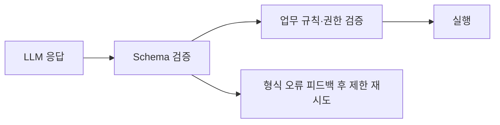

- Structured Output = [[LLM(Large Language Model)]]에게 **자유 텍스트가 아닌 정해진 스키마(JSON, Pydantic)에 맞는 출력**을 요청하고, 응답을 검증 가능한 데이터로 받는 기능.
- [[AI Agent|에이전트]]에서 [[Tool Calling]] 다음으로 자주 쓰는 기능 — 분류, 추출, 라우팅, 평가의 안정성이 크게 올라간다.

## 왜 자유 텍스트는 위험한가

```python
# 안 좋음
resp = llm.invoke("이메일에서 사람 이름과 회사명을 뽑아줘")
# 결과 예: "이름: 김철수\n회사: ABC"  ← 형식이 매번 다름, 파싱 깨짐
```

- 형식이 한 글자라도 다르면 파싱 실패.
- 사용자 LLM이 친절한 인사말을 덧붙이면 깨진다.
- production 재현성·테스트가 어렵다.

## OpenAI Structured Output

```python
from pydantic import BaseModel

class Person(BaseModel):
    name: str
    company: str

resp = client.beta.chat.completions.parse(
    model="gpt-4o-mini",
    messages=[{"role":"user", "content": text}],
    response_format=Person,
)
person: Person = resp.choices[0].message.parsed   # 이미 검증된 객체
```

- 모델이 JSON Schema를 따르도록 디코딩 단계에서 강제 → 100% 형식 보장.

## Anthropic — Tool Use로 우회

```python
# 도구 하나만 등록하고 강제 호출
tools = [{
    "name": "extract_person",
    "input_schema": Person.model_json_schema(),
    "description": "사람 정보 추출",
}]
resp = client.messages.create(
    model="claude-sonnet-4-6",
    messages=[...],
    tools=tools,
    tool_choice={"type": "tool", "name": "extract_person"},
)
person = Person(**resp.content[0].input)
```

## LangChain 통일 인터페이스

```python
from langchain_openai import ChatOpenAI

structured = ChatOpenAI(model="gpt-4o-mini").with_structured_output(Person)
person = structured.invoke(text)
```

- 공급자가 무엇이든 같은 API. [[LLM Provider 추상화]]의 한 측면.

## Provider native와 Tool 전략

LangChain은 모델·공급자가 지원하면 provider-native structured output을 우선 사용할 수 있고, 그렇지 않으면 tool calling으로 같은 스키마를 강제한다.

| 방식 | 장점 | 주의점 |
|---|---|---|
| Provider native | 제공자가 JSON Schema 제약을 직접 적용 | 모델·공급자 기능 차이를 확인해야 한다. |
| Tool strategy | tool calling을 지원하는 많은 모델에서 동작 | 도구 호출 loop와 오류 메시지가 대화에 들어간다. |
| JSON mode | 유효 JSON 생성에 집중 | 스키마·의미 검증은 애플리케이션 책임이다. |

스키마 타입도 목적에 맞춰 고른다.

- [[Pydantic]]: runtime validation, 범위 제한, validator가 필요할 때
- [[TypedDict]]: 가벼운 형태 선언만 필요할 때
- dataclass: 단순 데이터 구조가 필요할 때
- JSON Schema: 언어·프레임워크 경계에서 공유할 때

## 활용 시나리오

| 시나리오 | 출력 스키마 |
|---------|-------------|
| 의도 분류 | `Literal["refund", "shipping", "general"]` |
| 엔티티 추출 | `list[Entity]` |
| 평가 채점 ([[LLM-as-Judge]]) | `Judgement(score: int, reason: str)` |
| 계획 ([[Planning]]) | `Plan(steps: list[str])` |
| 라우팅 결정 ([[Supervisor 패턴]]) | `Route(next: Literal["a","b","c"])` |

## 형식 검증과 의미 검증은 다르다

유효한 Pydantic 객체가 곧 올바른 업무 판단을 뜻하지는 않는다. `intent="delete"`가 스키마에 맞아도 실제 사용자 의도가 삭제인지는 별도 분류·정책·근거 검증이 필요하다.



Structured Output은 자유 텍스트 파싱 오류를 줄여 주지만 [[Guardrails]]나 [[Contract Guardrail Pipeline]]을 대체하지 않는다.

## JSON mode vs Structured Output

- **JSON mode** — "JSON으로만 응답해라" 라는 약한 제약. 스키마 보장 X.
- **Structured Output** — 제공자 또는 tool strategy가 스키마 준수를 돕고, 파싱 결과를 검증한다.
- 가능하면 항상 Structured Output 사용.

## 실패 복구 전략

1. schema violation을 필드·제약 단위의 짧은 오류로 모델에 돌려준다.
2. 형식 오류에만 제한된 횟수로 재시도한다.
3. 권한 오류, 계약 위반, 외부 API 오류는 같은 프롬프트 재시도로 해결되지 않으므로 별도 경로로 보낸다.
4. raw 응답은 디버그용으로 보존하되, 파싱 실패 텍스트를 정규식으로 억지 실행값으로 바꾸지 않는다.
5. 반드시 fallback이 필요하다면 안전한 기본 라벨, 사용자 확인, 또는 fail-closed를 선택한다.

특히 복구된 값이 도구 실행을 유발한다면 confidence·출처·복구 사유를 함께 남긴다.

## 흔한 함정

- **enum 값에 한글** — 일부 모델은 ASCII enum이 더 안정적.
- **너무 복잡한 중첩 스키마** — 깊이 3~4 이상은 정확도가 떨어진다. 평탄화 권장.
- **Optional 필드 남발** — 모델이 비울지 채울지 헷갈림. 가능하면 default 값 부여.
- **description을 안 채움** — 필드 이름만으로 모델이 의미를 추측. `Field(description=...)`을 적자.

## 관련

- [[Pydantic]] — 스키마 정의 표준.
- [[Tool Calling]] — 내부적으로 같은 메커니즘.
- [[Intent Classification]] · [[Planning]] · [[LLM-as-Judge]] — 대표 활용처.
- [[Contract Guardrail Pipeline]]
- [[Guardrails]]

## 공식 문서

- [LangChain Structured Output](https://docs.langchain.com/oss/python/langchain/structured-output)
