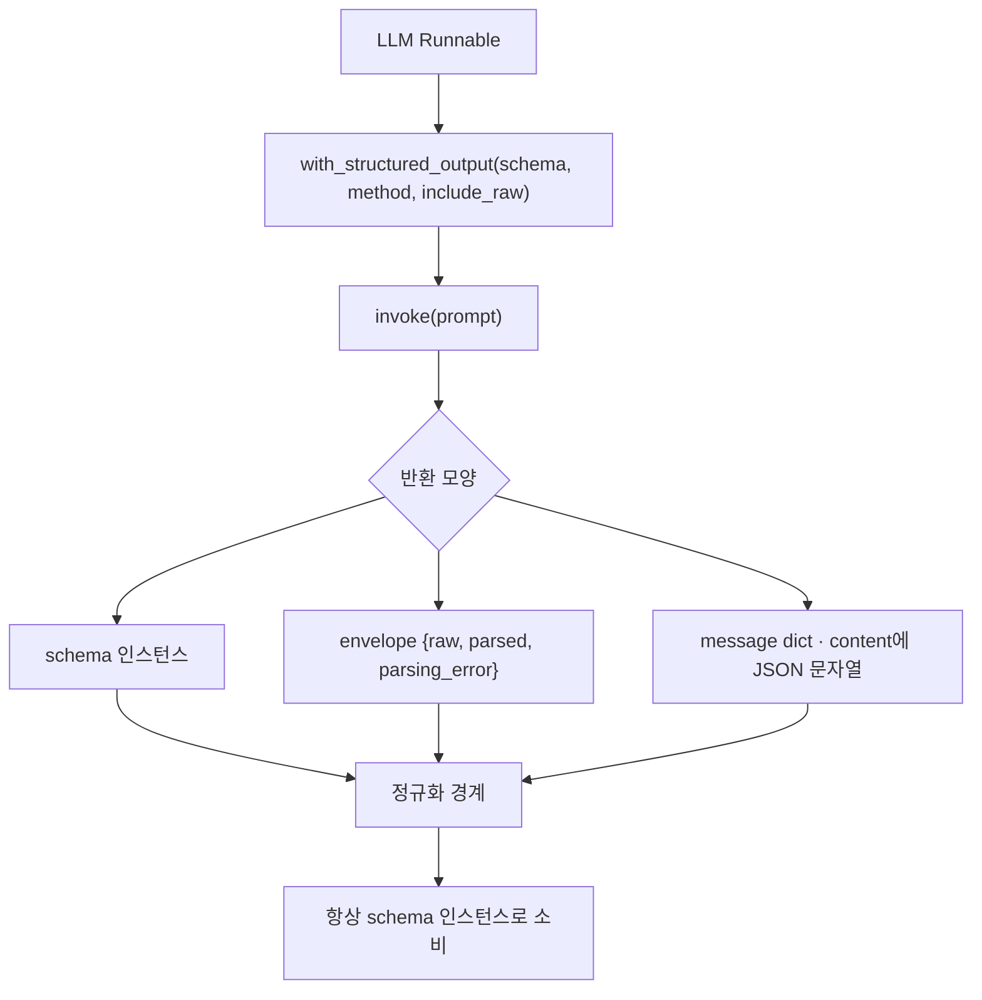

# with_structured_output

- [[LangChain]]이 [[Structured Output]]을 거는 표준 메서드다. LLM Runnable을 **스키마를 지키는 Runnable로 감싼다.**

```python
structured = llm.with_structured_output(RequestClassification)
result = structured.invoke(prompt)      # RequestClassification 인스턴스
```

## method 인자 — provider마다 다르게 준다

```python
def _with_structured_output(llm, schema, *, provider: str):
    """선택한 provider 안에서만 structured output 방식을 적용한다."""
    if provider == "ollama":
        return llm.with_structured_output(schema, method="json_schema")
    return llm.with_structured_output(schema)
```

| method | 강제 수준 |
|---|---|
| `json_mode` | **JSON 문법만** 강제. 필드 모양은 프롬프트 지시에 의존 |
| `json_schema` | 실제 [[JSON Schema]]를 런타임에 전달 → 생성 단계부터 제약 |
| `function_calling` | tool calling으로 우회 ([[Tool Calling]]) |

[[Ollama]]에서 `json_mode`를 쓰면 중첩 객체(`target`, `features`)가 문자열 스키마를 통과하지 못해 raw 재호출로 빠지는 게 실측됐다. 그래서 **같은 provider 안에서 `json_schema`로 올려** 생성부터 소비자 계약으로 제한한다.

## include_raw — 원본을 같이 받기

```python
with_structured_output = getattr(llm, "with_structured_output", None)
if callable(with_structured_output):
    try:
        return with_structured_output(schema, include_raw=True)
    except TypeError:
        return with_structured_output(schema)
```

`include_raw=True`면 결과가 **envelope**로 온다.

```python
{"raw": AIMessage(...), "parsed": SchemaInstance | None, "parsing_error": Exception | None}
```

- 파싱이 실패해도 **원본을 볼 수 있다.** 진단과 [[Structured Output 정규화|복구]]에 필수다.
- 모든 구현이 이 인자를 받지는 않으므로 `TypeError`로 폴백한다. 이게 [[LLM Provider 추상화]]의 현실적인 모습이다.



## 래핑은 전파돼야 한다

```python
class CountedLlmRunnable:
    def with_structured_output(self, *args, **kwargs) -> "CountedLlmRunnable":
        return CountedLlmRunnable(self._inner.with_structured_output(*args, **kwargs))
```

관측·예산 래퍼가 LLM을 감싸고 있을 때, `with_structured_output`이 **속 알맹이를 벗겨 내면 계측이 끊긴다.** 파생 Runnable도 같은 래퍼로 다시 감싸야 호출 수가 맞는다 ([[LLM 호출 원장과 예산]], [[Tool Observability Wrapping]]).

## 한 줄 정리

`with_structured_output`은 **스키마를 지키는 Runnable을 만드는 것**이고, method 선택과 include_raw 처리, 래퍼 전파가 실무의 세 지점이다.

## 관련

- [[Structured Output]]
- [[Structured Output 정규화]]
- [[JSON Schema]]
- [[Pydantic]]
- [[Pydantic v2 메서드 사전]]
- [[LangChain]]
- [[Ollama]]
- [[LLM 호출 원장과 예산]]
