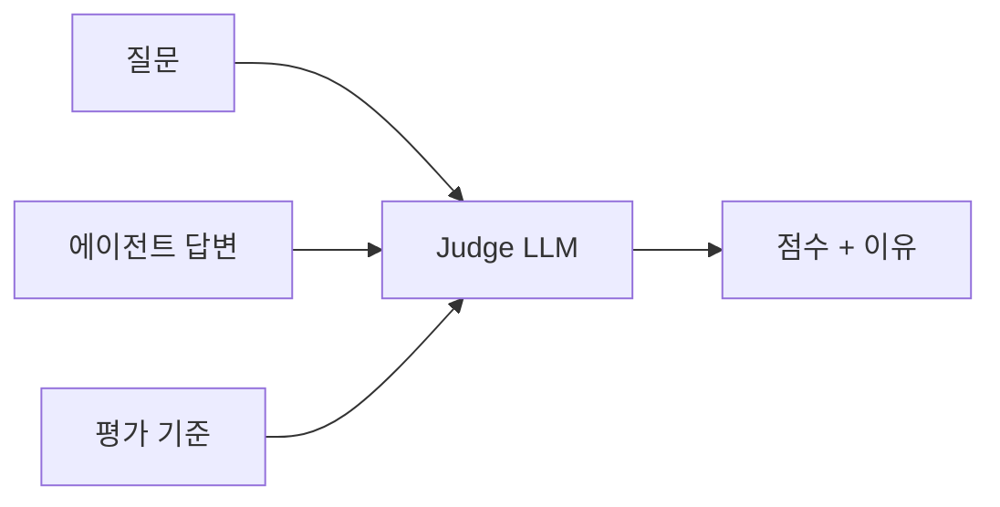

- Evaluation = [[AI Agent|에이전트]]가 **얼마나 잘 동작하는지 체계적으로 측정**하는 절차. 에이전트는 LLM·도구·프롬프트의 비결정성 때문에 "테스트는 됐는데 운영에선 안 된다"가 일상이라, 평가 루프 없이는 운영이 무너진다.
- 평가 루프는 보통 3계층으로 나눈다: **Inner Loop**(개발자) → **Outer Loop**(릴리즈) → **Production Loop**(운영).

## 왜 어려운가 — 4가지 도전

| # | 어려움 | 의미 |
|---|--------|------|
| ① | 비결정성 | 같은 입력에 다른 출력. 단위 테스트로 못 잡음 |
| ② | 잘못된 도구/파라미터 | 도구는 맞는데 인자가 틀린 케이스가 많음 |
| ③ | "더 나음" 측정 곤란 | 프롬프트 한 글자 차이도 결과를 바꿈 |
| ④ | 자동 회귀 | 모델·프롬프트·도구 교체 때마다 회귀 가능 |

## 3가지 평가 루프

### Inner Loop — 개발자 노트북

- 개발 중 즉시 피드백.
- **[[ReAct 패턴]] / [[Tool Calling]] trajectory 확인** + 빠른 회귀 테스트.
- 도구: `pytest`, [[LangChain]], [[LangSmith]], Strands Evaluations.

### Outer Loop — 릴리즈 전 회귀

- 데이터셋(수십~수백 시나리오)에 대해 일괄 평가.
- 변경 전/후 점수를 비교하고 **A/B 테스트**.
- 도구: AgentCore Evaluation, RAGAS, DeepEval, [[LangSmith]] eval.

### Production Loop — 운영 모니터링

- 실시간 사용자 트래픽 샘플링 → 자동 평가.
- 회귀가 감지되면 알림 / 롤백.
- 도구: [[Observability]] 시스템 + 자동 evaluator.

## 평가 방식 3가지

### 1. Code-based Evaluator

```python
def eval_exact_match(answer, expected):
    return 1.0 if answer.strip() == expected.strip() else 0.0
```

- 정답이 명확한 경우 (분류, 수식 결과).
- 빠르고 결정론적.

### 2. [[LLM-as-Judge]]

```python
prompt = f"질문: {q}\n답변: {a}\n참고: {ref}\n0~10으로 평가하고 이유를 적어라."
score = llm.invoke(prompt)
```

- 자유 형식 답변에 흔히 씀. 빠르고 유연하지만 편향·일관성 문제.

### 3. Human Evaluation

- 가장 정확하지만 비싸고 느림.
- Inner Loop의 골든 데이터 수집용으로 주로 사용.

## 측정 차원

| 차원 | 의미 | 예시 |
|------|------|------|
| **Faithfulness** | 답변이 컨텍스트에 충실한가 | RAG 환각 감지 |
| **Relevancy** | 질문과 관련 있는가 | 주제 이탈 검출 |
| **Correctness** | 사실관계가 맞는가 | ground truth와 비교 |
| **Tool accuracy** | 올바른 도구·인자를 골랐나 | trajectory 비교 |
| **Latency / Cost** | 응답 속도·토큰 비용 | 운영 KPI |
| **Safety** | 유해·민감 응답 여부 | [[Guardrails]] |

## 작업별 대표 지표

강의자료 기준으로 평가 지표는 작업 종류에 맞춰 골라야 한다.

| 작업 | 대표 지표 | 감각 |
|---|---|---|
| 분류 | [[분류 평가 지표|Accuracy, Precision, Recall, F1]] | 정답 라벨과 비교 가능 |
| 회귀 | [[회귀 평가 지표|MAE, MSE, RMSE]] | 실제 숫자와 예측 숫자의 차이를 평가 |
| 번역 | [[BLEU]], [[BERTScore]], Human Eval | 문장 품질과 의미 보존 평가 |
| 요약 | [[ROUGE]], [[BERTScore]], [[LLM-as-Judge]] | 원문 핵심을 잘 담았는지 평가 |
| QA | Exact Match, F1, LLM-as-Judge | 정답이 있으면 자동 평가 가능 |
| 자유 생성 | LLM-as-Judge, Human Eval | 정답이 하나가 아니므로 rubric 필요 |
| 에이전트 도구 사용 | Tool Accuracy, Reference Trajectory | 어떤 도구를 어떤 순서로 썼는지 평가 |

## 지표 선택 기준

- **분류 문제**라면 [[분류 평가 지표]]를 먼저 본다.
  - 예: 이 질문이 뉴스 도구로 가야 하는가, 주가 도구로 가야 하는가.
  - 전체 정답률은 Accuracy, 오탐/미탐 균형은 Precision/Recall/F1로 본다.
- **숫자 예측 문제**라면 [[회귀 평가 지표]]를 본다.
  - 예: 가격, 수요, 점수, 지연시간 예측.
  - 평균적으로 얼마나 틀렸는지는 MAE, 큰 실수를 얼마나 줄였는지는 RMSE를 본다.
- **자유 형식 답변**이라면 [[LLM-as-Judge]]나 사람 평가를 쓴다.
  - 예: 리포트, 요약, 상담 답변, RAG 최종 답변.
  - 이때는 정답 숫자보다 rubric이 더 중요하다.
- **번역/요약처럼 참조문이 있는 텍스트 생성 문제**라면 [[텍스트 생성 평가 지표]]를 본다.
  - 단어 겹침은 [[BLEU]], [[ROUGE]].
  - 의미 유사도는 [[BERTScore]].
  - 업무 품질 판단은 [[LLM-as-Judge]].

## LLM-as-Judge를 쓰는 경우

정답이 딱 하나로 정해지지 않는 생성형 작업에서는 강한 LLM에게 rubric을 주고 평가시킨다.



단, judge도 LLM이므로 완벽한 채점자가 아니다. 중요한 평가는 샘플링해서 사람이 확인한다.

## Ground Truth 3형태

- **Reference Answer** — "정답"이 텍스트로 있음.
- **Reference Trajectory** — 어떤 도구 순서로 풀어야 했는지.
- **Rubric** — 채점 기준만 자연어로.

## User Simulator

- 실제 사용자 트래픽이 부족할 때, LLM이 다양한 페르소나로 가상의 질의를 생성 → 에이전트 자동 부하 테스트.

## 권장 운영 팁

- **회귀 데이터셋을 git으로 관리** — 시나리오와 기대 결과를 코드처럼 PR로.
- 변경 시 항상 **세 모델로 평가**(현재 모델, 이전 모델, 후보 모델) — 자동 회귀 방지.
- 평가 비용도 KPI — 평가 LLM은 production 모델보다 강한 것을 쓰되 호출 횟수는 제한.

## 관련

- [[AI 평가 지표]] — 분류/회귀/생성형 평가의 전체 지도.
- [[분류 평가 지표]] — Accuracy, Precision, Recall, F1.
- [[회귀 평가 지표]] — MAE, MSE, RMSE.
- [[텍스트 생성 평가 지표]] — BLEU, ROUGE, BERTScore.
- [[LangSmith]] — trace, dataset, evaluator, experiment 관리.
- [[LLM-as-Judge]] — 평가자 LLM.
- [[Observability]] — Production Loop의 인프라.
- [[Guardrails]] — Safety 평가와 보완.
- [[Trajectory]] — Tool accuracy 평가 단위.
