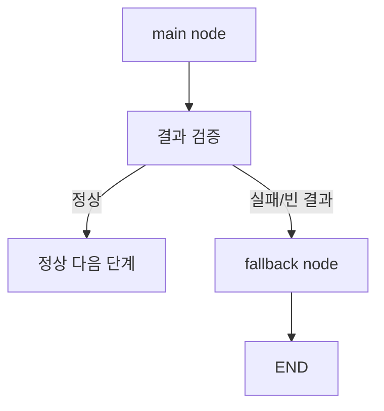
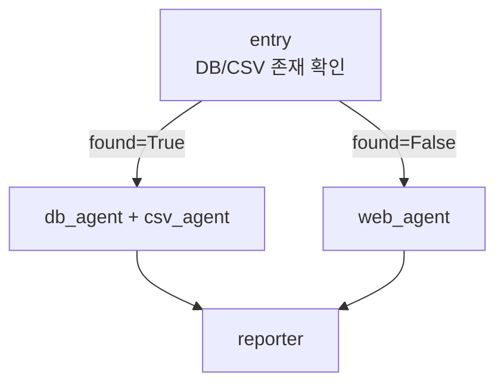

# Fallback

Fallback은 에이전트 실행 중 실패가 발생했을 때 대체 경로로 보내는 안전 설계다.

## 언제 필요한가

- 외부 API가 실패했을 때
- 도구 결과가 비어 있을 때
- 모델 응답이 이상할 때
- 같은 노드가 반복 실패할 때
- 사용자가 원하는 정보를 내부 데이터에서 찾지 못했을 때

## 구조



## 예시

```python
def route_after_search(state):
    if not state.get("docs"):
        return "fallback_search"
    return "generate"

builder.add_conditional_edges(
    "retrieve",
    route_after_search,
    {
        "generate": "generate",
        "fallback_search": "web_search",
    },
)
```

## Fallback의 역할

| 실패 | fallback 예 |
|---|---|
| DB 검색 결과 없음 | 웹 검색 도구 호출 |
| LLM 응답 파싱 실패 | 더 단순한 프롬프트로 재호출 |
| 주가 API 실패 | 사용자에게 티커 재확인 요청 |
| 뉴스 결과가 무관함 | 검색 키워드 재작성 후 재검색 |
| 위험한 도구 실행 직전 | [[Human-in-the-loop]] 승인 요청 |

## 로컬 우선 fallback

질병 건강관리 리포트 실습에서는 다음 흐름을 사용했다.



- 로컬 DB/CSV에 정보가 있으면 내부 정보를 우선 사용한다.
- 없으면 웹 검색으로 fallback한다.
- 이 패턴은 [[로컬 우선 정보 수집 MAS]]와 연결된다.

## 핵심

Fallback은 "실패하지 않는 코드"를 만드는 것이 아니라, 실패했을 때 그래프가 어디로 가야 하는지 미리 정해두는 것이다.

## 관련

- [[Loop Control]]
- [[Guardrails]]
- [[Human-in-the-loop]]
- [[LangGraph Conditional Fan-out]]
- [[로컬 우선 정보 수집 MAS]]
- [[Observability]]
