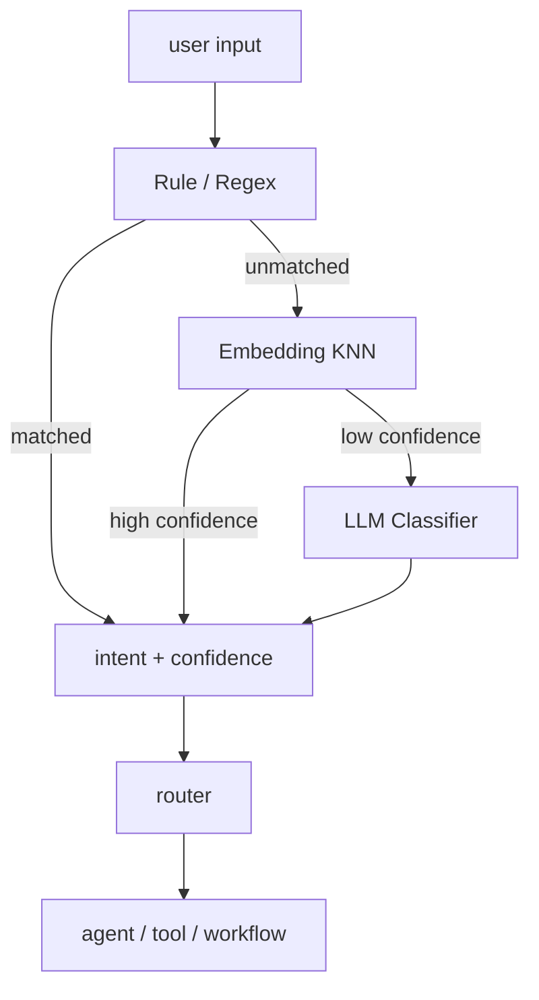
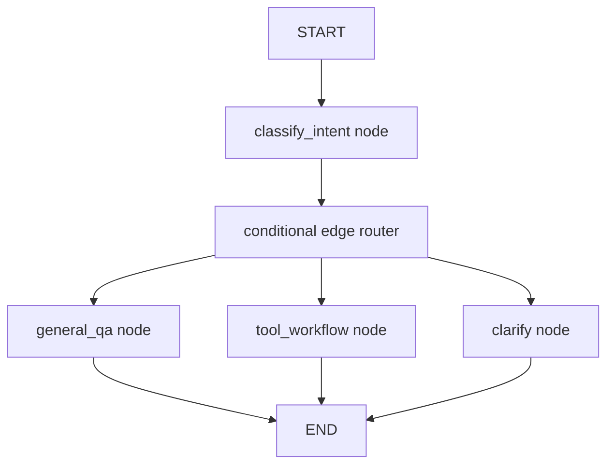

# Intent Classification

Intent Classification은 사용자의 자연어 입력을 사전 정의된 의도 카테고리로 분류해, 어떤 [[AI Agent|에이전트]], workflow, tool, graph node를 실행할지 정하는 단계이다.

챗봇/IVR 시절부터 있던 개념이지만, LLM Agent에서는 단순 텍스트 분류를 넘어 **실행 경로 라우팅**으로 이어진다. 특히 [[LangGraph StateGraph]]에서는 intent가 곧 다음 [[LangGraph Edge|edge]] 선택 조건이 된다.

## 왜 필요한가

- 한 에이전트가 모든 요청을 처리하면 system prompt가 비대해지고 정확도가 떨어진다.
- 미리 분류해서 specialist, tool, sub-workflow로 보내면 각 경로가 자기 역할에 집중할 수 있다.
- 불명확한 요청은 바로 실행하지 않고 clarify/fallback으로 보낼 수 있다.

## 분류 기법



## 1. Rule-based Classification

규칙 기반 분류는 명확한 명령어, slash command, 고정 키워드에 적합하다.

```python
def rule_classify(text: str) -> str | None:
    t = text.strip().lower()
    if t.startswith("/help"):
        return "help"
    if "환불" in t:
        return "refund"
    return None
```

장점은 빠르고 싸다는 점이다. 단점은 표현이 조금만 바뀌어도 놓칠 수 있다는 점이다.

## 2. Embedding KNN Classification

각 intent별 대표 문장을 embedding해두고, 사용자 입력과 가장 가까운 예시를 찾는 방식이다.

```python
intents = {
    "refund": ["환불해줘", "돈 돌려줘", "결제 취소하고 싶어"],
    "shipping": ["배송 언제 와", "택배 어디 있어", "주소 바꿔줘"],
}

def embed_classify(text: str, threshold=0.75) -> tuple[str, float] | None:
    vector = embed(text)
    hit = vector_store.search(vector, k=1)
    if hit.score < threshold:
        return None
    return hit.intent, hit.score
```

동의어와 표현 변형에 강하지만, intent 경계가 가까우면 오분류가 생긴다.

## 3. LLM Classification

모호한 자연어는 LLM에게 구조화된 출력으로 분류시킨다.

```python
from pydantic import BaseModel
from typing import Literal

class IntentResult(BaseModel):
    intent: Literal["refund", "shipping", "general", "unknown"]
    confidence: float
    reason: str
```

LLM 분류는 가장 유연하지만 느리고 비용이 든다. 그래서 보통 rule → embedding → LLM 순서의 cascade로 둔다.

## LangGraph에서의 Intent Classification

LangGraph에서는 intent classification이 단순 라벨링으로 끝나지 않는다. 분류 결과가 [[LangGraph State|State]]에 저장되고, `add_conditional_edges`의 router가 그 state를 읽어 다음 node를 고른다.



핵심은 **LLM 호출은 node에서 하고, edge router는 state를 읽는 가벼운 함수로 유지하는 것**이다.

```python
from typing import Literal, TypedDict

class AgentState(TypedDict):
    user_input: str
    intent: Literal["qa", "tool", "clarify"]
    confidence: float

def classify_intent(state: AgentState) -> dict:
    result = classifier.invoke(state["user_input"])
    return {
        "intent": result.intent,
        "confidence": result.confidence,
    }

def route_by_intent(state: AgentState) -> str:
    if state["confidence"] < 0.6:
        return "clarify"
    return state["intent"]

builder.add_node("classify", classify_intent)
builder.add_conditional_edges(
    "classify",
    route_by_intent,
    {
        "qa": "general_qa",
        "tool": "tool_workflow",
        "clarify": "clarify",
    },
)
```

## LangGraph 라우팅 패턴

| 패턴 | 설명 | 적합한 경우 |
|---|---|---|
| classifier node + conditional edge | 분류 node가 state에 intent를 쓰고 router가 다음 node 선택 | 가장 기본적인 intent routing |
| hierarchical routing | 큰 intent를 먼저 고르고, 하위 node에서 세부 intent 재분류 | intent가 많을 때 |
| multi-intent fan-out | 하나의 요청을 여러 intent로 나눠 여러 node를 실행 | "요약하고 차트도 그려줘" |
| tool-call routing | LLM의 tool call 여부를 보고 [[LangGraph ToolNode]]로 보냄 | ReAct agent, tool agent |
| fallback routing | confidence가 낮으면 clarify/default node로 보냄 | 오분류 비용이 클 때 |

## Multi-intent와 Conditional Fan-out

한 문장에 여러 의도가 있으면 단일 intent 라벨보다 list 형태가 낫다.

```python
class IntentResult(BaseModel):
    intents: list[Literal["summarize", "visualize", "search"]]
```

LangGraph에서는 router가 여러 실행 대상을 반환하는 [[LangGraph Conditional Fan-out]] 패턴으로 연결할 수 있다. 이때 각 node가 같은 state key를 동시에 갱신한다면 [[LangGraph State Reducer]]가 필요하다.

## Confidence와 Fallback

낮은 confidence를 그대로 실행하면 잘못된 tool이나 workflow가 호출된다.

일반적인 fallback:

- clarify: 사용자에게 되묻기
- default agent: 넓은 범위의 일반 답변 경로로 보내기
- human handoff: 사람 검토로 넘기기
- END: 실행하지 않고 종료하기

LangGraph에서는 이런 fallback도 그냥 node다. 즉, fallback은 예외 처리가 아니라 graph 설계의 일부가 된다.

## 운영 팁

- intent label은 너무 많게 시작하지 않는다. 5~15개 정도에서 출발하고 필요하면 계층화한다.
- unknown 비율을 모니터링하면 새 intent 추가 시점을 알 수 있다.
- intent 분류 데이터셋을 버전 관리하고 [[Evaluation|회귀 평가]]한다.
- LLM classifier 출력은 [[Structured Output]]과 [[Pydantic]]으로 고정한다.
- graph route 이름과 intent label을 1:1로 묶을지, mapping table을 둘지 명확히 정한다.

## 관련

- [[Supervisor 패턴]] — 분류 결과로 전문 에이전트 라우팅.
- [[Routing Workflow]] · [[Agent vs Workflow]] — Workflow 패턴 중 하나.
- [[LangGraph Edge]] · [[LangGraph Conditional Fan-out]] — LangGraph에서 분류 결과를 실행 경로로 바꾸는 방법.
- [[Structured Output]] · [[Pydantic]] — 신뢰성 있는 분류 출력.
