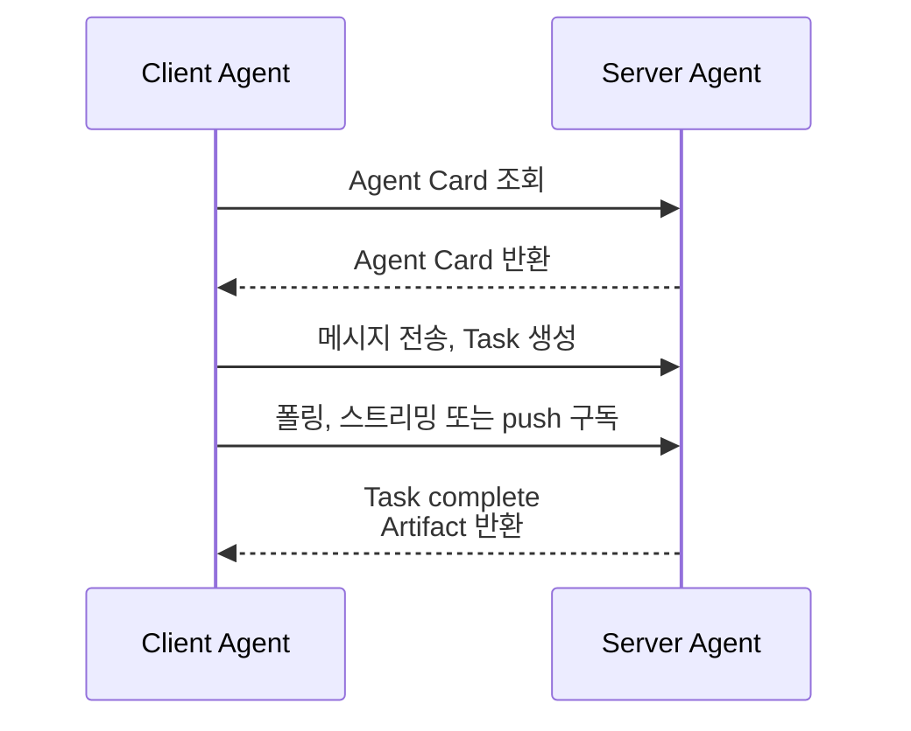

# A2A 프로토콜

A2A(Agent-to-Agent) Protocol은 서로 다른 조직·플랫폼의 [[AI Agent|에이전트]]가 능력을 발견하고, 작업을 위임하고, 비동기 결과를 교환하기 위한 개방형 통신 표준이다.

한 마디로: "내 회사의 Agent가 외부 Agent에게 계약된 작업을 맡기는 표준."

## 왜 필요한가

- [[Tool Calling]]·[[MCP(Model Context Protocol)|MCP]]는 **에이전트와 도구** 사이의 표준.
- A2A는 **에이전트와 에이전트** 사이의 표준 — 능력 발견(discovery), 작업 위임, 결과 반환.
- 사내 supervisor가 외부 SaaS 에이전트에 작업을 던지는 경우를 생각하면 명확.

## 핵심 추상화

| 용어 | 의미 |
|------|------|
| **Agent Card** | 에이전트의 능력·도구·인증 방식을 기술한 JSON manifest (`/.well-known/agent-card`는 v1 예시) |
| **Task** | 위임된 작업 단위. 상태와 취소·재구독 생명 주기를 가짐 |
| **Message** | 사용자/에이전트 발화 |
| **Artifact** | 작업 결과(파일, 텍스트, 구조화 데이터) |

## 버전과 호환성

A2A의 Agent Card endpoint와 RPC 이름은 프로토콜 버전에 따라 달라질 수 있다. 최신 v1 예시에서는 **/.well-known/agent-card**를 사용하므로, 구현할 때는 고정된 블로그 예시보다 해당 버전의 명세와 Agent Card가 광고한 버전을 우선한다.

Task는 즉시 완료될 수도, 장시간 실행될 수도 있다. 따라서 client는 submitted, working, input-required, completed, failed, canceled 같은 상태 전이와 재구독·취소를 제품 계약으로 다뤄야 한다.

## 통신 흐름



## 최소 Agent Card 예

```json
{
  "name": "translate-agent",
  "description": "텍스트를 한↔영 번역",
  "version": "1.0",
  "url": "https://example.com/a2a",
  "capabilities": {"streaming": true, "pushNotifications": false},
  "skills": [{
    "id": "translate",
    "description": "한국어 ↔ 영어 번역",
    "inputModes": ["text"],
    "outputModes": ["text"]
  }]
}
```

## MCP와의 차이

| | [[MCP(Model Context Protocol)\|MCP]] | A2A |
|--|--|--|
| 연결 대상 | LLM ↔ 도구·자원 | 에이전트 ↔ 에이전트 |
| 권한 모델 | 호스트 권한 그대로 | 인증된 HTTP 계약 |
| 통신 | JSON-RPC (보통 stdio) | HTTP + SSE |
| 사례 | Claude Desktop이 GitHub 파일 읽기 | Salesforce 에이전트가 Workday 에이전트에 휴가 신청 위임 |

## 운영 관점

- Agent Card의 identity, endpoint, 인증 요구사항, skill을 발견한 뒤에만 위임한다.
- polling, SSE streaming, webhook push 중 작업 시간과 연결 안정성에 맞는 결과 수신 방식을 선택한다.
- A2A Task ID, 사용자 요청 ID, tenant, 승인 상태를 함께 trace해야 외부 Agent 위임을 감사할 수 있다.
- Agent Card나 원격 Agent의 설명도 외부 입력이다. 호출 권한과 도구 실행 정책은 로컬 [[Guardrails]]와 [[Tool Execution Policy]]가 다시 확인한다.

## 다른 관련 프로토콜

- **ACP** (Agent Communication Protocol) — IBM 주도, A2A와 유사 목표.
- **MCP** — 도구·자원 표준.
- **AGNTCY** — Cisco 등이 추진한 에이전트 인터넷 비전.
- 통합 방향: MCP(도구) + A2A(에이전트) + OAuth(인증) 3종이 점차 굳어지는 중.

## 관련

- [[MCP(Model Context Protocol)]] — 도구 레이어의 자매 프로토콜.
- [[Multi Agent]] · [[Supervisor 패턴]] — A2A로 외부 에이전트를 워커로 편입.
- [[Strands Agents]] · [[CrewAI]] · [[AutoGen]] — A2A 어댑터 보유.
- [[MCP Security]] — 외부 Agent와 도구 연결의 신뢰 경계.

## 공식 문서

- [A2A 핵심 개념](https://a2a-protocol.org/latest/topics/key-concepts/)
- [A2A Agent Discovery](https://a2a-protocol.org/latest/topics/agent-discovery/)
- [A2A v1 변경 사항](https://a2a-protocol.org/latest/whats-new-v1/)
