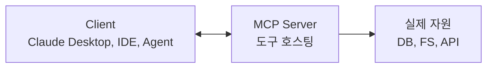

# MCP(Model Context Protocol)

MCP(Model Context Protocol)는 AI 애플리케이션이 도구와 데이터 소스를 일관된 계약으로 발견하고 연결하기 위한 개방형 프로토콜이다.

한 마디로: "[[Tool Calling|도구]]를 모델·IDE마다 새로 연결하지 말고, **MCP 서버**가 도구와 자원을 표준 계약으로 노출하자"는 발상이다.

## 왜 필요했나

- LangChain·OpenAI·Anthropic·Bedrock마다 도구 등록 방식이 달라, 같은 기능을 여러 번 구현했다.
- IDE나 에디터가 LLM 도구에 안전하게 접근할 표준이 없었다.

## 구조



- 메시지 형식은 JSON-RPC이며, 로컬은 stdio, 원격은 Streamable HTTP를 주로 사용한다. 이전 SSE 기반 연결은 호환성 요구에 따라 남아 있을 수 있다.

## 서버가 노출하는 3가지 primitive

1. **Resources** — 읽을 수 있는 데이터 (파일, DB 행).
2. **Tools** — LLM이 호출할 수 있는 함수.
3. **Prompts** — 재사용 가능한 프롬프트 템플릿.

서버 primitive와 별개로, client는 roots, sampling, 사용자 입력 요청처럼 자신의 capability를 협상할 수 있다. 사용할 수 있는 기능은 서버와 client가 광고한 버전·capability에 따라 확인한다.

## 최소 MCP 서버 (Python)

```python
from mcp.server.fastmcp import FastMCP

mcp = FastMCP("weather-server")

@mcp.tool()
def get_weather(city: str) -> str:
    """도시 날씨를 반환한다."""
    return weather_api.fetch(city)

if __name__ == "__main__":
    mcp.run()   # 기본 stdio
```

## 클라이언트 (Claude Desktop 설정 예)

```json
{
  "mcpServers": {
    "weather": {
      "command": "python",
      "args": ["/path/to/weather_server.py"]
    }
  }
}
```

- 이렇게 등록하면 Claude Desktop 안에서 `get_weather`가 즉시 도구로 잡힌다.

## 보안·권한

- MCP 서버는 **로컬 권한 그대로 동작** — 파일/네트워크 접근 가능. 신뢰할 수 없는 서버를 함부로 붙이면 안 된다.
- 권한 단위(`roots`)로 접근 가능한 경로를 제한.

## 최신 보안 적용

- MCP 서버는 특히 로컬에서 클라이언트 권한으로 실행될 수 있다. 신뢰하지 않는 server를 붙이거나 넓은 파일·네트워크 권한을 기본값으로 주면 안 된다.
- 원격 서버는 사용자별 인증, 최소 scope, server-side token 검증을 사용한다.
- tool description과 tool result는 시스템 정책보다 낮은 신뢰도의 외부 입력이다. 모델이 그 안의 지시를 따르기 전에 실행 정책이 다시 검사해야 한다.
- 구체적인 위협 모델과 운영 체크는 [[MCP Security]]를 따른다.

## 생태계

- [MCP 공식 조직](https://github.com/modelcontextprotocol)과 다양한 제품·프레임워크에서 server와 client 구현을 제공한다.
- 대표적인 연결 대상은 filesystem, source control, 협업 도구, DB, browser automation, 사내 API다.
- 실제 도입 전에는 유지보수 주체, 배포 방식, 필요 권한, 감사 가능성을 server별로 검토한다.

## [[Tool Calling]]과의 관계

- Tool Calling이 **모델 ↔ 도구 호출 형식**의 표준이라면, MCP는 **도구 자체를 모델·플랫폼 중립적으로 호스팅**하는 프로토콜.
- 둘은 충돌하지 않고 결합된다: MCP 서버가 도구를 노출 → 클라이언트가 그걸 LLM의 tool_call로 변환.

## 관련

- [[MCP Security]]
- [[A2A 프로토콜]]
- [[Tool Execution Policy]]
- [[SKILL]]

## 공식 문서

- [MCP 개요](https://modelcontextprotocol.io/)
- [MCP Security Best Practices](https://modelcontextprotocol.io/docs/tutorials/security/security_best_practices)
