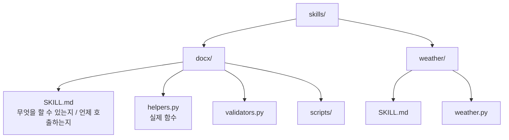
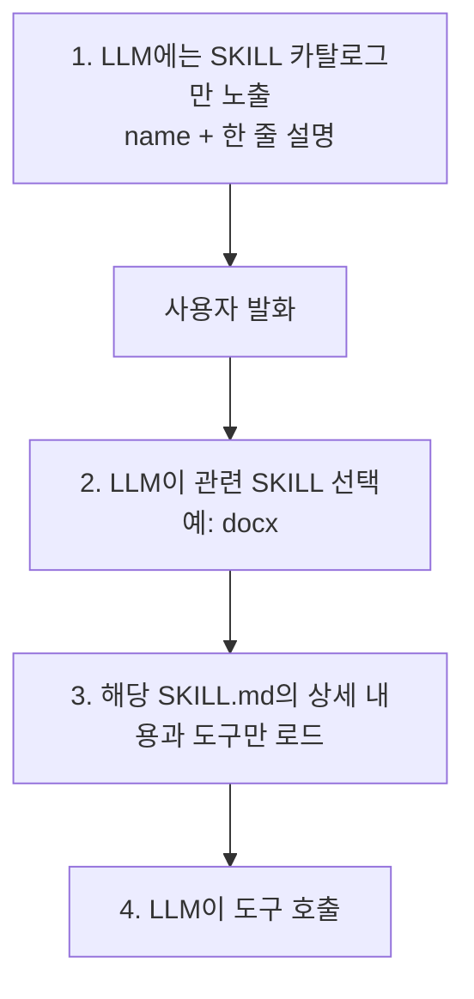

# SKILL

SKILL 또는 Agent Skill은 **도구·프롬프트·스크립트·문서·검증 규칙**을 하나의 능력 패키지로 묶고, 필요한 경우에만 Agent에 공개하는 방식이다. 특정 프레임워크 하나의 기능이 아니라, 최근 Agent 런타임에서 널리 쓰이는 Progressive Disclosure 설계 패턴으로 보는 편이 정확하다.

핵심 메커니즘은 **Progressive Disclosure(점진적 공개)**다. 모든 능력을 한꺼번에 system prompt에 넣지 않고, 사용자의 요청에 맞는 Skill만 동적으로 로드한다.

## 왜 필요한가

- 도구가 20개를 넘으면 LLM이 어느 도구를 골라야 할지 헷갈린다.
- system prompt에 모든 도구 설명을 박으면 토큰·정확도 모두 손해.
- SKILL은 **카탈로그 → 후보 SKILL 선택 → 그 SKILL의 상세 매뉴얼·도구만 로드** 라는 2단계 구조.

## SKILL 패키지 구조



## SKILL.md 형식 (개념)

```markdown
---
name: docx
description: Word(.docx) 파일 작성·편집·redline 비교
when_to_use:
  - 사용자가 docx 파일 생성·수정을 요청
  - 문서 비교가 필요할 때
---

# Tools
- create_doc(path, content)
- redline_compare(a, b)
...
```

## Progressive Disclosure 동작



## On-demand Skill 로딩

Skill catalog에는 이름, 짧은 설명, 위험도, 필요 권한만 둔다. 선택된 Skill의 상세 지침, 예시, 도구, 스크립트는 그 다음에 로드한다.

- catalog 설명은 라우팅 대상이므로 작업 경계와 언제 쓰는지를 명확히 쓴다.
- 상세 지침은 정보가 최신인지, 외부 입력을 신뢰하지 않는지, 실패 시 무엇을 반환하는지를 정한다.
- Skill을 설치하거나 갱신하는 일은 공급망 변경이다. 검토, 버전, 권한, 테스트를 함께 관리한다.

## Framework 구현 예

```python
from strands import Agent
agent = Agent(
    tools=[shell],
    load_tools_from_directory=True,   # ./tools 와 ./skills 를 자동 발견
)
```

- Agent가 Skill을 생성·수정하도록 허용할 수도 있지만, 자동 발견만으로 곧바로 실행 권한을 주면 안 된다. 새 Skill은 sandbox, 검토, 명시적 권한 부여 뒤에 catalog에 넣는다.

## [[Tool Calling]] · [[MCP(Model Context Protocol)|MCP]]와의 관계

- **Tool** = 함수 1개.
- **SKILL** = 관련 도구·문서·스크립트의 묶음 + "언제 쓸지" 설명.
- **MCP 서버** = 도구·자원의 외부 호스팅 표준.
- SKILL은 운영 편의 + Progressive Disclosure에 초점, MCP는 프로세스 분리·표준화에 초점. 둘은 결합 가능.

## 설계 권장

- 한 SKILL은 **하나의 관심사**만 — docx, sheets, web, db 등.
- `when_to_use`를 구체적으로 — supervisor의 라우팅 정확도가 곧 SKILL 정확도.
- 큰 SKILL은 다시 sub-skill로 쪼개기 ([[Hierarchical Agent|계층화]]의 SKILL판).

## 관련

- [[Tool Calling]] · [[MCP(Model Context Protocol)]] — 하부 메커니즘.
- [[Self-Improving Agent]] — 에이전트가 SKILL을 스스로 생성.
- [[Strands Agents]] — 대표 구현.
- [[MCP Security]] — 외부 도구와 Skill 공급망의 안전성.
- [[Agent Middleware]] — Skill 선택·로딩의 공통 정책 지점.
