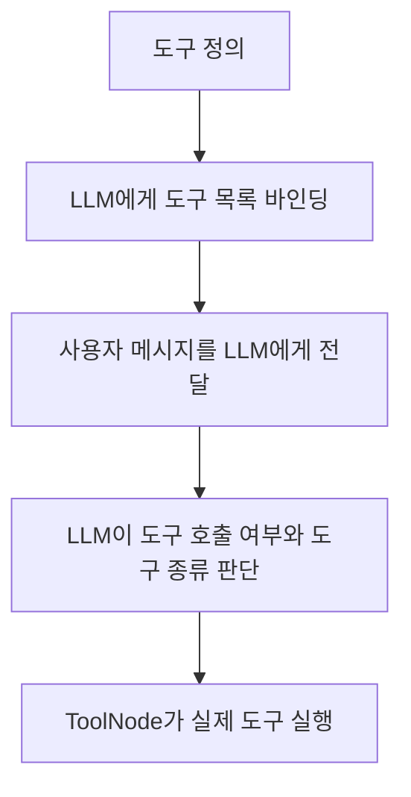
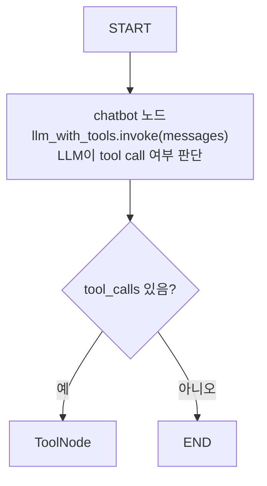

# LLM Tool Selection

## 정의

LLM Tool Selection은 LLM이 사용자 메시지와 도구 스키마를 보고 **어떤 도구를 호출할지, 또는 도구 없이 바로 답할지 판단하는 단계**이다.

도구를 코드에서 정의했다고 해서 자동으로 실행되는 것은 아니다. 도구를 LLM에게 알려준 뒤, 반드시 LLM 호출을 한 번 거쳐야 한다.



## 핵심 원칙

> 도구 선택은 Python 코드가 먼저 하는 것이 아니라, 도구를 쥔 LLM에게 질문을 넣었을 때 LLM이 결정한다.

즉 다음 코드만으로는 도구가 실행되지 않는다.

```python
mytools = [food_tool, care_tool]
llm_with_tools = llm.bind_tools(mytools)
```

이 코드는 LLM에게 "이런 도구들이 있다"고 알려주는 단계일 뿐이다.

실제 도구 선택은 아래 호출에서 일어난다.

```python
response = llm_with_tools.invoke(current_messages)
```

## 예시 코드

```python
@tool
def care_tool(care: str):
    """감기에 걸렸을 때 해야 할 조치를 알려줄 때 사용한다."""
    print("care_tool 노드")
    return "충분히 쉬고, 침대에 누워 전기 장판으로 땀을 흘려야합니다."
```

이 함수는 도구로 등록될 수 있는 함수이다.

```python
mytools = [food_tool, care_tool]
llm_with_tools = llm.bind_tools(mytools)
```

이 단계에서는 도구가 실행되지 않는다. LLM 객체가 도구 스키마를 알고 있는 상태가 된다.

```python
def chatbot(state: State):
    current_messages = state["messages"]
    response = llm_with_tools.invoke(current_messages)
    return {"messages": [response]}
```

여기서 비로소 LLM에게 현재 메시지가 전달된다.

LLM은 다음 정보를 함께 본다.

- 사용자 질문
- 이전 대화 메시지
- `food_tool`의 이름, 인자, docstring
- `care_tool`의 이름, 인자, docstring

여기서 중요한 점은 `#` 일반 주석이 아니라 docstring을 본다는 것이다.

```python
@tool
def care_tool(care: str):
    """감기에 걸렸을 때 해야 할 조치를 알려줄 때 사용한다."""
```

위 docstring은 LLM의 도구 선택 판단에 들어간다.

하지만 아래 같은 일반 주석은 보통 도구 스키마에 포함되지 않는다.

```python
# 감기에 걸렸을 때 해야 할 조치를 알려주는 함수
@tool
def care_tool(care: str):
    ...
```

따라서 도구의 목적은 반드시 docstring에 적는 것이 좋다.

그다음 다음 중 하나를 선택한다.

```text
1. 도구 없이 바로 답변한다.
2. food_tool 호출을 요청한다.
3. care_tool 호출을 요청한다.
4. 여러 도구 호출을 요청한다.
```

## LLM 호출 결과

`llm_with_tools.invoke(...)`의 결과는 크게 두 종류가 될 수 있다.

### 1. 도구 호출이 없는 응답

LLM이 도구가 필요 없다고 판단하면 일반 텍스트 응답을 만든다.

```text
AIMessage(content="감기에는 충분한 휴식이 중요합니다.")
```

이 경우 `ToolNode`로 갈 필요 없이 종료할 수 있다.

### 2. 도구 호출이 있는 응답

LLM이 도구가 필요하다고 판단하면 `tool_calls`가 포함된 응답을 만든다.

```text
AIMessage(
    content="",
    tool_calls=[
        {
            "name": "care_tool",
            "args": {"care": "감기 조치"},
            "id": "..."
        }
    ]
)
```

이 응답은 "내가 care_tool을 직접 실행했다"는 뜻이 아니다.

뜻은 다음에 가깝다.

```text
LLM: care_tool을 이 인자로 호출해줘.
```

이후 [[LangGraph ToolNode]]가 실제 Python 함수를 실행한다.

## LangGraph에서의 흐름



`chatbot` 노드는 도구를 실행하는 노드가 아니다.

`chatbot` 노드는 LLM에게 현재 메시지를 넣고, LLM이 다음 행동을 결정하게 만드는 노드이다.

실제 도구 실행은 `ToolNode`가 담당한다.

## 왜 LLM에게 먼저 물어봐야 하는가

도구 선택은 자연어 의미 판단이 필요하기 때문이다.

예를 들어 두 도구가 있다고 하자.

```python
@tool
def food_tool(food: str):
    """감기에 좋은 음식을 알려줄 때 사용한다."""

@tool
def care_tool(care: str):
    """감기에 걸렸을 때 해야 할 조치를 알려줄 때 사용한다."""
```

사용자 질문:

```text
감기에 걸렸는데 뭘 먹으면 좋아?
```

이 질문은 `food_tool`에 가깝다.

사용자 질문:

```text
감기에 걸렸는데 어떻게 해야 해?
```

이 질문은 `care_tool`에 가깝다.

이런 의미 판단은 단순 if문으로도 만들 수 있지만, 다양한 자연어 표현을 다루려면 LLM이 도구 설명을 보고 판단하게 하는 것이 유연하다.

## `bind_tools`와 `invoke`의 차이

| 코드 | 역할 | 도구 실행 여부 |
|---|---|---|
| `llm.bind_tools(mytools)` | LLM에게 도구 목록을 알려줌 | 실행 안 됨 |
| `llm_with_tools.invoke(messages)` | LLM에게 메시지를 넣어 도구 호출 여부를 판단시킴 | 아직 실행 안 됨 |
| `ToolNode(mytools)` | LLM이 요청한 tool call을 실제 함수 실행으로 바꿈 | 실행됨 |

## 주의할 점

도구를 바인딩했다고 해서 LLM이 반드시 도구를 쓰는 것은 아니다.

도구 사용을 강제하지 않는 한, LLM은 다음 중 하나를 선택할 수 있다.

- 도구 호출
- 일반 답변
- 잘못된 도구 선택
- 필요한 도구를 호출하지 않음

따라서 도구 설명, 시스템 프롬프트, 조건부 라우팅을 명확히 설계해야 한다.

## `create_react_agent`에서의 도구 선택

`create_react_agent(llm, mytools)`를 쓰면 직접 `bind_tools`, `ToolNode`, `tools_condition`을 조립하지 않아도 기본 도구 호출 루프가 만들어진다.

```python
agent = create_react_agent(llm, mytools)
result = agent.invoke({"messages": "나는 고혈압 환자인데 중식이 먹고싶어"})
```

이 경우에도 핵심은 같다.

```text
상위 agent LLM이 사용자 질문과 도구 설명을 보고
어떤 도구를 호출할지 판단한다.
```

예를 들어 다음 도구들이 있다면:

```python
mytools = [chinese_meal_expert, japanese_meal_expert, western_meal_expert]
```

사용자 질문이 다음과 같을 때:

```text
나는 고혈압 환자인데 중식이 먹고싶어
```

상위 agent는 `chinese_meal_expert`의 이름과 docstring을 보고 이 도구가 적절하다고 판단할 수 있다.

이때 별도의 prompt를 넣지 않아도 동작할 수 있지만, 신뢰도는 도구 이름과 docstring 품질에 크게 의존한다.

관련: [[LangGraph create_react_agent]]

## 한 줄 정리

> 도구를 LLM에게 쥐어준 뒤 `llm_with_tools.invoke()`를 호출해야 LLM이 어떤 도구를 쓸지 판단하고, 그 다음 `ToolNode`가 실제 도구를 실행한다.

관련:

- [[LangChain @tool]]
- [[LangGraph ToolNode]]
- [[Tool Calling]]
- [[Workflow Node vs Tool]]
