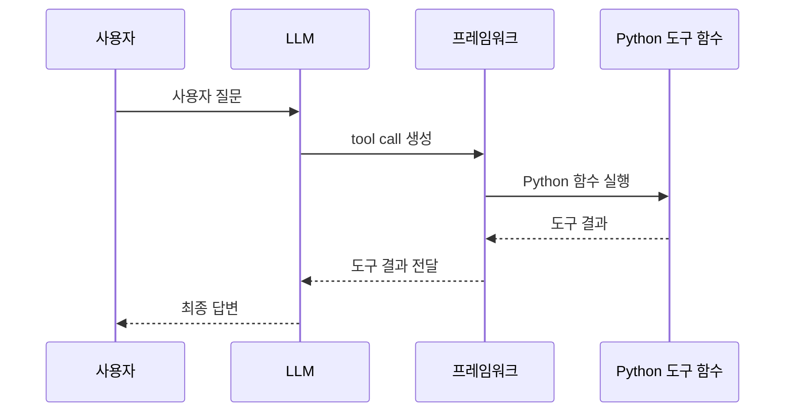

# LangChain @tool

## 정의

`@tool`은 LangChain에서 Python 함수를 LLM이 호출 가능한 도구로 변환하는 데코레이터이다.

```python
from langchain_core.tools import tool

@tool
def food_tool(food: str):
    """감기에 좋은 음식을 알려줄 때 사용한다."""
    return "생강차와 닭고기 수프를 드세요."
```

## 역할

`@tool`은 함수 이름, 인자 타입, docstring을 바탕으로 도구 스키마를 만든다.

LLM은 이 스키마를 보고 다음을 판단한다.

- 이 도구를 언제 써야 하는가
- 어떤 인자를 넣어야 하는가
- 도구를 호출할지 말지

## LLM이 실제로 보는 정보

`@tool` 함수에서 LLM이 보는 것은 함수 코드 전체가 아니다.

LLM은 보통 `@tool`이 만든 도구 스키마를 본다.

| 항목 | LLM이 보는가 | 설명 |
|---|---:|---|
| 함수 이름 | 예 | 예: `food_tool`, `care_tool` |
| 함수 인자 이름 | 예 | 예: `food`, `care` |
| 함수 인자 타입 | 예 | 예: `str` |
| 함수 docstring | 예 | 도구 사용 설명서 역할 |
| `#` 일반 주석 | 보통 아니오 | tool schema에 포함되지 않음 |
| 함수 내부 구현 코드 | 보통 아니오 | 실행기는 코드를 실행하지만 LLM이 코드 본문을 읽고 판단하는 것은 아님 |

따라서 LLM에게 도구의 용도를 알려주려면 `#` 주석이 아니라 docstring에 써야 한다.

좋은 예:

```python
@tool
def cardio_food_tool(goal: str):
    """심폐지구력 향상에 도움이 되는 음식을 추천할 때 사용한다."""
    return "바나나, 오트밀, 고구마, 닭가슴살, 물을 추천합니다."
```

나쁜 예:

```python
# 심폐지구력 향상에 도움이 되는 음식을 추천할 때 사용한다.
@tool
def cardio_food_tool(goal: str):
    return "바나나, 오트밀, 고구마, 닭가슴살, 물을 추천합니다."
```

위처럼 `#` 주석에만 설명을 적으면 LLM이 도구 선택 근거로 사용하지 못할 수 있다.

## 중요한 점

LLM이 직접 Python 함수를 실행하는 것은 아니다.

LLM은 "이 도구를 이런 인자로 호출해달라"는 구조화된 요청을 만든다. 실제 함수 실행은 LangChain이나 LangGraph의 실행기가 담당한다.



## 흔한 오타: `@toolc`

도구 데코레이터 이름은 정확히 `@tool`이다.

정답:

```python
@tool
def stock_tool(ticker: str):
    """주가 조회. 종목코드+.KS(코스피)/.KQ(코스닥)."""
    ...
```

오답:

```python
@toolc
def stock_tool(ticker: str):
    ...
```

`@toolc`는 LangChain 데코레이터가 아니다.

따라서 `toolc`라는 이름을 따로 정의하지 않았다면 Python은 다음과 같은 오류를 낸다.

```text
NameError: name 'toolc' is not defined
```

도구가 정상 등록되려면 다음 세 가지가 맞아야 한다.

- `from langchain_core.tools import tool` import
- 함수 위에 `@tool`
- 함수 docstring에 도구 사용 목적 설명

관련: [[Tool Calling]], [[LLM Tool Selection]]

## bind_tools

도구를 LLM에게 알려주려면 `bind_tools()`를 사용한다.

```python
mytools = [food_tool, care_tool]
llm_with_tools = llm.bind_tools(mytools)
```

이후 LLM은 답변을 바로 생성할 수도 있고, 도구 호출을 요청할 수도 있다.

중요한 점은 `bind_tools()`만으로는 도구가 실행되지 않는다는 것이다.

```python
llm_with_tools = llm.bind_tools(mytools)
```

이 코드는 LLM에게 도구 목록을 알려주는 단계이다. 실제 도구 선택은 메시지를 넣어 LLM을 호출할 때 일어난다.

```python
response = llm_with_tools.invoke(current_messages)
```

이 호출에서 LLM이 사용자 메시지와 도구 설명을 보고 `food_tool`을 쓸지, `care_tool`을 쓸지, 도구 없이 답할지를 결정한다.

자세한 흐름은 [[LLM Tool Selection]] 참고.

## docstring의 중요성

```python
@tool
def care_tool(care: str):
    """감기에 걸렸을 때 해야 할 조치를 알려줄 때 사용한다."""
    return "충분히 쉬고 수분을 섭취하세요."
```

docstring은 사람이 읽는 주석이면서 동시에 LLM이 읽는 도구 사용 설명서이다.

부정확한 docstring은 잘못된 도구 선택으로 이어질 수 있다.

예를 들어 다음 docstring은 LLM이 `care_tool`을 선택하는 데 직접적인 힌트가 된다.

```python
"""감기에 걸렸을 때 해야 할 조치를 알려줄 때 사용한다."""
```

사용자가 "감기 걸렸을 때 어떻게 해야 해?"라고 물으면 LLM은 이 설명을 보고 `care_tool`을 호출할 가능성이 높아진다.

## Node와의 차이

`@tool` 함수는 워크플로우 단계가 아니다.

워크플로우 단계는 [[LangGraph Node]]이고, 도구는 LLM이 필요할 때 호출할 수 있는 기능이다.

자세한 비교:

- [[Workflow Node vs Tool]]

## 한 줄 정리

> `@tool`은 Python 함수를 LLM이 호출할 수 있는 도구 스키마로 바꿔주는 LangChain 데코레이터이다.

관련:

- [[Tool Calling]]
- [[LLM Tool Selection]]
- [[LangGraph ToolNode]]
- [[데코레이터(Decorator)]]
