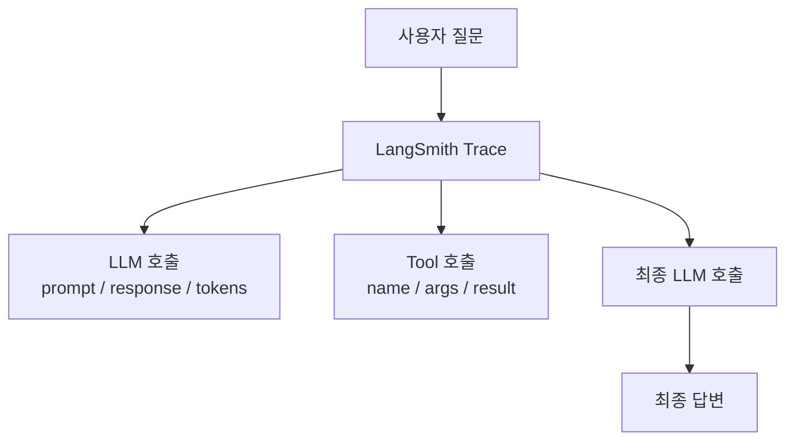
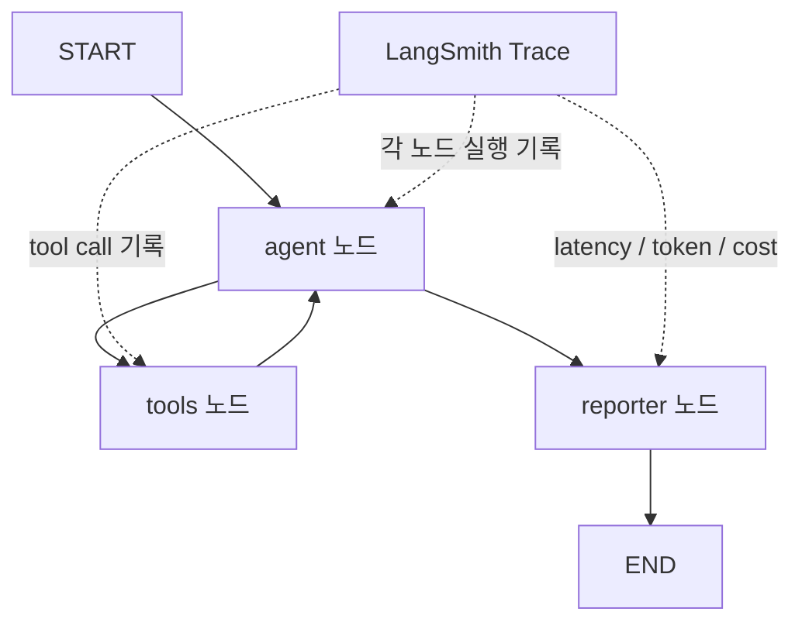
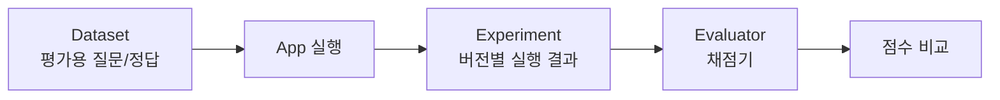
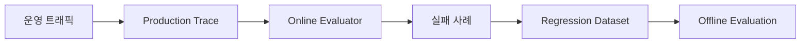

# LangSmith

- LangSmith = [[LLM(Large Language Model)]] 애플리케이션과 [[AI Agent]]를 **추적, 디버깅, 평가, 모니터링**하는 LangChain 계열 플랫폼이다.
- 한 줄로 말하면, **에이전트가 왜 그렇게 답했는지 실행 과정을 펼쳐서 보는 도구**다.
- [[LangGraph]] 실습에서는 노드 실행, LLM 호출, 도구 호출, 토큰 수, 지연 시간, 에러를 한 화면에서 보는 용도로 이해하면 된다.

## 왜 필요한가

- LLM 답변은 매번 달라질 수 있다.
- 에이전트는 여러 노드, 여러 도구, 여러 LLM 호출을 거치므로 실패 원인을 눈으로 따라가기 어렵다.
- `print()`만으로는 다음 질문에 답하기 힘들다.
  - 어느 노드에서 시간이 오래 걸렸나?
  - 어떤 프롬프트가 실제로 LLM에 들어갔나?
  - LLM이 왜 그 도구를 골랐나?
  - 도구 인자는 제대로 들어갔나?
  - 총 토큰과 비용은 얼마나 나왔나?

## 핵심 기능

| 기능 | 쉽게 말하면 | 봐야 하는 것 |
|---|---|---|
| Tracing | 실행 과정을 단계별로 기록 | 입력, 출력, 중간 단계, tool call |
| Debugging | 실패 원인 찾기 | 잘못된 프롬프트, 잘못된 도구 인자 |
| Monitoring | 운영 상태 감시 | latency, error, token, cost |
| Evaluation | 품질 평가 | dataset, evaluator, experiment |
| Feedback | 사람 피드백 수집 | annotation, user feedback |

## Trace

- Trace = 한 번의 요청이 내부에서 어떻게 실행됐는지 기록한 전체 실행 흐름이다.
- 일반 백엔드의 request trace와 비슷하지만, LLM 앱에서는 프롬프트, 응답, 도구 호출, 토큰 사용량이 함께 중요하다.



## Run

- Run = Trace 안에 들어있는 하나의 실행 단위다.
- 예를 들어 한 번의 agent 실행이 Trace라면, 그 안에는 여러 Run이 있다.
  - LLM 호출 Run
  - Tool 호출 Run
  - Retriever 호출 Run
  - LangGraph 노드 Run

## LangGraph와 연결

LangGraph는 노드 단위로 실행되기 때문에 LangSmith에서 구조가 잘 보인다.



- 어떤 노드가 실행됐는지 확인한다.
- 조건부 edge가 어느 경로를 탔는지 확인한다.
- agent가 같은 tool을 반복 호출하는지 확인한다.
- [[Loop Control]]이나 [[LangGraph recursion_limit]]이 필요한 상황을 찾는다.

## Evaluation과 연결

LangSmith 평가 흐름은 보통 다음 순서다.



- Dataset: 평가용 입력과 기대 답변을 모아둔 것.
- Example: Dataset 안의 한 개 테스트 케이스.
- Experiment: 특정 프롬프트/모델/코드 버전을 Dataset에 돌린 결과.
- Evaluator: 결과를 채점하는 함수나 LLM judge.
- Feedback: 점수, 라벨, 코멘트 형태의 평가 결과.

## Offline Evaluation

- 배포 전에 curated dataset으로 평가한다.
- 프롬프트 변경, 모델 변경, 도구 변경 전후를 비교한다.
- 회귀 테스트에 좋다.

예:

- `gpt-4o-mini`에서 `gpt-4o`로 바꿨을 때 정확도가 좋아졌는가?
- 프롬프트를 바꿨더니 tool call이 더 정확해졌는가?
- RAG 답변의 hallucination이 줄었는가?

## Online Evaluation

- 운영 중 실제 사용자 요청을 샘플링해서 평가한다.
- 정답 reference가 없는 경우가 많으므로 [[LLM-as-Judge]], 안전성 검사, 포맷 검사, 휴리스틱을 쓴다.
- 문제가 있는 production trace를 dataset으로 모아 다음 offline evaluation에 재사용한다.



## 설정 감각

공식 문서 기준으로 현재 기본 환경 변수는 다음 형태다.

```bash
export LANGSMITH_TRACING=true
export LANGSMITH_API_KEY="..."
export LANGSMITH_PROJECT="ai-agent-practice"
```

- `LANGSMITH_TRACING=true`: trace를 보낼지 켠다.
- `LANGSMITH_API_KEY`: LangSmith API key.
- `LANGSMITH_PROJECT`: trace를 모을 프로젝트 이름.
- 예전 예제에서는 `LANGCHAIN_TRACING_V2`, `LANGCHAIN_API_KEY`, `LANGCHAIN_PROJECT`를 쓰는 경우도 있다. 최신 문서에서는 `LANGSMITH_*` 계열을 우선 보면 된다.

## 연결 확인 체크리스트

- API key를 넣고 `LANGSMITH_TRACING=true`가 설정되어 있으면 trace 전송 준비가 된 것이다.
- 프로젝트가 실제로 보이는지 확인하려면 `langsmith.Client()`로 프로젝트 목록을 조회한다.

```python
import langsmith

client = langsmith.Client()
for project in client.list_projects():
    print(project.name)
```

- 프로젝트 이름을 확실히 바꾸고 싶으면 `setdefault`보다 직접 대입이 명확하다.

```python
os.environ["LANGSMITH_PROJECT"] = "test"
```

- `os.environ.setdefault("LANGSMITH_PROJECT", "test")`는 이미 값이 있으면 기존 값을 유지한다.
- 그래서 노트북에서 예전 프로젝트명이 남아 있으면 trace가 예상과 다른 프로젝트로 들어갈 수 있다.

## 실습에서 봐야 할 화면

- Trace tree: 어떤 단계가 어떤 순서로 실행됐는지.
- Prompt: 실제 LLM에 들어간 system/human message.
- Tool call: LLM이 고른 도구 이름과 인자.
- Output: 각 단계의 응답.
- Latency: 어느 단계가 느린지.
- Token / Cost: 어떤 단계가 비용을 많이 쓰는지.
- Error: 실패한 Run과 에러 메시지.

## 언제 쓰면 좋나

- LangGraph agent가 예상치 못한 답을 할 때.
- tool을 잘못 고르거나 인자를 잘못 넣을 때.
- 반복 루프가 왜 도는지 알고 싶을 때.
- 프롬프트 변경 전후를 비교하고 싶을 때.
- 운영에서 토큰/비용/지연 시간을 모니터링하고 싶을 때.
- 실패 trace를 모아 평가 데이터셋으로 만들고 싶을 때.

## 주의

- 프롬프트와 사용자 입력이 외부 서비스에 저장될 수 있으므로 민감 정보 마스킹이 필요하다.
- 비용이 큰 서비스에서는 trace sampling을 설정한다.
- 평가자 LLM도 틀릴 수 있으므로 중요한 평가는 사람 검토와 함께 본다.

## 공식 문서

- Observability: https://docs.langchain.com/langsmith/observability
- Tracing quickstart: https://docs.langchain.com/langsmith/observability-quickstart
- Evaluation: https://docs.langchain.com/langsmith/evaluation
- Evaluation concepts: https://docs.langchain.com/langsmith/evaluation-concepts

## 관련

- [[Observability]]
- [[Evaluation]]
- [[LLM-as-Judge]]
- [[다수결 평가]]
- [[라벨 정규화]]
- [[Trajectory]]
- [[LangChain]]
- [[LangGraph]]
- [[LangGraph Edge]]
- [[Loop Control]]
- [[Cost와 Token]]
