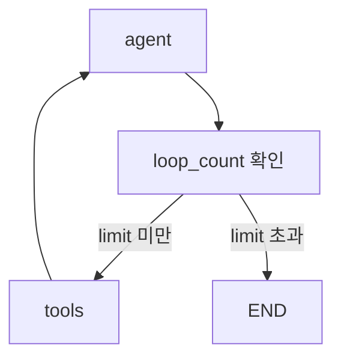
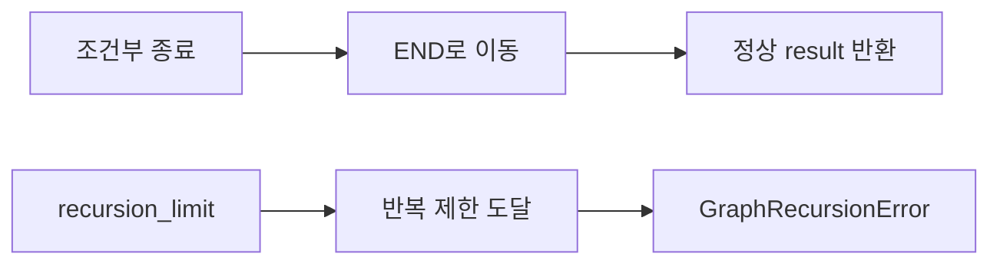

# Loop Control

Loop Control은 [[Agentic Loop]]가 너무 오래 돌거나 같은 도구를 반복 호출하지 않도록 제한하는 설계다.

에이전트는 `LLM 판단 → 도구 실행 → 관찰 → 다시 판단`을 반복하기 때문에 종료 조건이 약하면 비용과 시간이 폭증한다.

## 왜 필요한가

- 같은 도구를 계속 호출하는 무한 루프 방지
- 토큰 비용 제한
- 응답 지연 제한
- 잘못된 경로를 빨리 종료하고 fallback으로 넘기기

## 1. State에 카운터 넣기

```python
class State(TypedDict):
    messages: Annotated[list, add_messages]
    loop_count: int
```

노드가 실행될 때마다 `loop_count`를 증가시키고, 일정 횟수를 넘으면 [[END]] 또는 fallback 노드로 보낸다.



## 2. Conditional Edge로 종료 판단

```python
builder.add_conditional_edges(
    "agent",
    should_continue,
    {"tools": "tools", END: END},
)
```

`should_continue` 함수가 State를 보고 다음 경로를 결정한다.

## 3. recursion_limit

LangGraph 실행 옵션에서 재귀/반복 횟수 제한을 걸 수 있다.

```python
graph.invoke(
    {"messages": "질문"},
    config={"recursion_limit": 10},
)
```

- 명시적인 종료 조건을 만들기 어렵거나, 실습 중 무한 루프를 막을 때 유용하다.
- 운영에서는 `recursion_limit`만 믿지 말고, State 기반 종료 조건을 함께 두는 것이 좋다.
- 자세한 정리: [[LangGraph recursion_limit]]

## 조건부 종료 vs recursion_limit

| 구분 | 조건부 종료 | `recursion_limit` |
|---|---|---|
| 목적 | 업무 로직에 따른 정상 종료 | 무한 루프 방지용 강제 중단 |
| 구현 | `add_conditional_edges`로 [[END]] 연결 | `graph.invoke(..., {"recursion_limit": n})` |
| 결과 | 정상 `result` 반환 | `GraphRecursionError` 발생 가능 |
| 예시 | 목표 금액 달성 시 종료 | END 없는 자기 반복 그래프 중단 |
| 실무 감각 | 반드시 설계해야 하는 종료 조건 | 마지막 안전장치 |



## GraphRecursionError

```python
from langgraph.errors import GraphRecursionError

try:
    graph.invoke({"count": 0}, {"recursion_limit": 10})
except GraphRecursionError:
    print("recursion_limit 도달, 에러 중단")
```

- `GraphRecursionError`는 그래프가 허용된 반복 제한을 넘었을 때 발생한다.
- 이 에러가 났다는 것은 그래프가 정상적으로 [[END]]에 도달하지 못했다는 신호다.
- 그래서 원인을 보려면 edge 구조와 라우터 함수를 먼저 확인해야 한다.

## 실무 감각

| 상황 | 추천 |
|---|---|
| 실습/프로토타입 | `recursion_limit`로 안전장치 |
| 반복 횟수를 업무 규칙으로 제한 | State counter |
| 특정 도구 실패가 반복됨 | fallback 노드로 이동 |
| 비용이 중요한 서비스 | 토큰/시간 제한도 함께 체크 |

## 관련

- [[Agentic Loop]]
- [[LangGraph Edge]]
- [[LangGraph recursion_limit]]
- [[Fallback]]
- [[Observability]]
