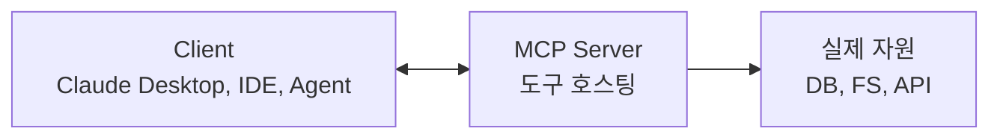

- MCP(Model Context Protocol)는 Anthropic이 2024년 11월 공개한 **AI 도구·데이터 소스 표준 프로토콜**.
- 한 마디로 "[[Tool Calling|도구]]를 LLM마다 새로 짜지 말고, **MCP 서버**로 한 번 만들어 어떤 클라이언트(Claude Desktop, Cursor, VSCode, [[AI Agent|에이전트]])에서도 같이 쓰자"는 발상.

## 왜 필요했나

- LangChain·OpenAI·Anthropic·Bedrock마다 도구 등록 방식이 달라, 같은 기능을 여러 번 구현했다.
- IDE나 에디터가 LLM 도구에 안전하게 접근할 표준이 없었다.

## 구조



- 통신은 JSON-RPC. 로컬은 stdio, 원격은 SSE/HTTP.

## 서버가 노출하는 3가지 primitive

1. **Resources** — 읽을 수 있는 데이터 (파일, DB 행).
2. **Tools** — LLM이 호출할 수 있는 함수.
3. **Prompts** — 재사용 가능한 프롬프트 템플릿.

## 최소 MCP 서버 (Python)

```python
from mcp.server.fastmcp import FastMCP

mcp = FastMCP("weather-server")

@mcp.tool()
def get_weather(city: str) -> str:
    """도시 날씨를 반환한다."""
    return weather_api.fetch(city)

if __name__ == "__main__":
    mcp.run()   # 기본 stdio
```

## 클라이언트 (Claude Desktop 설정 예)

```json
{
  "mcpServers": {
    "weather": {
      "command": "python",
      "args": ["/path/to/weather_server.py"]
    }
  }
}
```

- 이렇게 등록하면 Claude Desktop 안에서 `get_weather`가 즉시 도구로 잡힌다.

## 보안·권한

- MCP 서버는 **로컬 권한 그대로 동작** — 파일/네트워크 접근 가능. 신뢰할 수 없는 서버를 함부로 붙이면 안 된다.
- 권한 단위(`roots`)로 접근 가능한 경로를 제한.

## 생태계

- Anthropic, OpenAI(2025년 채택), Google 등이 지원.
- [github.com/modelcontextprotocol](https://github.com/modelcontextprotocol)에 다수의 공식·커뮤니티 서버.
- 대표 서버: filesystem, github, slack, postgres, puppeteer 등.

## [[Tool Calling]]과의 관계

- Tool Calling이 **모델 ↔ 도구 호출 형식**의 표준이라면, MCP는 **도구 자체를 모델·플랫폼 중립적으로 호스팅**하는 프로토콜.
- 둘은 충돌하지 않고 결합된다: MCP 서버가 도구를 노출 → 클라이언트가 그걸 LLM의 tool_call로 변환.
