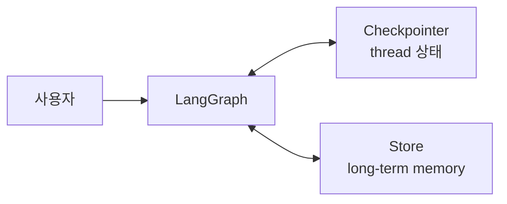

- Memory = [[AI Agent|에이전트]]가 **이전 대화·관찰·사실**을 기억해 다음 추론에 사용하는 메커니즘.
- LLM 자체는 stateless다 — 기억은 외부 인프라(컨텍스트, DB, 벡터 스토어)가 책임진다.

## 두 가지 축

### 1) 시간 범위

- **단기 메모리(Short-term)** — 현재 대화 세션. 보통 `messages` 리스트 또는 LangGraph의 `State`.
- **장기 메모리(Long-term)** — 세션이 끝나도 보존. DB·벡터 스토어에 저장 후 필요 시 검색.

### 2) 정보 형태

- **Conversational** — 메시지 이력 그대로.
- **Semantic** — 사실(fact). "사용자 이름은 김철수", "선호 언어는 한국어".
- **Episodic** — 과거 사건/대화의 요약 (지난 주에 X 작업을 했음).
- **Procedural** — 절차·규칙. system prompt나 학습된 패턴 형태.

## 단기 메모리 패턴

```python
# LangGraph
class State(TypedDict):
    messages: Annotated[list, add_messages]   # 누적
```

- 컨텍스트 윈도우가 차오르면 **요약·트리밍**.

```python
from langchain_core.messages import trim_messages
trimmed = trim_messages(messages, max_tokens=4000, strategy="last")
```

## 장기 메모리 — 벡터 기반

```python
from langchain_core.vectorstores import VectorStore

def remember(text: str, user_id: str):
    store.add_texts([text], metadatas=[{"user_id": user_id}])

def recall(query: str, user_id: str, k: int = 5):
    return store.similarity_search(query, k=k, filter={"user_id": user_id})
```

- 매 턴 사용자 발화로 검색해 상위 k개를 system message로 prepend.

## LangGraph Store (영구 메모리)

```python
from langgraph.store.memory import InMemoryStore
store = InMemoryStore()
# 그래프 컴파일에 store 주입 → 모든 노드에서 user별 long-term memory 접근
```

- LangGraph는 단기(`checkpointer`)와 장기(`store`)를 분리해 다룬다.

## LangGraph에서 꼭 구분할 것

| 구분 | [[LangGraph Checkpointer]] | [[LangGraph Store]] |
|---|---|---|
| 핵심 목적 | 그래프 실행 상태 저장 | 재사용 가능한 장기 지식 저장 |
| 기억 범위 | 같은 `thread_id` 중심 | 여러 thread/session에서 재사용 |
| 대표 데이터 | `messages`, interrupt 위치, 다음 실행 지점 | 사용자 선호, 프로젝트 지식, 장기 프로필 |
| 실습 구현 | `InMemorySaver`, `SqliteSaver` | `InMemoryStore` |
| 한 줄 감각 | "대화를 이어가기" | "나중에도 기억하기" |



### InMemorySaver

- RAM에 checkpoint를 저장한다.
- 빠르고 실습용으로 좋다.
- 프로세스가 꺼지면 기억이 사라질 수 있다.
- 자세한 정리: [[LangGraph InMemorySaver]]

### SqliteSaver

- sqlite 파일에 checkpoint를 저장한다.
- 노트북/로컬 실습에서 이어 실행을 확인하기 좋다.
- `interrupt`나 여러 턴 대화 실습에 적합하다.

### InMemoryStore

- 장기 기억의 인터페이스를 실습하기 좋다.
- 이름은 InMemory라서 영구 저장은 아니지만, Checkpointer와 Store의 역할 차이를 이해하기 좋다.

## 강의자료 기준 핵심 문장

- [[LangGraph Checkpointer]]는 그래프의 실행 상태를 매 단계마다 저장해 같은 대화, 즉 같은 [[LangGraph thread_id]]를 이어갈 수 있게 한다.
- [[LangGraph Store]]는 대화 thread를 넘어 재사용할 지식을 [[LangGraph namespace]]로 분류해 저장한다.
- [[LangGraph InMemorySaver]]는 메모리(RAM)에 저장되므로 코드 실행 상태가 내려가면 함께 휘발된다.

## 흔한 함정

- **모든 걸 LLM 컨텍스트에 욱여넣기** — 비용·지연·환각이 모두 폭증. 필요한 것만 검색해 넣는 게 원칙.
- **요약의 누적 오류** — 요약을 다시 요약하면 정보가 표류. 원본을 함께 보관하고 요약은 인덱스로만 쓰자.
- **PII 누출** — 장기 메모리에 민감정보가 들어가지 않게 분류·삭제 정책 필요.

## 관련

- [[Tool Calling]] — 도구 결과도 메모리의 일부.
- [[RAG(Retrieval-Augmented Generation)]] — 장기 메모리 검색은 사실상 RAG.
- [[Reflexion]] — 자기 피드백을 메모리로 활용.
- [[LangGraph Checkpointer]]
- [[LangGraph InMemorySaver]]
- [[LangGraph Store]]
- [[LangGraph thread_id]]
- [[LangGraph namespace]]
- [[LangGraph 메모리 상태 관리]]
