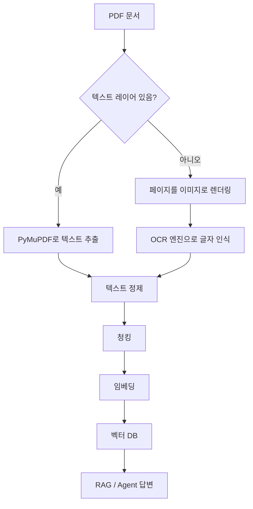
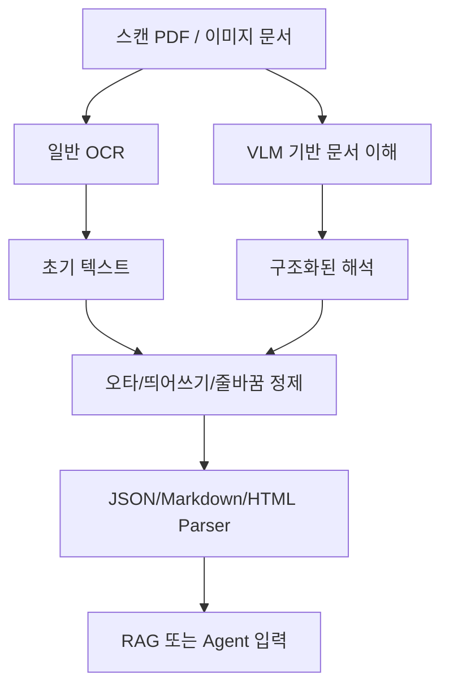

# OCR

- OCR(Optical Character Recognition)은 이미지 안에 있는 글자를 기계가 읽을 수 있는 텍스트로 바꾸는 기술이다.
- [[LLM(Large Language Model)]]에게 문서를 읽히려면, 문서가 먼저 텍스트 형태로 변환되어야 한다.
- Word, HWP, TXT처럼 원래 텍스트 데이터가 들어 있는 문서는 비교적 바로 파싱할 수 있다.
- PDF는 두 종류가 섞여 있어서 먼저 구분해야 한다.

## PDF를 LLM에게 읽히기 전에 구분할 것

- 텍스트 레이어가 있는 PDF
  - PDF 안에 실제 텍스트가 들어 있다.
  - 복사/드래그가 잘 되는 PDF가 보통 여기에 해당한다.
  - [[PyMuPDF]] 같은 라이브러리로 텍스트 추출이 잘 된다.

- 스캔 이미지 PDF
  - 페이지 전체가 사진처럼 들어 있다.
  - 눈으로는 글자가 보이지만 컴퓨터 입장에서는 이미지일 수 있다.
  - 이 경우 단순 텍스트 추출만으로는 내용이 안 나오고, OCR이 필요하다.

## AI Agent / RAG에서의 위치

- OCR은 [[RAG(Retrieval-Augmented Generation)]]의 앞단에 있는 문서 전처리 단계다.
- 문서에서 텍스트를 뽑아야 [[청킹(Chunking)]], [[임베딩(Embedding)]], [[벡터 데이터베이스]] 저장이 가능하다.
- 텍스트 추출이 틀어지면 뒤의 검색 품질도 같이 떨어진다.

## PyMuPDF와 OCR의 관계

- [[PyMuPDF]]는 PDF를 열고, 페이지별 텍스트를 추출하고, 페이지를 이미지로 렌더링하는 데 강하다.
- 텍스트 레이어가 있는 PDF라면 PyMuPDF만으로도 텍스트 추출이 잘 된다.
- 스캔 이미지 PDF라면 PyMuPDF로 페이지를 이미지로 만든 뒤, 별도의 OCR 엔진에 넘기는 식으로 처리한다.
- 즉, PyMuPDF는 OCR 자체라기보다 PDF 처리와 OCR 준비 단계에서 많이 쓰인다.

## OCR의 대표적인 한계

- 오타 문제
  - 비슷하게 생긴 글자를 잘못 읽을 수 있다.
  - 예: `0`과 `O`, `1`과 `l`, 작은 글씨, 흐릿한 글씨, 손글씨.

- 띄어쓰기 문제
  - 단어 사이 간격을 잘못 판단해서 단어가 붙거나 쪼개질 수 있다.
  - 한국어 문서는 조사, 띄어쓰기, 줄바꿈이 함께 섞여 오류가 나기 쉽다.

- 줄 인식 문제
  - 사람이 보기에는 한 문장이지만 OCR은 여러 줄로 끊어서 읽을 수 있다.
  - 반대로 서로 다른 줄을 한 줄로 붙여버릴 수도 있다.

- 문장부호 인식 문제
  - 쉼표, 마침표, 괄호, 따옴표, 표 번호 같은 기호가 누락되거나 잘못 인식될 수 있다.

- 표 구조 무너짐 문제
  - 표는 단순 텍스트가 아니라 행, 열, 셀의 관계가 중요하다.
  - OCR이 표 안의 글자는 읽어도 어느 값이 어느 컬럼에 속하는지 잃어버릴 수 있다.
  - 이 경우 RAG에서 잘못된 관계를 근거로 답변할 위험이 있다.

## VLM으로 보완하기

- [[VLM]](Vision-Language Model)은 이미지와 텍스트를 함께 이해하는 모델이다.
- 전통 OCR이 글자 단위 인식에 집중한다면, VLM은 페이지의 시각적 배치, 표 구조, 제목, 문단, 캡션 같은 맥락을 함께 볼 수 있다.
- 그래서 OCR만으로 어려운 줄 인식, 표 구조, 다단 레이아웃, 손글씨, 그림과 텍스트가 섞인 문서에서 보완 수단이 될 수 있다.
- 단, VLM도 완벽하지 않으므로 중요한 문서에서는 결과 검증이 필요하다.

## Parser로 구조 보존하기

- OCR이나 VLM 결과를 그냥 긴 문자열로 저장하면 문서 구조가 쉽게 무너진다.
- 따라서 후처리 단계에서 목적에 맞는 parser를 사용해 구조를 보존하는 것이 좋다.

- JSON parser
  - 정해진 key-value 구조로 결과를 저장할 때 좋다.
  - 예: `{ "disease": "고혈압", "symptom": "두통", "caution": "저염식" }`
  - 장점은 프로그램이 읽기 쉽고, 필드 누락 여부를 검증하기 쉽다는 것이다.

- Markdown parser
  - 제목, 소제목, 목록, 표를 사람이 읽기 좋은 형태로 보존할 때 좋다.
  - RAG 문서 청킹 전에 `# 제목`, `## 소제목`, `- 목록` 구조를 유지하기 쉽다.

- HTML parser
  - 웹 문서나 표, 링크, 강조 태그처럼 레이아웃 정보가 중요한 경우에 좋다.
  - `<table>`, `<tr>`, `<td>` 같은 태그를 사용하면 표의 행/열 관계를 보존하기 쉽다.

## OCR 문제를 줄이는 실무 전략

- 텍스트 PDF면 먼저 [[PyMuPDF]]로 텍스트 레이어를 추출한다.
- 스캔 PDF면 OCR 또는 VLM 기반 처리를 사용한다.
- 표가 중요하면 단순 텍스트보다 Markdown table, HTML table, JSON 구조로 저장한다.
- OCR 결과를 그대로 믿지 말고 오타, 띄어쓰기, 줄바꿈을 후처리한다.
- 중요한 필드는 schema를 정해서 JSON으로 검증한다.
- RAG에 넣기 전 원문 페이지 번호, 파일명, bbox 같은 metadata를 같이 저장한다.

## 실무 체크 포인트

- `page.get_text()` 결과가 거의 비어 있으면 스캔 이미지 PDF일 가능성이 크다.
- PDF를 LLM에 바로 넣기보다 먼저 텍스트 추출 품질을 확인해야 한다.
- 페이지 번호, 파일명, 문서 제목 같은 metadata를 같이 저장하면 RAG에서 출처 표시가 쉬워진다.
- 표, 다단 레이아웃, 각주가 많은 PDF는 추출 순서가 깨질 수 있으므로 결과를 꼭 샘플링해서 확인한다.
- OCR 결과에는 오타가 섞일 수 있으므로 중요한 업무에서는 후처리나 사람 검토가 필요하다.

## 한 줄 정리

- LLM은 이미지를 직접 읽는 것이 아니라, 보통 문서를 텍스트로 변환한 뒤 그 텍스트를 읽는다.
- PDF가 텍스트 PDF면 [[PyMuPDF]]로 바로 추출하고, 스캔 PDF면 OCR 단계를 추가한다.
