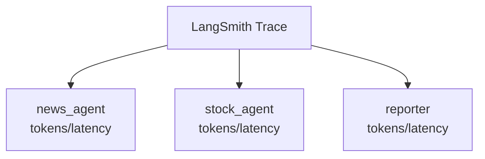
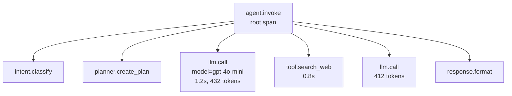

- Observability = [[AI Agent|에이전트]]의 **모든 LLM 호출, [[Tool Calling|도구 실행]], 상태 변화, 비용**을 기록·시각화·검색해서 "왜 이렇게 동작했는가"를 사후에 재구성할 수 있게 만드는 인프라.
- 일반 백엔드의 로그·트레이스와 같은 결이지만, LLM은 **비결정성** 때문에 더 촘촘한 기록이 필요하다.

## 무엇을 기록해야 하나

| 카테고리 | 항목 |
|---------|------|
| LLM 호출 | model, prompt, response, tokens(in/out), latency, cost |
| Tool 호출 | name, args, result, latency, error |
| State 변화 | 단계별 state diff (LangGraph) |
| Trajectory | 전체 사고·행동 시퀀스 |
| 가드레일 | 차단 여부, 사유 |
| 사용자 컨텍스트 | user_id, thread_id, session |

## OpenTelemetry 기반 (표준)

```python
from opentelemetry import trace
tracer = trace.get_tracer(__name__)

with tracer.start_as_current_span("agent.invoke") as span:
    span.set_attribute("user_id", uid)
    with tracer.start_as_current_span("llm.call") as s:
        s.set_attribute("model", "gpt-4o-mini")
        resp = llm.invoke(...)
        s.set_attribute("tokens.in", resp.usage.prompt_tokens)
```

- OTel은 표준 → Datadog, Honeycomb, Tempo, Jaeger 등 어디로도 보낼 수 있음.

## LLM 특화 도구

| 도구 | 특징 |
|------|------|
| **LangSmith** | [[LangChain]] 친화, prompt/trace/eval 통합 SaaS |
| **Langfuse** | 오픈소스, self-host 가능 |
| **Weights & Biases Weave** | 실험·평가 결합 |
| **Arize Phoenix** | 오픈소스, OTel 호환 |
| **AWS AgentCore Observability** | Bedrock 친화, X-Ray 통합 |

## LangSmith 통합 예

```python
import os
os.environ["LANGCHAIN_TRACING_V2"] = "true"
os.environ["LANGCHAIN_API_KEY"] = "..."
os.environ["LANGCHAIN_PROJECT"] = "ai-agent-practice"

# 이후 모든 LangChain/LangGraph 호출이 자동 트레이싱
agent.invoke({"input": "..."})
```

## LangGraph에서 특히 봐야 할 것

LangGraph는 노드 단위로 실행되기 때문에, LangSmith 같은 도구에서 다음을 보면 디버깅이 쉬워진다.

| 봐야 할 것 | 이유 |
|---|---|
| 어떤 노드가 실행됐는가 | 그래프 경로가 의도대로 갔는지 확인 |
| 각 노드의 latency | 병목 노드 찾기 |
| 각 노드의 token/cost | 비용이 큰 단계 찾기 |
| tool call args | LLM이 도구 인자를 제대로 넣었는지 확인 |
| 반복 횟수 | [[Loop Control]]이 필요한지 확인 |



## 트레이스 단위 — Span 설계 권장



- 각 노드(LangGraph) / 에이전트(Strands) / 도구를 span으로.
- root span에 thread_id, user_id 같은 식별자 → 검색용.

## 비용·토큰 추적

- 토큰 카운트는 모델마다 차이 — 응답 객체의 `usage` 필드를 그대로 저장.
- $/1K 토큰을 곱해 cost 컬럼 계산 → 사용자/엔드포인트별 청구·이상 탐지.
- **prompt caching**(Anthropic/OpenAI) 적용 비율을 모니터링하면 비용 최적화 포인트가 보인다.

## 회귀 데이터셋 자동 수집

- production trace 중 LLM-as-Judge가 저점을 매긴 케이스를 데이터셋으로 자동 적재 → [[Evaluation|회귀 평가]] 시드.

## 운영 팁

- **저장 비용**이 빠르게 늘어난다 — 샘플링(예: 10%) + 에러 100% + 저점 100% 패턴.
- 프롬프트·응답 PII는 자동 마스킹 후 저장.
- 트레이스 보존 기간을 SLO에 맞춰 합의(예: 30일 hot, 1년 cold).

## 관련

- [[Evaluation]] — 트레이스가 평가의 원료.
- [[Trajectory]] — 트레이스를 의미 단위로 묶은 단위.
- [[Cost와 Token]] — 비용 모니터링.
