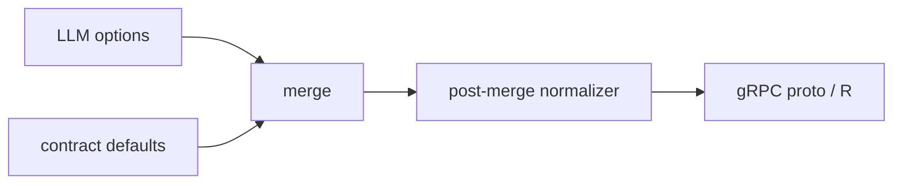

# Post-merge Normalizer

Post-merge Normalizer는 LLM 옵션과 계약 기본값이 병합된 뒤, 최종 실행 직전에 옵션을 다시 보정하는 레이어이다.

[[Pre-validation Normalizer]]가 "검증 통과를 위한 정리"라면, Post-merge Normalizer는 "실제 proto/R 실행을 위한 마무리"에 가깝다.

## 위치

## 언제 필요한가

- 기본값 병합 후에야 전체 옵션을 알 수 있을 때
- 앞단 블록 결과를 봐야 보정할 수 있을 때
- metadata 전체 컬럼을 기준으로 누락 row를 채워야 할 때
- 특정 블록군(TDP/TVS)에 공통 마무리 규칙이 있을 때

## registry dispatch

post-merge normalizer는 block type으로 dispatch한다.

- exact registry: `BLOCK_042`
- prefix registry: `VISUALIZATION_*`

이렇게 하면 새 블록을 추가할 때 normalizer를 독립적으로 등록할 수 있다.

## 한 줄 정리

Post-merge Normalizer는 **default merge까지 끝난 최종 옵션을 블록 실행 환경에 맞게 마지막으로 보정하는 레이어**이다.

## 관련

- [[Configuration Merge Pipeline]]
- [[Pre-validation Normalizer]]
- [[Registry Pattern]]
- [[Block Contract]]
