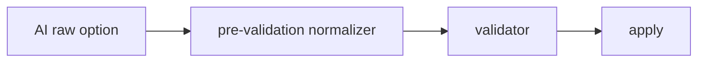

# Pre-validation Normalizer

Pre-validation Normalizer는 본 검증 전에 입력값을 검증 가능한 형태로 먼저 정리하는 레이어이다.

AI가 만든 옵션은 의미는 맞아도 타입, 표기, 필드명이 흔들릴 수 있다. 이 상태에서 바로 validation을 돌리면 "실패해야 할 값"과 "조금만 고치면 되는 값"이 섞인다.

## 위치



## 하는 일

| 작업 | 예 |
|---|---|
| 타입 보정 | `"1"` -> `1`, `"true"` -> `true` |
| 배열 보정 | `"age"` -> `["age"]` |
| 필드명 보정 | `x_var` -> `xVar` |
| alias 보정 | `"target"` -> 실제 컬럼명 |
| 기본값 채움 | 누락된 optional 값에 안전한 기본값 |
| 명시 옵션 우선 | 사용자가 직접 고른 옵션은 AI 추천보다 우선 |

## validation과의 차이

| 레이어 | 목적 |
|---|---|
| normalizer | 고칠 수 있는 입력 흔들림을 정리 |
| validator | 정책상 허용 가능한지 판정 |
| guardrail | 위험하거나 불가능한 실행을 차단 |

정규화는 관대해도 되지만, 검증은 엄격해야 한다.

## explicit options

Explicit options는 사용자가 직접 지정했거나 UI에서 이미 확정된 옵션이다.

원칙:

- 명시 옵션은 AI가 덮어쓰지 않는다.
- 명시 옵션이 데이터 계약과 맞지 않으면 자동 수정하지 않고 경고한다.
- AI 추천 옵션은 빈 칸을 채우거나 후보를 제안하는 역할에 가깝다.

## 흔한 예

```python
def normalize_x_var(value):
    if value is None:
        return []
    if isinstance(value, str):
        return [value]
    return list(value)
```

이런 보정은 모델의 자유도를 UI 계약 안으로 접어 넣는다.

## 한 줄 정리

Pre-validation Normalizer는 **AI가 만든 불안정한 옵션을 검증 가능한 입력으로 다듬는 사전 정리층**이다.

## 관련

- [[Guardrails]]
- [[Agent 응답 정규화]]
- [[Structured Output]]
- [[Workflow Action]]
- [[AI Pipeline Error Normalization]]
