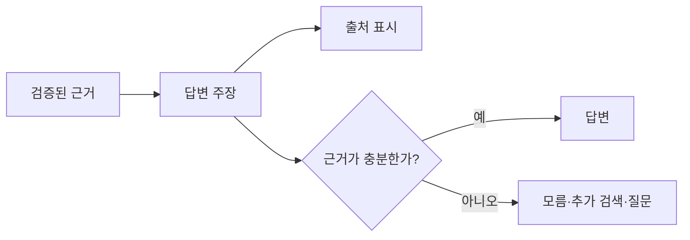

# Grounded Generation

Grounded Generation은 모델이 그럴듯한 일반 지식으로 답을 채우지 않고, **검증된 컨텍스트와 도구 결과에 근거해 답변을 생성하도록 만드는 방식**이다. [[RAG(Retrieval-Augmented Generation)]]는 정보를 가져오는 구조이고, Grounded Generation은 가져온 정보가 실제 답변의 주장으로 올바르게 연결되게 하는 규칙이다.

## 근거의 단위

좋은 근거는 문서 전체가 아니라 답변의 각 주장에 연결할 수 있는 최소 단위다. [[Lexical Graph RAG]]의 Statement, 문서의 문단, SQL 결과 행, API 응답 필드가 이에 해당한다.

## 생성 규칙

1. 제공된 근거가 뒷받침하는 사실만 단정한다.
2. 근거가 없는 추론은 추론임을 표시하거나 제외한다.
3. 서로 충돌하는 출처는 하나를 임의로 선택하지 말고, 충돌과 기준 시점을 설명한다.
4. 근거가 부족하면 모른다고 답하거나 [[Query Transformation|재검색]]·추가 질문으로 전환한다.
5. 인용은 실제 출처 위치를 가리켜야 하며, 링크·문서명만 나열해서는 안 된다.

"답변이 없다"는 실패가 아니라, 근거 없는 답변을 막는 정상적인 결과다. 특히 정책, 의료, 금융, 운영 변경처럼 오류 비용이 큰 영역에서 중요하다.

## 인용과 출처 추적

출처 메타데이터에는 문서 ID, 제목, 버전, 위치, 수집 시각, 접근 권한을 포함한다. 답변 생성 시에는 각 핵심 주장에 이 식별자를 함께 전달하고, UI에서는 사람이 다시 확인할 수 있는 형태로 렌더링한다.

단순한 문서 링크는 신뢰성을 보장하지 않는다. 인용한 문단이 실제로 해당 주장을 지지하는지, 문서 버전이 최신인지, 사용자가 그 문서를 볼 권한이 있는지를 별도로 확인해야 한다.

## 평가 기준

| 항목 | 질문 |
|---|---|
| Faithfulness | 답변의 주장이 제공된 근거에서 실제로 따라오는가? |
| Citation correctness | 붙은 인용이 바로 앞 주장을 지지하는가? |
| Citation completeness | 중요한 외부 사실에 빠진 근거는 없는가? |
| Abstention quality | 근거 부족 상황에서 안전하게 보류했는가? |

이 평가는 [[LLM-as-Judge]]만으로 확정하지 않는다. 표본을 사람이 검수하고, 실패 사례는 [[Evaluation|회귀 평가]] 데이터셋에 추가한다.

## 관련

- [[RAG(Retrieval-Augmented Generation)]]
- [[Query Transformation]]
- [[Lexical Graph RAG]]
- [[Guardrails]]
- [[Evaluation]]
- [[Observability]]
