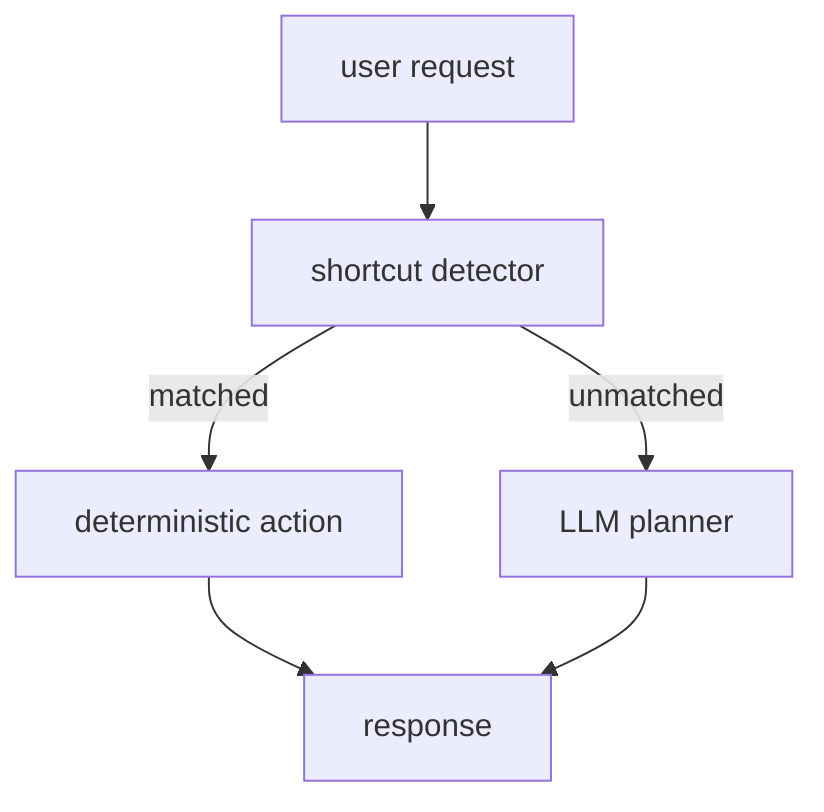

# Rule-based Shortcut

Rule-based Shortcut은 사용자의 의도가 명확할 때 LLM planning을 거치지 않고 결정적 규칙으로 바로 처리하는 패턴이다.

## 언제 쓰나

- 특정 키워드가 곧 실행 대상과 1:1로 연결될 때
- 잘못 해석할 여지가 적을 때
- LLM 호출 비용과 지연을 줄이고 싶을 때
- shortcut 실패 시 일반 planner로 fallback할 수 있을 때

## 예시

```python
def detect_shortcut(text: str) -> str | None:
    lowered = text.lower()
    if "bar chart" in lowered or "막대그래프" in lowered:
        return "bar_chart"
    if "scatter plot" in lowered or "산점도" in lowered:
        return "scatter_plot"
    return None
```

## 구조



## 주의

- shortcut은 좁고 명확한 경우에만 둔다.
- shortcut이 너무 많아지면 rule system이 agent보다 복잡해진다.
- 실행 전에는 여전히 [[Contract Guardrail Pipeline]]이나 [[Pre-validation Normalizer]]를 통과시킨다.

관련: [[Early Guard Pattern]], [[Lightweight Intent Handler]], [[Fallback]]
